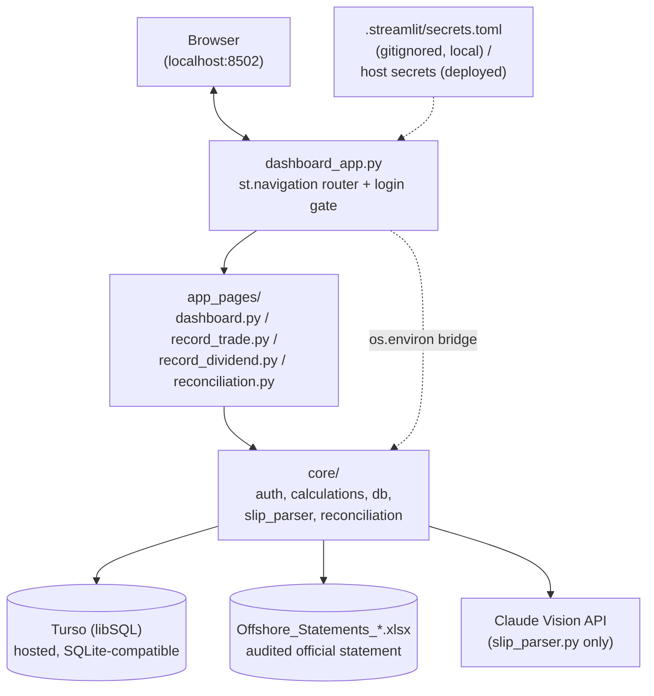
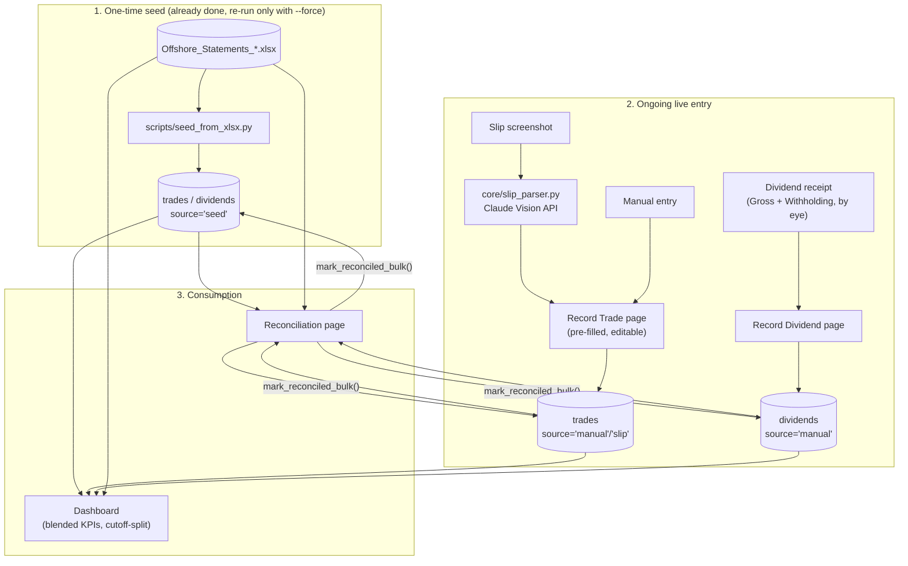
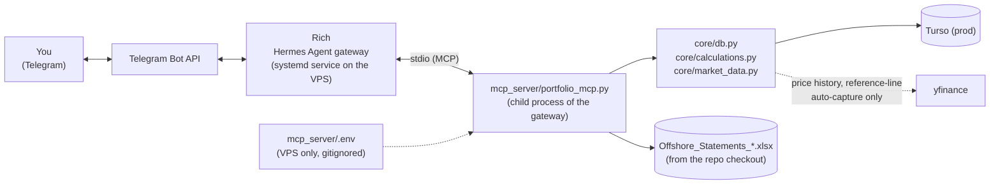
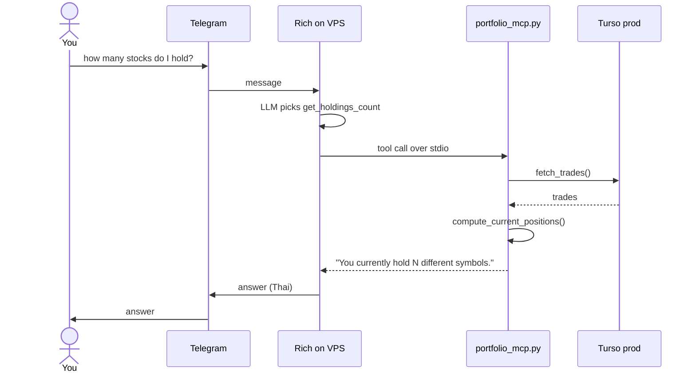

# Architecture

## Tech stack

| Layer | Choice | Notes |
|---|---|---|
| UI framework | [Streamlit](https://streamlit.io) 1.58 | Multi-page app via `st.navigation`/`st.Page` |
| Language | Python 3.12 | Single `.venv_dashboard` virtualenv |
| Data wrangling | pandas 3.0 | Every `core/` function is DataFrame-in/DataFrame-out |
| Persistence | Turso (`libsql` client) | Hosted, SQLite-compatible; `get_connection()` always targets Turso now, local and deployed alike -- `data/portfolio.db` is a frozen pre-migration snapshot, no longer read by the running app (see "Hosting" below) |
| Official source file | openpyxl 3.1 (via `pandas.read_excel`) | Reads the audited `Offshore_Statements_*.xlsx` |
| Charts | Plotly 6.8 | Dashboard only |
| Slip parsing | Anthropic SDK 0.120 (`claude-opus-5`, vision) | Structured-output JSON schema, see `core/slip_parser.py` |
| PDF extraction | pdfplumber 0.11 | Used by `scripts/extract_statement.py` (the pre-existing, unchanged monthly-statement pipeline) |
| Testing | pytest 9.1 | 140 tests as of V2; every `core/` module is pure logic, no Streamlit import, so it's testable without a running app |

Full pinned versions: `requirements.txt`.

## System architecture



`core/` holds every function that touches data or does a calculation --
none of it imports Streamlit, so it's unit-testable in isolation
(`tests/`). `app_pages/` is Streamlit-only glue: layout, widgets, session
state. `dashboard_app.py` is the thin entry point (login gate +
`st.navigation` page routing) and stays at the project root, everything
else moved into `core/` during V1's post-Step-7 restructure.

## Hosting (v3)

Deployed on **Streamlit Community Cloud** (free, deploys straight from
this GitHub repo), backed by **Turso** (free, SQLite-compatible hosted
database) for persistence -- chosen after Streamlit Community Cloud,
Render, and Google Cloud Run's free tiers all turned out to lack durable
storage (ephemeral disks that reset on redeploy), and Hugging Face Spaces'
free tier turned out to no longer include the Docker SDK Streamlit needs.
Compute and storage are deliberately decoupled: Streamlit Community Cloud
hosts the running app (which can restart, sleep, or redeploy freely
without losing data), while Turso is the single source of truth for
`trades`/`dividends`/`symbol_types`/`rebalance_plans`, shared identically
by the local dev instance and the deployed one via the same
`TURSO_DATABASE_URL`/`TURSO_AUTH_TOKEN` secrets.

`core/db.py` deliberately has no Streamlit import (see `CLAUDE.md`), so it
can't read `st.secrets` directly -- `dashboard_app.py` bridges the two
Turso values from `st.secrets` into `os.environ` at startup, before any
`core.db` call happens, and `get_connection()` reads them from there.

See `docs/DEPLOYMENT.md` for the actual setup steps and
`docs/VERSION_CONTROL.md` for why this shipped as v3.

## Data flow / pipelines

Three distinct flows through this system:



The pre-existing monthly statement pipeline (`scripts/extract_statement.py`
-> `scripts/merge_into_workbook.py`, PDF -> updated xlsx) is **unchanged**
and out of scope for everything in this app -- it's what produces the
`Offshore_Statements_*.xlsx` file these flows read from. See
`docs/ROADMAP.md` for why `scripts/reconcile.py` and
`scripts/merge_into_workbook.py` specifically were confirmed broken/one-off
during V2 research and deliberately not touched.

See `docs/DATA_MODEL.md` for the schema these flows write to, and
`docs/METHODOLOGY.md` for how the Dashboard/Reconciliation calculations
themselves work.

## Hermes / Telegram integration (V4.13)

A separate system, [Hermes Agent](https://hermes-agent.nousresearch.com),
runs four Telegram bots on a personal DigitalOcean VPS. One of them, "Rich"
(Stock & Investment), answers portfolio questions by calling a small MCP
server, `mcp_server/portfolio_mcp.py`, that lives in **this repo** and reads
the same Turso database as the Streamlit app. The MCP server imports
`core/db.py` / `core/calculations.py` directly -- no Streamlit, no copied
logic -- so the bot's numbers come from the same code the pages use and can't
quietly drift from what the app shows.

### Components



### One question, end to end



Inside Hermes the tools appear as `mcp__portfolio__<tool name>` (e.g.
`mcp__portfolio__get_holdings_count`), which is what shows up in logs and in
the bot's conversation history.

### Tools

| Tool | Answers | Source of the number |
|---|---|---|
| `get_holdings_count` | How many symbols are held | Open positions from `compute_current_positions` (FIFO); fully sold symbols don't count |
| `get_upcoming_ex_dates` | Which held symbols have an Ex-Date this month | `market_profile_cache` Ex-Date via `calculations.is_ex_date_this_month`. yfinance only reports *past* Ex-Dates, so this means "already went ex-dividend this month", not a forward schedule |
| `get_holdings_pl` | Current-holdings P/L | `calculations.compute_holdings_pl`: live Unrealized (latest cached price minus cost basis) + Dividends Received. Same as Monitor Stocks' Total P/L; excludes gains from fully sold positions |
| `get_lifetime_pl` | All-time P/L | `calculations.compute_investment_gain` over full history, same as Dashboard's Investment Gain/Loss with Duration = All. Its Unrealized is the xlsx statement's own figure for the latest imported month (frozen, not live), and the answer names that month |
| `get_reference_line_status` | Which held symbols have passed their nearest support/resistance line | Same pieces `cached_db.reference_line_summary()` composes, called directly. Writes reference-line data (see below) |
| `get_company_fundamentals(symbol, refresh)` | Fundamentals for one ticker, held or not: profile, Analyst Target verdict (Overvalued / Undervalued / Fair value), latest-year Revenue / Net Income / Free Cash Flow / Total Debt with YoY, and the five key ratios | The same stored `fundamentals_cache` row and shared functions as the Company Fundamentals page (`valuation_assessment`, `statement_series`, `yoy_pct`, `compute_key_ratios`), worded by `core/fundamentals_summary.py`. A ticker never looked up is fetched live and saved by `core/fundamentals_capture.py`; `refresh=true` re-fetches. ETFs/funds get profile and price only. Statement figures carry their own currency (e.g. TWD for TSM). Writes only `fundamentals_cache` |
| `get_holdings_health` | (V4.16) The Health rating of every current holding at once: grouped Weak / Mixed / Healthy with the reason for each Weak and Mixed one, healthy holdings that still carry a red measure, the date range of the stored data, and separate lines for ETFs/funds, too-little-data and held symbols not stored yet | `core/health.py` (`assess_health`, `health_reasons`) over the stored `fundamentals_cache` rows for the holdings from `compute_current_positions`, worded by `summarize_holdings_health` in `core/fundamentals_summary.py`. **Read-only**: no live fetch, no write. The same verdict as Monitor Stocks' Health column and Company Fundamentals' Summary of Health |

`get_company_fundamentals` also ends with the health block for the ticker
(`core/health.py` via `describe_health`: verdict, each group with its measures and
lights, what to watch, the rule profile used), so "is KO healthy?" gets the same
verdict the page shows. ETFs/funds have no statements and get no health block.

### Design decisions

- **Same repo, imported not copied.** A fix to `core/` reaches the bot on the
  VPS's next `git pull` plus a gateway restart.
- **Shared formulas live in `core/calculations.py`.** `is_ex_date_this_month`,
  `compute_investment_gain` and `compute_holdings_pl` were extracted from the
  page code so the Streamlit pages and the MCP tools call one implementation.
- **Two P/L numbers on purpose.** Dashboard's Unrealized is frozen at the last
  imported statement; Monitor Stocks' is live. Each tool matches the page it
  mirrors rather than inventing a third figure.
- **Write boundary is code, not the database.** The Turso credential is
  read-write and Turso has no per-table tokens, so `portfolio_mcp.py` only
  calls read functions plus derived-data writes to two tables:
  `reference_lines` in `get_reference_line_status` (setting `passed_at`,
  auto-capturing lines for a never-checked symbol) and `fundamentals_cache` in
  `get_company_fundamentals` (first lookup of a ticker, or `refresh=true`).
  The fundamentals write only ever saves a fetch that returned a real price, so
  an unknown symbol or a Yahoo outage saves nothing and can't blank a good
  stored row. A ticker typed into Telegram is validated (letters, digits and
  `. ^ = -`, up to 20 characters) before it can become a database key.
  `get_holdings_health` and the health block are read-only (stored rows in, text
  out; no fetch). New tools must never call `save_trade`, `save_dividend` or
  `save_symbol_types`.
- **Prod on the VPS, dev locally.** The VPS `mcp_server/.env` points at the
  prod database; the local `mcp_server/.env` points at dev so local testing
  can't write to prod.
- **stdio subprocess, not a remote server.** Hermes spawns the script from
  the `rich` profile's `config.yaml`; nothing extra to host or authenticate.
- **Lightweight dependencies.** `mcp_server/requirements.txt` omits Streamlit
  and Plotly because the VPS has ~2GB RAM and no swap.

### Deployment on the VPS

| What | Where |
|---|---|
| MCP server code | `/root/repos/analyze-monthly-offshore-statement/mcp_server/portfolio_mcp.py` |
| Python venv | `.../mcp_server/.venv` |
| Prod credentials | `.../mcp_server/.env` (`chmod 600`, gitignored) |
| Rich's config | `/root/.hermes/profiles/rich/config.yaml` |
| Rich's persona | `/root/.hermes/profiles/rich/SOUL.md` |
| Conversation history | `/root/.hermes/profiles/rich/state.db`, table `messages` |

`config.yaml` entry:

```yaml
mcp_servers:
  portfolio:
    command: "/root/repos/analyze-monthly-offshore-statement/mcp_server/.venv/bin/python"
    args:
      - "/root/repos/analyze-monthly-offshore-statement/mcp_server/portfolio_mcp.py"
```

Updating after a change to the MCP server or `core/`:

```bash
ssh -i <key> root@<vps-host>
cd /root/repos/analyze-monthly-offshore-statement && git pull origin main
hermes -p rich gateway restart
systemctl status hermes-gateway-rich --no-pager   # portfolio_mcp.py should appear as a child process
journalctl -u hermes-gateway-rich -f              # live logs
```

`mcp_server/README.md` has the local-testing and first-time deployment steps.

### How it was built

```mermaid
flowchart TD
    subgraph P["Prepare"]
        A["Discuss: can Rich answer from the portfolio?<br/>is MCP needed?"]
        B["Check before building<br/>Hermes supports MCP<br/>core/ has no Streamlit dependency<br/>VPS RAM headroom"]
        C["Decide<br/>two P/L variants<br/>write only reference lines<br/>5 tools first<br/>prod database"]
        A --> B --> C
    end

    subgraph D["Develop (branch v4.13)"]
        E["Extract shared logic to<br/>core/calculations.py"]
        F["Confirm existing numbers unchanged<br/>tests + old vs new on the dev DB"]
        G["Build mcp_server/ one tool at a time"]
        E --> F --> G
    end

    subgraph T["Each tool verified with a real stdio MCP client"]
        T1["get_holdings_count"] --> T2["get_upcoming_ex_dates<br/>get_holdings_pl"] --> T3["get_lifetime_pl"] --> T4["get_reference_line_status"]
    end

    subgraph S["Ship"]
        H["Docs: ROADMAP / CHANGELOG / VERSION_CONTROL"] --> I["Merge to main, tag v4.13, push"]
    end

    subgraph V["Deploy to the VPS"]
        J["git clone / pull<br/>venv + pip install"] --> K["Prod .env (scp, chmod 600)<br/>check prod connection"]
        K --> L["Back up, then edit<br/>config.yaml + SOUL.md"]
        L --> M["Restart gateway<br/>MCP child process appears"]
    end

    C --> E
    G --> T1
    T4 --> H
    I --> J
    M --> N["Real Telegram round trip<br/>re-check numbers independently"]
```



### Verification

Every tool was exercised through a real stdio MCP client (a genuine
subprocess, not a direct function call) against the dev database, and the
two P/L tools were cross-checked against independent replicas of the
pre-refactor page logic. After deployment, a Telegram round trip on prod
(holdings count, Ex-Date list, current-holdings P/L) matched an independent
re-computation exactly. `get_lifetime_pl` and `get_reference_line_status`
have been verified on dev but not yet asked through Telegram on prod.

`get_company_fundamentals` (V4.15) was verified on dev through a real MCP
client, with every value cross-checked against what the real Company
Fundamentals page rendered for the same symbol, its first-lookup and refresh
paths checked against a direct Yahoo Finance fetch, and a before/after diff of
every table confirming that only `fundamentals_cache` changed. It has not yet
been asked through Telegram on prod.

`get_holdings_health` and the health block (V4.16) were verified through a real
stdio MCP client against dev: the holdings answer matched what the real Monitor
Stocks page rendered in its Health column (same members in every group, same ETF
and not-stored lists) and an independent recomputation; the per-company block
matched the real Company Fundamentals page measure by measure for 13 symbols; and a
full before/after backup diff showed all 13 tables identical, i.e. nothing written.

**Verify Rich from its log, not from how a reply reads.** A reply can imitate a
tool's output. Rich's `state.db` (`messages.tool_calls`) records each call -- MCP
calls appear as `tool_call` with `mcp__portfolio__<tool name>` -- so "did Rich use the
tool?" is answerable exactly. On 19 Sep 2026 a first "health of <stock>" question was
answered with a script Rich wrote itself (`write_file`, then `terminal` running
yfinance) and no portfolio tool call, with figures that differed from the app's
(trailing-period Yahoo figures vs the app's annual statements). The VPS was still on
V4.15 and Rich's `SOUL.md` didn't mention health, but it shows the failure mode to
watch for: an unrouted question gets improvised numbers.

### Known limitations

- Rich doesn't always reach for a tool on the first try; it may need a nudge
  ("look again") or a stronger `SOUL.md`. It can also skip the tools and write its
  own Yahoo Finance script for a company question (seen 19 Sep 2026), producing
  numbers that disagree with the app; `SOUL.md` should say which questions go to
  which tool and forbid ad-hoc scripts for them. Which model Rich runs on
  (`model.default` in its `config.yaml`) changes how reliably it routes.
- Hermes rejects multiple local tool calls in one batch
  (`Local tools require one entry per tool_call`); Rich retries on its own,
  but multi-tool questions can show repeated attempts.
- The VPS has ~2GB RAM and no swap; check `free -h` before adding processes.
- A live lookup or refresh depends on Yahoo Finance, which has blocked shared
  cloud IPs before. From the VPS it can fail; it then says so and saves
  nothing, and stored data keeps being served.
- Not covered yet: dividend income, Dashboard growth-vs-principal KPIs,
  Target Allocation status, a portfolio-wide "which of my holdings look
  under/overvalued" view (Monitor Stocks' Fundamentals tab has it),
  Rebalance suggestions, full statement tables, and ETF-specific facts such as
  expense ratio and holdings (ETFs get only a profile and price).

### Adding a tool

Put the formula in `core/calculations.py` (with tests) and have the Streamlit
page call it, then wrap it as a new `@mcp.tool()` in
`mcp_server/portfolio_mcp.py`. That way the page and the bot share one
implementation. See `docs/ROADMAP.md` (V4.13) for the full design history.
