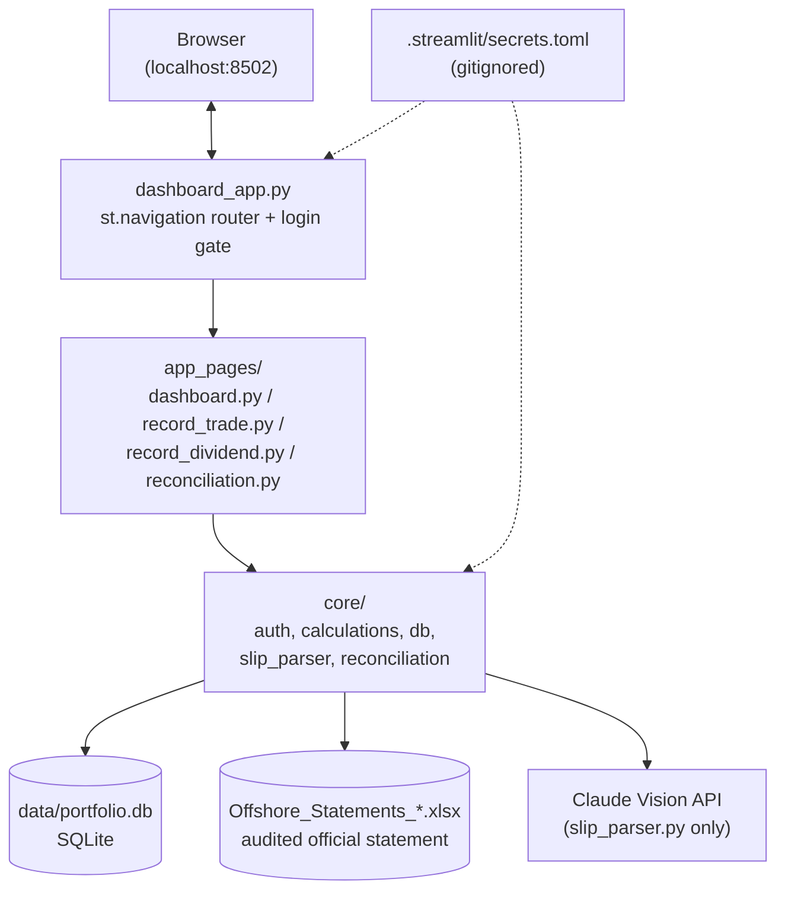
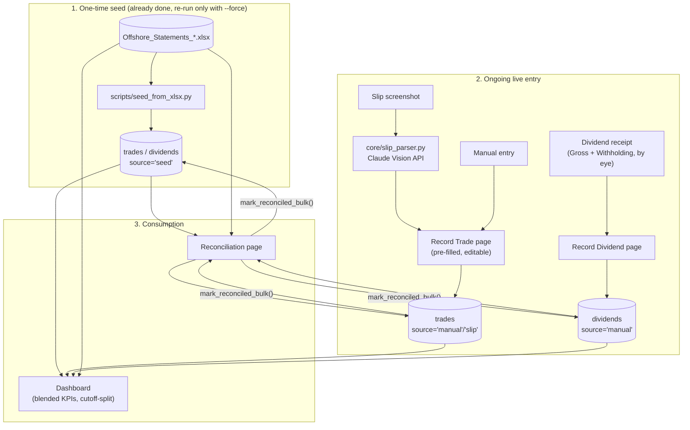

# Architecture

## Tech stack

| Layer | Choice | Notes |
|---|---|---|
| UI framework | [Streamlit](https://streamlit.io) 1.58 | Multi-page app via `st.navigation`/`st.Page` |
| Language | Python 3.12 | Single `.venv_dashboard` virtualenv |
| Data wrangling | pandas 3.0 | Every `core/` function is DataFrame-in/DataFrame-out |
| Persistence | SQLite (stdlib `sqlite3`) | One file, `data/portfolio.db`; no server, no ORM |
| Official source file | openpyxl 3.1 (via `pandas.read_excel`) | Reads the audited `Offshore_Statements_*.xlsx` |
| Charts | Plotly 6.8 | Dashboard only |
| Slip parsing | Anthropic SDK 0.120 (`claude-opus-5`, vision) | Structured-output JSON schema, see `core/slip_parser.py` |
| PDF extraction | pdfplumber 0.11 | Used by `scripts/extract_statement.py` (the pre-existing, unchanged monthly-statement pipeline) |
| Testing | pytest 9.1 | 140 tests as of V2; every `core/` module is pure logic, no Streamlit import, so it's testable without a running app |

Full pinned versions: `requirements.txt`.

## System architecture

`core/` holds every function that touches data or does a calculation --
none of it imports Streamlit, so it's unit-testable in isolation
(`tests/`). `app_pages/` is Streamlit-only glue: layout, widgets, session
state. `dashboard_app.py` is the thin entry point (login gate +
`st.navigation` page routing) and stays at the project root, everything
else moved into `core/` during V1's post-Step-7 restructure.

## Data flow / pipelines

Three distinct flows through this system:

The pre-existing monthly statement pipeline (`scripts/extract_statement.py`
-> `scripts/merge_into_workbook.py`, PDF -> updated xlsx) is **unchanged**
and out of scope for everything in this app -- it's what produces the
`Offshore_Statements_*.xlsx` file these flows read from. See
`docs/ROADMAP.md` for why `scripts/reconcile.py` and
`scripts/merge_into_workbook.py` specifically were confirmed broken/one-off
during V2 research and deliberately not touched.

See `docs/DATA_MODEL.md` for the schema these flows write to, and
`docs/METHODOLOGY.md` for how the Dashboard/Reconciliation calculations
themselves work.
