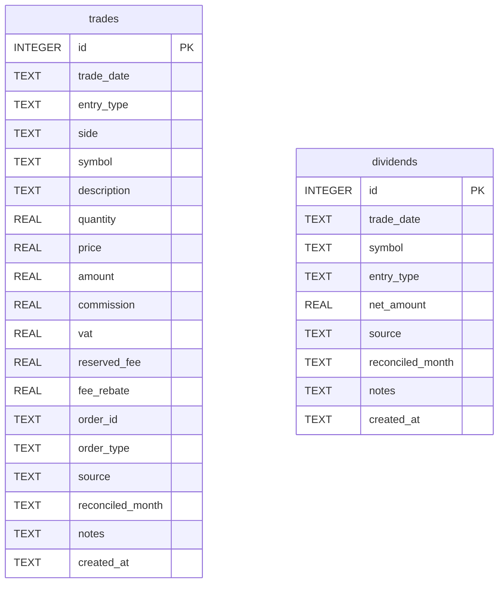

# Data model

Two independent SQLite tables (`data/portfolio.db`, schema defined in
`core/db.py`). No foreign key between them -- a dividend/interest posting
isn't linked back to the specific trade(s) that produced it.

## `trades`

| Column | Type | Notes |
|---|---|---|
| `id` | INTEGER PK | autoincrement |
| `trade_date` | TEXT | ISO `YYYY-MM-DD` |
| `entry_type` | TEXT | default `'Trade Entry'`; also `'Stock Split'`, `'ReOrg CA'`, or blank (seeded rights-distribution rows) |
| `side` | TEXT | `'buy'` \| `'sell'` \| NULL (corporate-action rows have no side) |
| `symbol` | TEXT NOT NULL | |
| `description` | TEXT | free text, often blank |
| `quantity` | REAL NOT NULL | **signed**: positive = buy, negative = sell |
| `price` | REAL | nullable -- e.g. a rights-offering distribution has no price |
| `amount` | REAL | **signed** gross value = quantity × price, negated for a buy (cash out), positive for a sell (cash in). Does **not** include commission. |
| `commission` | REAL | net fee total, see `db.compute_net_commission()` |
| `vat`, `reserved_fee`, `fee_rebate` | REAL | the raw components that get netted into `commission` at insert time |
| `order_id`, `order_type` | TEXT | from the broker slip, if available |
| `source` | TEXT NOT NULL | `'seed'` (imported from xlsx) \| `'manual'` \| `'slip'` |
| `reconciled_month` | TEXT | NULL until Reconciliation confirms this row against an xlsx statement; then the `'YYYY-MM'` of the statement it matched |
| `notes` | TEXT | |
| `created_at` | TEXT NOT NULL | `datetime('now')` at insert time |

## `dividends`

| Column | Type | Notes |
|---|---|---|
| `id` | INTEGER PK | autoincrement |
| `trade_date` | TEXT NOT NULL | ISO `YYYY-MM-DD` |
| `symbol` | TEXT | NULL for Interest rows (matches the xlsx seed convention) |
| `entry_type` | TEXT NOT NULL | CHECK constrained: `'Dividend'` \| `'Interest'` \| `'Capital Distribution'` |
| `net_amount` | REAL NOT NULL | gross minus withholding tax, computed at save time on Record Dividend |
| `source` | TEXT NOT NULL | `'seed'` \| `'manual'` |
| `reconciled_month` | TEXT | same semantics as `trades.reconciled_month` |
| `notes` | TEXT | |
| `created_at` | TEXT NOT NULL | |

## Mapping to the official xlsx

The xlsx (`data/Offshore_Statements_*.xlsx`) is the audited source of
truth; SQLite is where live activity gets logged between statements and
where the seeded historical copy lives. Column names and vocabulary
**don't** line up 1:1 -- both `scripts/seed_from_xlsx.py` (the one-time
importer) and `core/reconciliation.py` (the ongoing matcher) have to bridge
the gap:

| xlsx sheet | xlsx columns | SQLite table | Note |
|---|---|---|---|
| `Transactions` | Trade Date, Entry Type, Side, Symbol, Description, Quantity, Price, Amount, Commission | `trades` | Only rows with `Symbol` non-null become trade rows -- journal/cash rows in `Transactions` are skipped |
| `Income` (`Dividends` + `Div. Adj(NRA Withheld)` rows) | Trade Date, Symbol, Net Amt | `dividends` (`entry_type='Dividend'`) | The two xlsx rows per real dividend are **grouped and summed** by `(Trade Date, Symbol)` into one SQLite row |
| `Income` (`Credit/Margin Interest` rows) | Trade Date, Net Amt (Symbol present but discarded) | `dividends` (`entry_type='Interest'`, `symbol=NULL`) | The real xlsx Symbol (e.g. `SHV`) is intentionally dropped -- see `docs/ROADMAP.md`'s V2 research notes for why this was a deliberate, verified decision, not an oversight |

Full vocabulary-difference reasoning (why matching/blending never keys on
`entry_type` across the xlsx/SQLite boundary) lives in
`docs/METHODOLOGY.md` and `docs/ROADMAP.md` (V2 section) -- not repeated
here to avoid the two documents drifting out of sync.
