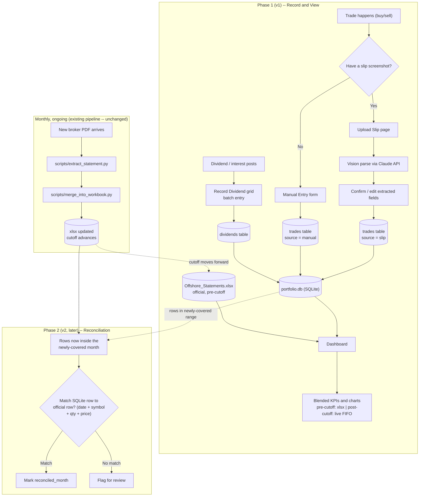
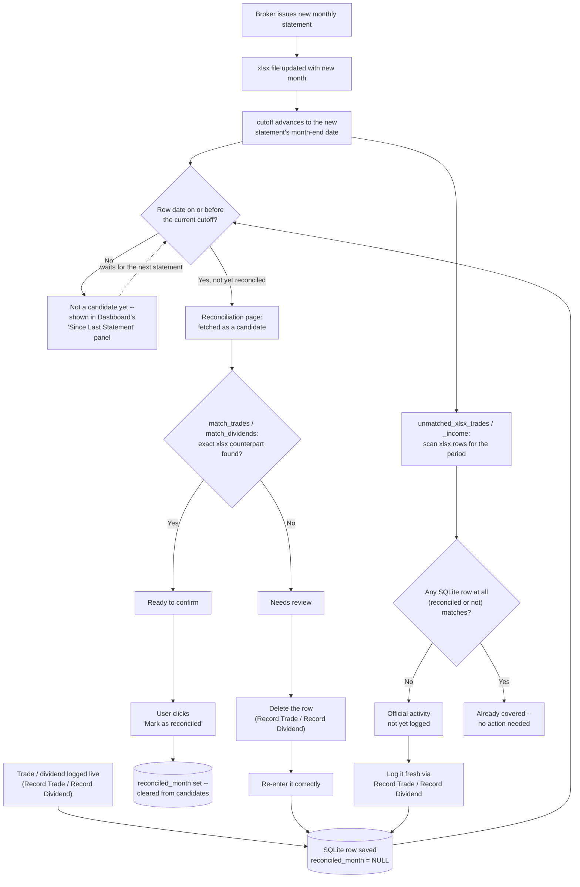

# Roadmap -- build history and design record

The design record for this project's build history: how and why things were
built the way they were, including the real bugs found along the way. See
`CHANGELOG.md` and `docs/METHODOLOGY.md` for the user-facing changelog and
the calculation/methodology detail respectively -- this document is the
process/design side, not the user-facing side.

This file was originally `docs/V1_PLAN.md`, reconstructed as a permanent
record after the live Claude Code plan file (a planning-session artifact
outside this repo, at `~/.claude/plans/`) was overwritten once by a later,
unrelated planning session. **Lesson learned from that incident**: a Claude
Code plan file is not durable -- it gets overwritten the next time Plan Mode
is used for anything else. Every completed build's plan now lives here
instead, permanently. See `CLAUDE.md` for the reminder to keep doing this.

V1, V2, and V2.1 below are **done**. V1 and V2 are merged into `main`;
V2.1 is built and verified on its own branch (`v2.1-allocation-type`, see
`docs/VERSION_CONTROL.md`), pending merge.

## V1: Record Trade and View

### Context

Before this build, portfolio activity was split across three disconnected
surfaces: the Streamlit dashboard (`analyze monthly offshore statement/`,
read-only, refreshed only when a new broker PDF was manually processed), a
hand-maintained Excel workbook where every trade got re-typed across
multiple sheets, and a design prototype (`personal investment portfolio
tool/`) with good trade-entry UX but no data persistence at all. The user
does DCA (recurring small buys) and wanted one web application that both
*shows* portfolio performance and *records* new activity accurately, without
the multi-sheet manual re-entry.

Confirmed through conversation: one unified app, single portfolio (no
multi-user), trade entry supporting **both** slip-image upload (auto-parsed)
and a manual form, dividend entry as a **quick-entry grid** capturing **net
amount only** at the time this was planned (later revised during Step 6 --
see below). Rebalance planning and formal monthly reconciliation against the
official broker PDF were explicitly deferred to a later phase (v2).

### Workflow overview

End-to-end process, phased. Phase 1 (v1) is what got built; Phase 2 (v2) is
a reconciliation loop discussed but deferred, shown here so the full
lifecycle is visible.



### Build steps (all DONE)

```mermaid
flowchart LR
    S1["Step 1<br/>Login gate"] --> S2["Step 2<br/>Storage + seed"]
    S2 --> S3["Step 3<br/>Multi-page shell +<br/>Dashboard blending"]
    S3 --> S4["Step 4<br/>Record Trade:<br/>Manual Entry"]
    S4 --> S45["Step 4.5<br/>Trade traceability +<br/>position visibility"]
    S45 --> S46["Step 4.6<br/>Live sell Realized<br/>P/L preview"]
    S46 --> S5["Step 5<br/>Record Trade:<br/>Upload Slip"]
    S5 --> S55["Step 5.5<br/>Oversell + delete<br/>confirmation"]
    S55 --> S6["Step 6<br/>Record Dividend:<br/>grid + matrix"]
    S6 --> S7["Step 7<br/>Polish +<br/>full regression"]
    S7 --> S8["Bonus<br/>core/ restructure"]
    S8 -.-> V2["v2 (separate round)<br/>Reconciliation, Rebalance"]
```



**Step 1 — Login gate. DONE.** `auth.py` (salted SHA-256, `hmac.compare_digest`)
+ a password gate wrapping `dashboard_app.py` -- nothing renders until it
passes. Validated: wrong password blocks with an error, correct password
reveals the dashboard, a new session requires logging in again. Added a
**Log out** button -- a real gap found during testing.

**Step 2 — Persistent storage + historical seed. DONE.** `db.py` +
`scripts/seed_from_xlsx.py`. Validated against real data: seeded 902 trade
rows and 895 dividend/interest rows, exact match to the xlsx's own counts;
re-running without `--force` correctly no-ops.

**Step 3 — Multi-page shell + Dashboard blending. DONE.** `app_pages/dashboard.py`
(router split out of `dashboard_app.py`), `compute_fifo_realized_pl`/
`blended_realized_pl`/`blended_dividends` added to `calculations.py`.
Validated against real data: with zero live trades logged, blended KPIs
matched the pre-blend values exactly.

**Step 4 — Record Trade: Manual Entry. DONE**, plus two things found
necessary from real testing:
- **Delete** capability for manual/slip-sourced trades, seed rows never
  shown/deletable. Editing a mistake is delete + re-enter, not in-place.
- **Duration-filter bug, found and fixed**: the dashboard's date-range
  filter was capped at the last official statement month, silently
  excluding any live trade/dividend dated after it from KPI calculations.
  Fixed via a `data_end` extended upper bound; Portfolio Value/Unrealized
  P/L/Holdings correctly continue to stay pinned to the last official
  statement regardless.

**Step 4.5 — Trade traceability & position visibility. DONE.** Two gaps
raised from live testing: show *why* a KPI changed (per-trade Realized P/L,
not just an aggregate), and show current holding + average cost for a
symbol while entering a new trade against it. `_run_fifo` factored out as a
shared internal helper so `compute_fifo_realized_pl` and the new
`compute_current_positions` don't duplicate lot-tracking logic. Validated
against real NVDY data: a test sell of 10 shares at $25 (above the $18.54
blended average) correctly showed a **-$6.93** loss, because FIFO drew from
a specific 2024 lot costing $25.69/share.

**Step 4.6 — Live sell Realized P/L preview. DONE.** `estimate_sell_realized_pl()`
simulates a FIFO sell against the current lot book (commission excluded,
not yet known at preview time) and shows it live as Quantity/Price are
typed -- Side/Symbol/Quantity/Price all moved outside `st.form(...)` so
they're reactive. Verified the live preview matches the actual recorded
result exactly (both -$6.93) before commission.

**Step 5 — Record Trade: Upload Slip. DONE.** `slip_parser.py` (Claude
vision, `claude-opus-5`, JSON-schema-constrained structured output) + an
Upload Slip tab in `app_pages/record_trade.py`. Symbol/Side/Quantity/Price
moved to sit above both tabs, shared -- parsing a slip pre-fills them via
`session_state` through an `on_click` callback (writing to a widget's
session_state *after* it's already been instantiated in the same script run
raises `StreamlitAPIException` -- hit and fixed during real testing).
Validated against the real slip images in `labs/`: both parsed exactly
right field-for-field (buy: NVDY, 7.3969607 sh @ $12.14, $0.13 commission,
$0.0092 VAT, Market Order, matching Order ID; sell: PFRL, 14 sh @ $49.28,
$1.04 commission, $0.03 reserved fee, $1.04 rebate -- net commission $0.03
exactly reproducing the slip's own $689.95 Total Credit). Two real bugs
found and fixed: (1) the schema didn't allow `trade_date` to be null, so a
slip with its date section cropped out of frame returned `""` and crashed
`pd.to_datetime()` -- fixed by making it nullable, falling back to today
(editable); (2) numeric prefill fields crashed on `float(None)` for fields a
buy slip genuinely doesn't show -- `prefill.get(key, 0.0)` only substitutes
the default when the key is *missing*, not when it's explicitly `None`, so
switched to `prefill.get(key) or 0.0`.

**Step 5.5 — Oversell confirmation + delete confirmation. DONE.** (1)
Selling more than the current FIFO position holds shows a warning *and*
requires an explicit checkbox (keyed per symbol+quantity, so confirming one
oversell never silently carries over to a different one) before
`render_trade_form` lets the save through -- applies identically to Upload
Slip and Manual Entry, since both call the same function. (2) Deleting a row
in Recent Trades opens a small `st.popover` confirmation ("Delete this
... ?" + a "Yes, delete" button) instead of deleting on the first click.

**Step 6 — Record Dividend: grid + matrix. DONE.** `app_pages/record_dividend.py`
-- entry grid, Recent list (manual-only, matching Record Trade's
convention), Matrix view (full history incl. seed, symbols x months via
`pivot_table` with margins). `db.delete_dividend(id)` added to mirror
`delete_trade`. Changed from the original design based on real usage:
- **Gross Amount + Withholding Tax, not a single Net Amount field.** Dime!'s
  activity feed shows a dividend as two separate line items (e.g. "Dividend
  HDV: 2.45 USD" and "Dividend Withholding Tax HDV: -0.36 USD") which the
  user was previously subtracting by hand in Excel. The grid takes both real
  numbers directly and computes Net = Gross - Withholding silently at save
  time -- deliberately *not* an assumed flat 15%, since Capital Distribution
  rows have no withholding line at all in the real data (confirmed from the
  user's own `labs/dividend receipt.JPEG`). `round(..., 2)` avoids binary
  float noise (2.45-0.36 != 2.09 exactly) leaking into stored data.
- **Symbol is required unless Entry Type is Interest.** A real gap found
  from testing: nothing stopped saving a Dividend row with a blank Symbol.
  Now blocked with a clear per-row error at save time.
- **Symbol autocomplete** via `SelectboxColumn`, sourced from trade history
  (a dividend can't happen before the stock was bought) -- a hard-constrained
  dropdown (no free-text escape hatch in this Streamlit version), unlike
  Record Trade's Symbol field below.
- **Delete-with-confirm**, matching Record Trade's `st.popover` pattern.

Also revisited on **Record Trade** while working through the same request:
- **Symbol** changed from `st.text_input` to `st.selectbox(..., accept_new_options=True)`
  -- sourced from trade history too, but *with* a free-text escape hatch
  (unavailable on the grid's `SelectboxColumn`), so a genuinely new symbol
  can still be typed.
- **Quantity/Executed Price and all four fee fields** default to blank
  (`value=None` + placeholder) instead of a pre-filled "0.0000" -- typing a
  real value no longer requires backspacing the default first. A parsed
  slip's real prefilled values (even a genuine $0.00) still show pre-filled,
  since those are meant to be reviewed, not retyped.

**Step 7 — Polish + full regression. DONE.** `requirements.txt` created
(pins streamlit, pandas, openpyxl, plotly, anthropic, pdfplumber, pytest);
`docs/METHODOLOGY.md` extended with the FIFO/blending and Record
Trade/Record Dividend methodology sections; `CHANGELOG.md` extended; full
`pytest` suite green; manual walkthrough covered piecemeal across the whole
build via live user testing rather than one final cold pass, plus a direct
SQLite persistence check (confirmed real entries survived ~16+ server
restarts across the session).

**Bonus, post-Step-7 — `core/` restructure.** Grouped `auth.py`,
`calculations.py`, `db.py`, `slip_parser.py` into a `core/` package (with
`dashboard_app.py` staying at the root as the Streamlit entry point);
untracked a generated audit-report artifact (`scripts/full_history_check.json`);
removed two stale log files. Surfaced two real, unrelated latent bugs via
post-move testing (not caused by the move's import-line changes themselves):
- `db.py`'s `DB_PATH` was computed relative to its own file location, which
  silently pointed at a *new, empty* database once `db.py` moved a directory
  deeper -- the app was reading/writing `core/data/portfolio.db` for one
  restart cycle before this was caught and fixed. No real data was lost
  (`data/portfolio.db` was never touched). Fixed by resolving from a proper
  `PROJECT_ROOT` two levels up; added a regression test.
- `compute_fifo_realized_pl`'s output columns (all of them, not just `id`)
  come back as `dtype=object` when there are zero realized rows, because
  `pd.DataFrame([], columns=[...])` can't infer types from no data -- this
  is what actually caused both the reported merge error and the `.dt`
  accessor crash (both were downstream symptoms of the empty-decoy-database
  bug above, not independent issues). `id` is now explicitly cast to
  `float64` regardless, since a genuinely empty result (e.g. an account with
  no sells yet) is a real, reachable state worth being robust to.

### Storage schema

SQLite file: `data/portfolio.db` (`core/db.py`, no Streamlit import, every
function accepts an optional injected `conn` for testing).

```sql
CREATE TABLE trades (
    id            INTEGER PRIMARY KEY AUTOINCREMENT,
    trade_date    TEXT NOT NULL,                        -- ISO 'YYYY-MM-DD'
    entry_type    TEXT NOT NULL DEFAULT 'Trade Entry',
    side          TEXT,                                   -- 'buy' | 'sell'
    symbol        TEXT NOT NULL,
    description   TEXT,
    quantity      REAL NOT NULL,                          -- SIGNED: +buy, -sell
    price         REAL,
    amount        REAL,                                   -- SIGNED gross (qty*price)
    commission    REAL,                                   -- NET fee total
    vat           REAL, reserved_fee REAL, fee_rebate REAL,
    order_id      TEXT, order_type TEXT,
    source        TEXT NOT NULL DEFAULT 'manual',          -- 'seed' | 'manual' | 'slip'
    reconciled_month TEXT,                                 -- set by V2 Reconciliation, see below
    notes         TEXT,
    created_at    TEXT NOT NULL DEFAULT (datetime('now'))
);

CREATE TABLE dividends (
    id          INTEGER PRIMARY KEY AUTOINCREMENT,
    trade_date  TEXT NOT NULL,
    symbol      TEXT,                                     -- NULL for Interest rows
    entry_type  TEXT NOT NULL CHECK(entry_type IN ('Dividend','Interest','Capital Distribution')),
    net_amount  REAL NOT NULL,
    source      TEXT NOT NULL DEFAULT 'manual',            -- 'seed' | 'manual'
    reconciled_month TEXT,                                 -- set by V2 Reconciliation, see below
    notes       TEXT,
    created_at  TEXT NOT NULL DEFAULT (datetime('now'))
);
```

### Average-cost vs. FIFO -- decision

`compute_realized_pl` stays **untouched** for the frozen historical xlsx
data (already audited, documented, reconciled -- don't move numbers that
have already been checked). `compute_fifo_realized_pl` is used for
everything flowing through SQLite (seed + live), since per-trade
granularity now exists to track specific lots the way the broker actually
does. See `docs/METHODOLOGY.md` for the full writeup, including why a sell
above average cost can still realize a loss.

### File/module structure (as of end of V1)

```
analyze monthly offshore statement/
├── dashboard_app.py          # thin router (st.navigation) -- entry point, stays at root
├── core/                     # added post-Step-7 (see "Bonus" above)
│   ├── __init__.py
│   ├── auth.py                 # password hash/verify, no streamlit import
│   ├── calculations.py         # FIFO + average-cost realized P/L, blending, ROI
│   ├── db.py                   # SQLite schema, CRUD, no streamlit import
│   └── slip_parser.py          # Claude vision call + field mapping, no streamlit import
├── app_pages/
│   ├── dashboard.py
│   ├── record_trade.py
│   └── record_dividend.py
├── data/
│   ├── Offshore_Statements_2023-01_to_2026-06.xlsx   # unchanged, official source
│   └── portfolio.db
├── scripts/
│   └── seed_from_xlsx.py       # one-time import of xlsx Transactions/Income into SQLite
├── tests/
│   ├── test_calculations.py
│   ├── test_db.py
│   ├── test_slip_parser.py     # never touches the real API -- injected fake client
│   └── test_auth.py
├── requirements.txt
├── .streamlit/secrets.toml     # ANTHROPIC_API_KEY, APP_PASSWORD_SALT, APP_PASSWORD_HASH (gitignored)
└── docs/
    ├── METHODOLOGY.md          # calculation/KPI reasoning
    └── ROADMAP.md               # this file (then named V1_PLAN.md)
```

See "V2: Reconciliation" below for what was added on top of this structure.

## V2: Reconciliation

### Context

V1 (above) blends two sources at a `cutoff` date: the audited xlsx statement
for anything `<= cutoff`, live SQLite FIFO for anything after. Each time the
xlsx gets manually updated with a new month (that update process itself is
unchanged and out of scope here), the cutoff advances, and some SQLite rows
that were previously "live/after cutoff" now fall inside the newly-official
period. This feature verifies each such row actually matches an official
xlsx row -- proving the live entry was accurate -- and marks it via the
`reconciled_month` column (present in both `trades` and `dividends` schemas
since Step 2, but never read or written by any code until now). Rows that
don't match get flagged for manual review instead of silently ignored.

Scope: self-contained to matching SQLite against whatever xlsx is currently
live -- **does not** touch `scripts/reconcile.py` or
`scripts/merge_into_workbook.py` (both confirmed broken/one-off during
research, a separate concern). Shipped as a new **Reconciliation** page
under a new "Tools" nav section, filling the placeholder left in V1's
`dashboard_app.py`.

### Research findings (verified against real data, not assumed)

- **No unique ID exists on the xlsx side for trades.** The only usable key
  is `(Trade Date, Symbol, Quantity, Price)` -- empirically unique across
  all 902 historical rows, but same-day/same-symbol/same-price legs with
  *different* quantities are real (whole-share + fractional-share fills), so
  treat this as best-effort 1:1 pairing per `(date, symbol)` bucket, not a
  guaranteed lookup. **Exact match only, no fuzzy/tolerance matching** --
  except two *bounded* precision alignments that are really "match what the
  UI can produce," not fuzziness: round Quantity to 6dp (Record Trade's
  `number_input` format caps entry there; xlsx carries up to 9dp) and Price
  to 4dp before comparing.
- **Every real xlsx dividend is two Income rows** sharing `(Trade Date,
  Symbol)` -- a `Dividends` row (gross) and a `Div. Adj(NRA Withheld)` row
  (tax, negative). Must match against the **grouped sum**, exactly mirroring
  `scripts/seed_from_xlsx.py::build_dividend_rows()`. Round `Net Amt` to 2dp
  on both sides (unrounded float noise already sits in seeded data).
- **Interest correction**: real xlsx `Credit/Margin Interest` rows *do* have
  a real Symbol (e.g. `SHV`, `SGOV`) -- but `seed_from_xlsx.py` hardcodes
  `symbol=None` on the SQLite side regardless. Interest matching must ignore
  the xlsx Symbol column entirely and key on `(Trade Date, round(Net Amt,2))`
  only, mirroring the seed script's actual behavior, not the literal xlsx
  data. Same-day multi-symbol interest postings are real (e.g. `2024-04-05`:
  SGOV 0.14 + SHV 0.72, two separate un-summed SQLite rows) -- pair
  positionally, don't group/sum.
- **Entry-type vocabulary is never normalized** between xlsx (`Dividends`/
  `Div. Adj(NRA Withheld)`/`Credit/Margin Interest`) and SQLite (`Dividend`/
  `Interest`/`Capital Distribution`, CHECK-constrained) -- match dividends on
  `(date, symbol, amount)` only, never on entry_type, per the same
  "widen filters at the consumption site" convention
  `calculations.py::blended_dividends` already documents.
- **`pd.merge` treats NaN as equal on join keys** -- relevant because one
  real seed trade (a rights distribution) has `Price=NaN` on both sides.
  Verified working correctly with no special-casing.
- **First run surfaces the full history, not a trickle**: `reconciled_month`
  had never been written before this feature, so the first run found all
  902/902 trades and 895/895 dividend+interest rows unreconciled. The UI is
  designed for "confirm ~900 rows grouped by month," not "review a handful."

### Implementation

**`core/reconciliation.py`** -- pure logic, no Streamlit import, no `conn`
param (DataFrame-in/DataFrame-out except the xlsx loader):

- `load_xlsx_for_reconciliation(path)` -- loads Summary/Transactions/Income,
  parses Trade Date, computes `cutoff` the same way `app_pages/dashboard.py`
  does inline (`Summary["Month"].max() + MonthEnd(0)`) -- a second
  independent loader, same precedent as `seed_from_xlsx.py`'s own loader.
- `_pair_1to1(left, right, key_cols)` -- generic duplicate-safe 1:1 pairing
  via a shared `groupby(..., dropna=False).cumcount()` rank folded into the
  join key, used by every matcher below so a duplicate on one side without a
  duplicate counterpart on the other is correctly left unmatched rather than
  fanning out to match twice. `dropna=False` matters: a NaN-valued key
  column (the rights-distribution Price) still needs a real per-row rank,
  not every NaN-key row collapsing into one group.
- `match_trades(sqlite_trades, xlsx_transactions)` -- key: exact
  `(Trade Date, Symbol, round(Quantity,6), round(Price,4))`. xlsx side
  filtered to `Symbol.notna()` first.
- `match_dividend_rows` / `match_interest_rows` / `match_dividends` -- the
  non-Interest and Interest-only matchers described in Research findings
  above, concatenated by `match_dividends` (`entry_type` is a strict
  two-way partition, covers every input row once).
- `unmatched_xlsx_trades` / `unmatched_xlsx_income` -- the reverse
  direction: xlsx rows with no SQLite counterpart at all (official activity
  never logged). Both take the **full** trades/dividends table, not just
  unreconciled candidates -- otherwise a row a prior run already reconciled
  looks like a fresh gap. `since` optionally scopes to `Trade Date >= since`
  for speed.

**`core/db.py`** additions -- `fetch_unreconciled_trades`/`_dividends`
(candidates: `<= cutoff` and `reconciled_month IS NULL`),
`mark_reconciled`/`_bulk` (`table` validated against a fixed allowlist since
table names can't be parameterized via `?`; `month` is the xlsx statement
month the row matched against, not the cutoff date; bulk version is one
transaction, executemany + single commit, rollback on failure).

**`app_pages/reconciliation.py`** -- new page, five things on it:

1. Title + caption stating the cutoff date and what it means.
2. Fetches candidates, runs `match_trades`/`match_dividends` against the
   loaded xlsx.
3. **"Ready to confirm"** (matched rows) -- `st.metric` totals, grouped by
   `xlsx_month` into `st.expander`s (required at ~900-row first-run scale),
   a "Mark all N as reconciled" button behind an `st.popover` confirm, plus
   a smaller per-month "Mark just this month" button for steady-state use.
4. **"Needs review"** (unmatched SQLite rows) -- plain read-only table, no
   action buttons. Fix path is delete-and-re-enter in Record
   Trade/Record Dividend, matching this app's established
   mistake-correction model (see "Deferred / future" below for one gap this
   surfaced).
5. **"Official activity not yet logged"** (unmatched xlsx rows) -- defaults
   to the newest statement month only for speed, checkbox to scan full
   history. Read-only, informational. Arguably the highest-value check in
   the whole feature, since a never-logged entry has no other surface in
   the app that would ever mention it.

Nav wiring in `dashboard_app.py`: the "Tools" section placeholder left in V1
became `"Tools": [st.Page("app_pages/reconciliation.py", title="Reconciliation")]`.

### Edge cases (all explicitly handled)

| Case | Handling |
|---|---|
| Row never matched | Left-joins preserve every input row; unmatched ones surface with a `reason`, never dropped |
| Duplicate entries on either side | `_pair_1to1`'s per-key rank enforces strict 1:1; excess duplicates flagged unmatched |
| Already-reconciled rows reprocessed | Prevented structurally by the `reconciled_month IS NULL` filter in `fetch_unreconciled_*` |
| Capital Distribution (no xlsx vocabulary) | Matched on (date, symbol, amount) only, entry_type never part of the key |
| Interest Symbol mismatch | xlsx Symbol ignored entirely, matches seed script's actual (not literal-data) behavior |
| Same-day multi-symbol interest | Positional pairing, not grouped/summed |
| First-run ~900-row backlog | Grouped-by-month UI + bulk action, designed for from the start |
| Unmatched-xlsx false positives | `unmatched_xlsx_*` require the *full* table, not unreconciled-only candidates |
| Float precision | Quantity 6dp / Price 4dp (matches UI input ceilings) / dividend amounts 2dp |
| NaN price (rights distribution) | Works via `pd.merge`'s NaN-equality |

### Operational notes -- database/Excel effects and the cutoff relationship

**Effect on database vs. Excel**: the only function in this feature that
writes anything is `mark_reconciled_bulk()`, and it only ever sets
`reconciled_month` on existing rows -- never deletes a row or changes any
financial figure. The xlsx is never written to, under any button, ever --
every function only reads it. The write goes straight to the SQLite file on
disk (not session state), so it survives page refresh/`st.rerun()`/server
restart; only an explicit `reconciled_month = NULL` update or a restored
file backup undoes it.

**Relation between `cutoff` and reconciliation**: the Dashboard blends at
`cutoff` (`<= cutoff` = official xlsx figures, `> cutoff` = live SQLite data
in the "Since Last Statement" panel). Reconciliation only ever looks at
`<= cutoff` rows not yet reconciled. Rows in "Since Last Statement" are
**not** reconciliation candidates yet -- they only become candidates once
the xlsx is updated with a new statement and `cutoff` advances past their
date. This is also why the first-ever run has a large backlog:
`reconciled_month` was never written before this feature existed, so all
seeded history through the cutoff counted as "unverified" even though it
was correct. Going forward, each new statement only adds the small batch
logged live since the previous one.

**If a reviewed row turns out to be wrong**: this app has no in-place edit,
by design -- the fix is always delete-then-re-enter on the page that owns
it (Record Trade for trades, Record Dividend for dividends/interest,
"Recent list" view). `reconciled_month` does not lock or protect a row from
that delete button.

### Reconciliation flow diagram



### Testing

`tests/test_reconciliation.py` -- synthetic-DataFrame style matching
`tests/test_calculations.py`: exact-match happy path, no-match, price/
quantity mismatch (no tolerance), same-day different-quantity legs, duplicate
handling, `Symbol.notna()` filtering, 6dp/4dp precision, NaN-price
regression, grouped dividend sum matching, Capital Distribution vocabulary
mismatch, interest ignoring xlsx Symbol, same-day multi-interest positional
pairing, unmatched-xlsx-row detection, already-reconciled rows not
re-flagged, `since` filtering. Plus `tests/test_db.py` additions for
`fetch_unreconciled_*`/`mark_reconciled*`.

### Verification (results from the real first run)

Against the real `data/portfolio.db`/xlsx: **902/902 trades and 895/895
dividend+interest rows matched**, 0 rows needing review, 0 gaps found --
confirming the audited xlsx and the live-logged data had agreed the whole
time. All four app pages (Dashboard, Record Trade, Record Dividend,
Reconciliation) verified via Streamlit's `AppTest` headless harness with no
exceptions. Full test suite: 140/140 passing.

Matching definitions were independently cross-checked against this
account's real Dime! slip/receipt screenshots in `labs/` (a buy
confirmation, a sell confirmation, a dividend activity receipt) --
confirmed the Gross/Withholding split, the fee-netting formula, and the
whole-share/fractional-share leg pattern all match exactly what this
feature expects.

## V2.1: Symbol Allocation Type

### Context

The user manually tracks two parallel portfolios in a personal Excel
workbook (`labs/วางแผนการเงิน_Financial Planning v1.0 (20260706bk).xlsx`): a
`4.2.dividend (chaii)` sheet (income-focused holdings -- bond ETFs,
covered-call ETFs: SHV, SGOV, VRIG, PFRL, ICLO, FLTR, JAAA, GOOY, QYLD,
KLIP, RYLD) and a `4.2.growth (chaii)` sheet (capital-appreciation stocks:
KO, PLTR, TSM, ARM, NDAQ, RKLB, AIQ, and others). A symbol lives in exactly
one sheet -- that sheet membership *is* the allocation type. A third sheet
(`4.4.sum (chaii)`) computes a full target-allocation tracker on top of
this tagging (e.g. Dividend 87.1% actual vs. 80% target) -- that's the
**Rebalance planner** already named-but-deferred below; this version is
just the tagging foundation it will eventually need.

Scoped, through conversation, to exactly three things: **just the tagging**
(no target-%/rebalance math yet), **one tag per symbol** (not per trade --
matches how the Excel sheets themselves work), and **three buckets --
Dividend, Growth, Others** -- where Others is a catch-all default so no
symbol is ever left in a blank/ambiguous state, not a real target-allocation
type itself. Also decided on a **two-track classification** flow: a
one-time bulk catch-up page for symbols that already existed before this
shipped, plus an inline field in Record Trade that only fires on a symbol's
very first-ever trade going forward -- confirmed against real prior art
(`personal investment portfolio tool/NOTES.md`'s "Record box," which has a
Portfolio (Dividend/Growth) field right in trade entry).

### Data model

```sql
CREATE TABLE symbol_types (
    symbol           TEXT PRIMARY KEY,
    allocation_type  TEXT NOT NULL CHECK(allocation_type IN ('Dividend', 'Growth')),
    updated_at       TEXT NOT NULL DEFAULT (datetime('now'))
);
```

No stored "Others" value -- the CHECK constraint only allows the two
*actively chosen* types; absence of a row means "Others," mirroring how
`reconciled_month IS NULL` already means "not yet reconciled" elsewhere in
this schema. Full coverage (every symbol always shows a type, never blank)
is guaranteed at **fetch time** by `db.fetch_symbol_types()`, not by
writing a row for every symbol: it starts from every distinct symbol in
`trades` (not just tagged ones), left-joins `symbol_types`, and fills
missing rows with `"Others"`. This keeps the table small while still
satisfying "every stock always has a visible bucket" -- see
`docs/DATA_MODEL.md` for the full column reference.

### Implementation

**`core/db.py`**: `set_symbol_type`/`clear_symbol_type`/`fetch_symbol_types`
(described above), plus `TestSymbolTypes` in `tests/test_db.py` (9 tests,
including a regression for a fully-sold-out symbol still appearing in the
fetch -- real and common, not hypothetical: 44 of 96 traded symbols today
have net zero position).

**`app_pages/allocation_type.py`** (new page, under Tools nav alongside
Reconciliation): a metric ("N of M symbols still in Others"), a type filter
(`st.radio`: All/Others/Dividend/Growth) with a "Showing N of M" row count,
and a `st.data_editor` grid with two independent input paths -- bulk
checkbox-select + "Set N selected to Dividend/Growth/Others" buttons
(applied immediately), or edit a row's dropdown directly + "Save dropdown
changes" (diffs against prior state, only writes actual changes). The bulk
buttons were added after the first version shipped, in response to real
usage feedback that one-row-at-a-time dropdown editing was too slow for a
~96-symbol backlog.

**`app_pages/record_trade.py`**: `is_new_symbol = bool(symbol) and symbol
not in known_symbols`, computed right after the outer Symbol widget (the
same `known_symbols` list that already drives the Symbol autocomplete --
no new query needed). When true, an `Allocation Type` selectbox appears
(keyed by symbol, so a stale selection can't carry over to a different new
symbol before submitting), defaulting to Others. On save, calls
`db.set_symbol_type(symbol, allocation_type)` only if `is_new_symbol` and a
real choice was made -- leaving it at Others is a no-op, already the
default.

**`app_pages/dashboard.py`**: `symbol_types`/`symbol_type_map` fetched once
near the top (shared per-symbol aggregates section), merged into `by_symbol`
as a new `Allocation Type` display column, plus a Dividend/Growth/Others
`st.metric` row (Market Value + % of holdings) under the existing "Current
Allocation" pie chart -- grouped the same way that chart's data already
supports, just by allocation type instead of by symbol.

### Testing and verification

`tests/test_db.py`'s `TestSymbolTypes`: upsert behavior, the CHECK
constraint rejecting both invalid strings and `"Others"` itself as a stored
value, `clear_symbol_type` removing a row (unknown symbol = no-op), full
coverage including a fully-sold-out symbol, and an empty-database edge case
(caught a real bug -- see below). Full suite: 149/149 passing (9 new).

Verified against real data at every step:
- `fetch_symbol_types()` against the real `data/portfolio.db`: exactly 96
  symbols, all "Others" before any tagging, including sold-out spot-check
  symbols (AEE, BWB, CIBR).
- Allocation Type page: `AppTest` confirms it renders with no exception
  (96 of 96 symbols shown); `AppTest` doesn't support driving `st.data_editor`
  interactively, so the edit-and-save click-through was verified live in the
  browser instead (same pattern as Reconciliation's "Mark all" button).
- Record Trade: `AppTest` confirms the field appears for a genuinely new
  symbol (options `Others`/`Dividend`/`Growth`, default Others) and is
  absent for an existing one -- both directions checked. The full
  save-and-persist round trip hit an `AppTest` limitation (a
  `st.selectbox(accept_new_options=True)` pre-seeded with an out-of-`options`
  value resets to `None` on a second `.run()` call) and was deferred to a
  real-browser check with a throwaway symbol.
- Dashboard: By Symbol table has zero blank/NaN Allocation Type values
  across 95 rows (43 Dividend / 29 Growth / 23 Others after live tagging);
  the value-weighted metric row (88.2% / 11.0% / 0.7%) closely tracks the
  real Excel's own 87.1%/12.9% actual split.
- All 5 pages (Dashboard, Record Trade, Record Dividend, Reconciliation,
  Allocation Type) smoke-tested clean via `AppTest` in one final pass.

**Bug found and fixed**: `pd.DataFrame({"Symbol": []})` built from a plain
empty Python list defaults to `float64` dtype, not `object` -- broke the
merge against `symbol_types`' object-dtype `Symbol` column on an empty
database. Fixed by explicitly constructing `pd.Series(..., dtype="object")`
-- the same empty-collection dtype pitfall already hit twice elsewhere in
this project (see `compute_fifo_realized_pl`'s `id` column, V1's "Bonus"
section above).

## V2.2: Monitor Stocks

### Context

The user wanted one table showing every currently-held symbol, filterable
by Allocation Type (Dividend/Growth/Others, from v2.1), enriched with
**live market data** -- replacing the manual process from their Excel
workbook, where "live" price/change columns were actually frozen
`GOOGLEFINANCE()` values (Excel can't execute Google Sheets functions) plus
HTML-scraping of finviz.com/stockanalysis.com for supplementary fields,
several already broken (`"Loading..."` literal values) in the user's own
source spreadsheet -- the reason a proper free market-data library was used
instead of replicating either approach.

Scoped through conversation: **current holdings only** (not every symbol
ever traded -- a live-price monitor is for what's actually owned today),
and an **incremental column rollout** -- rather than build every column at
once, each addition below was tested with real data and shown in chat
*before* being implemented, then verified against real holdings afterward.
That request-by-request pattern is why this section reads as a sequence of
small, independently-motivated additions rather than one upfront design.

### Data source decision: `yfinance`

Google Finance has no server-usable API outside the Sheets-only
`GOOGLEFINANCE()` formula. Scraping is proven fragile (already broken in
the user's own data). `yfinance` (unofficial Yahoo Finance wrapper, free,
no API key) is the standard Python choice for this. First non-Claude
external network call in this project -- `yfinance==1.5.2` pinned in
`requirements.txt`.

**Market price is kept in-memory only** (`@st.cache_data(ttl=300)`), never
persisted to `data/portfolio.db` -- every other table in that database
holds data the user actually owns/entered; a `market_data` table would be
the first one holding a third party's cached data, and a "monitor" should
show what's fresh (within the TTL) or visibly being refetched, not a
number that's silently stale after a restart.

### Implementation

**`core/market_data.py`** (new module, no Streamlit import, mirrors
`slip_parser.py`'s dependency-injection test pattern -- `yf_module` can be
swapped for a fake in tests). `fetch_stock_profile(symbols)` batches, per
symbol, inside one `try`/`except` so a bad symbol never aborts the batch:

- **Description, Sector/Industry, Beta, Quote Type** from yfinance's
  `info` dict, plus **daily closes over the trailing 90 calendar days**
  (`History90D`) for the sparkline and as the latest-close price source
  (yfinance's `currentPrice`/`regularMarketPrice` fields were found
  inconsistent across symbol types during feasibility testing -- present
  for an equity, `None` for a short-duration bond ETF).
- **Explicit `start`/`end` dates, not `period="90d"`** -- confirmed by
  direct comparison that the shorthand returns 90 *trading* days (~131
  calendar days), silently diverging from the user's own reference formula
  (`GOOGLEFINANCE(symbol,"Price",TODAY()-90,TODAY())`, calendar-day
  arithmetic). A regression test asserts the requested span is exactly 91
  days (90 back + 1, since `end` is exclusive).
- **ETF fallbacks for two equity-only concepts**, same shape both times --
  yfinance leaves a field blank for funds, but a fund-appropriate field
  exists in the same `info` dict:
  - Sector/Industry blank for 28 of 52 real holdings (almost all ETFs) ->
    fall back to `fundFamily`/`category` (issuer / Morningstar-style fund
    classification) when the equity field is blank.
  - Beta (`beta`, Yahoo's 5-year-monthly figure) blank for 29 of 52 ->
    fall back to `beta3Year` (the 3-year-monthly figure funds are
    conventionally reported under) -- confirmed to exactly match
    finviz.com's own displayed ETF Beta for a real holding (SHV: 0.01 both
    ways). Confirmed no equity ever has `beta3Year` populated, so the
    fallback can't override a real equity beta.
- **Dividends**: yfinance's `dividendRate`/`trailingAnnualDividendRate`
  fields are blank/`$0.00` for ETFs despite real payouts (confirmed: SHV,
  SCHD). Fixed differently from the fallbacks above -- computed directly
  from `Ticker.dividends` (the actual per-share payout history with real
  dates), summed over the trailing 365 calendar days, which works for both
  equities and ETFs. Returns `Dividend Per Year` ($/share), `Dividend
  Yield %` (`= Dividend Per Year / Latest Price * 100`, computed here
  rather than using yfinance's own `dividendYield` field since that one
  doesn't always reconcile exactly to price/share), and `Dividend
  Frequency` (a label from the trailing payout count: 0->None,
  1->Annual, 2->Semi-Annual, 4->Quarterly, 12->Monthly, else->"Irregular
  (N/yr)"). A non-payer (confirmed real: ARM) gets `0.0`/`0.0`/"None" --
  valid data, distinct from an unresolvable symbol's NaN/NaN/None.

**`app_pages/monitor_stocks.py`** (new page, under **Overview** nav
alongside Dashboard -- it's a read-only view, not data entry or a
maintenance tool). Merges `calculations.compute_current_positions()`
(already excludes sold-out symbols) + `db.fetch_symbol_types()` (renamed
`Category` on this page) + a `@st.cache_data(ttl=300)`-wrapped
`fetch_stock_profile()`, with a **Refresh now** button that clears the
cache on demand and a **Last refreshed** timestamp (`dd/mm/yyyy HH:MM`,
captured inside the cached function at cache-miss time, not recomputed
every rerun).

Page-level computed columns (all derived, not fetched -- built from the
merged frame since they need `Quantity` from `compute_current_positions()`
alongside `Latest Price` from the profile fetch):
- **Total Market Value / Unrealized / Unrealized %** -- `Quantity x Latest
  Price`; `Position Value - Cost Basis`; the % version guarded against
  `Cost Basis > 0` (NaN otherwise, not a divide-by-zero crash).
- **Weight % / Category Weight %** -- share of the whole portfolio vs.
  share of just the symbol's own Dividend/Growth/Others group.
- **Expected Div per Year/Month** -- `Total Market Value x (Dividend
  Yield % / 100) x 0.85`, net of the 15% Thai (NRA) withholding tax
  (`WITHHOLDING_TAX_RATE`), matching how Dashboard's own Dividends KPI is
  already net (there because the broker's recorded amount already is;
  here applied explicitly since yfinance's yield is gross). `% Div per
  Year` itself stays gross -- a fund's advertised yield is conventionally
  quoted pre-tax. A permanent `help=` tooltip on every tax-adjusted figure
  states the deduction, not just a mention in the page caption.
- **Div Return Contribution %** -- applies the user-supplied Portfolio
  Return formula (`Sigma(wi x ri)`) to dividends: `wi` = `Category Weight
  %`, `ri` = `Dividend Yield %`, net of tax. Summing this column within
  one category reproduces that category's blended yield exactly (proven
  algebraically and confirmed real: 8.3564% both ways for the Dividend
  category).
- **Category Summary** -- a KPI-card row (`st.metric`, matching
  Dashboard's own visual style) per category (All/Others/Dividend/Growth):
  Holdings (count), Total Cost, Total Market Value (delta: % of
  portfolio), Unrealized % (delta: $ amount), Total Div/Yr, Total Div/Mth,
  Expected Div Return %. A real correctness bug was found and fixed here:
  Total Cost sums *every* symbol (Cost Basis is always known, sourced
  from live trade history, never from yfinance), but Total Market
  Value/Unrealized/Total Div/Yr sum **resolved symbols only** -- pairing
  Unrealized %'s numerator and denominator from that same resolved-only
  subset is what avoids a nonsensical **-100%** for a category holding
  only one unresolvable symbol (naively dividing $0 resolved value by the
  all-symbol cost). A caption lists any excluded symbols by name when
  nonzero.
- Two **pie charts** (top-10-plus-"Other" grouping, shared
  `_grouped_pie()` helper): by Symbol, and by a blended Classification
  (Sector for equities, Asset Class for ETFs/unresolved symbols).

**Column labels/order** were abbreviated and reordered per the user's own
annotated proposal once the table reached 21 columns (Symbol, Desc., Cat.,
90D Trend, Asset Class, Port. Group, Weight %, Cat. Weight %, Shares,
Cost/Sh, Mkt. Price, Tot. Cost, Tot. Mkt., Unreal., Unreal. %, Div Yield
%, Freq., Expt. Div/Yr, Expt. Div/Mth, Beta, Div Contrib %) -- full names
kept as hover tooltips on every column so nothing is lost.

### Testing and verification

`tests/test_market_data.py`: 16 tests, injected `FakeYfModule`/`FakeTicker`
doubles (happy path, ETF Sector/Beta fallback + equity-not-overridden
pairs, dividend happy path + 365-day-window exclusion + non-payer,
90-calendar-day regression, unresolvable symbol, exception mid-fetch,
empty history, empty symbol list). Full suite: **164/164 passing**.

Verified against all 52 real current holdings at every step (not just the
first pass) -- ETF fallback coverage (Sector/Industry blank dropped from
28 to 1 of 52; Beta blank dropped from 29 to 2 of 52, the remainder
genuinely missing in both fields), the 90-day window fix (61 rows per
symbol instead of the previous ~90), and every derived column
cross-checked by reconstructing it independently (e.g. `Quantity x Avg
Cost == Cost Basis` for all 52 rows; `Expected Div per Year` for two real
holdings, CLOZ and SHV, reproduced by hand in chat before implementing and
matched exactly afterward: $64.26 and $216.13 net of tax). One live check
caught a real, naturally-occurring second failure mode: a transient Yahoo
timeseries error for a *different* symbol (HDV) than the already-known
unresolvable one, confirming the resolved/unresolved split handles an
arbitrary, changing set of failures, not just the one case already known
about. `AppTest` smoke-tested clean throughout; all 6 pages (Dashboard,
Monitor Stocks, Record Trade, Record Dividend, Reconciliation, Allocation
Type) verified together in a final pass.

**Considered and explicitly deferred**: an externally-sourced "Unified
Portfolio Category" proposal (5-6 functional buckets like Growth Equity/
Fixed Income/Cash Equivalents) -- flagged two concerns before declining to
bundle it in: its own example table referenced a symbol that doesn't match
any real holding (suggesting it wasn't checked against real portfolio
data, unlike everything else in this section), and it would be a *third*
classification axis requiring the same scale of build as v2.1's Allocation
Type (new table, new tagging page). Not rejected -- deferred to its own
properly-scoped pass later if wanted.

## V2.3: System Backup

### Context

Right after discarding and rebuilding the Rebalance branch (see
`docs/VERSION_CONTROL.md`'s branch history), the user wanted a safety net
before continuing further feature work: manual, on-demand backups of the
two files most at risk from an accident -- `data/portfolio.db` (live
trade/dividend data) and the official Statement xlsx (actively read by
Dashboard and Reconciliation, periodically replaced with a new date-range
file whenever a new month's statement arrives). Pulled forward ahead of
Rebalance/Reallocate Investment, which shifted from v2.3 to v2.4 as a
result -- and "simplify UX/UI," which shifted from v2.4 to v2.5.

Scoped through conversation: **backup-only for this pass** -- restoring
from a backup is a natural, separate follow-up once backup itself is built
and trusted, matching this project's incremental-rollout pattern. Two
pieces of user feedback after the first working version expanded the
scope mid-build: a free-text note per backup, and delete-with-confirm plus
a type filter on the history table.

### Design decisions

**Version label, not hand-maintained**: this project already identifies
each version by its branch name (`v2.3-system-backup`,
`v2.2-monitor-stocks`, etc. -- `docs/VERSION_CONTROL.md`'s own Branches
table). A manually-set `APP_VERSION` constant would risk quietly going
stale if a bump were ever forgotten, so `core/version.py`'s
`current_app_version()` instead reads the current git branch
(`git rev-parse --abbrev-ref HEAD`) and extracts its leading `vN.M`/`vN`
prefix; falls back to the nearest tag (`git describe --tags --always`) for
a branch without one (e.g. `main`); falls back to `"unknown"` if git
itself is unavailable -- this label is a convenience for filenames/the
sidebar and must never block a backup or crash the app shell. Also shown
in the sidebar (`st.sidebar.caption`, placed *after* `pg.run()` in
`dashboard_app.py` so it renders below the nav's page list).

**Database backup uses SQLite's own online-backup API**
(`sqlite3.Connection.backup()`), not a raw file copy -- guarantees a
consistent snapshot even if the app has the database open elsewhere,
unlike `shutil.copy` which can grab a torn, mid-write read. The source
connection is opened read-only (`mode=ro`) so backing up can never itself
write to the live db.

**Statement backup matches by glob pattern**
(`data/Offshore_Statements_*.xlsx`), not a hardcoded filename -- this file
is periodically replaced with a new date-range name whenever a new
month's official statement arrives (unlike `dashboard.py`/
`reconciliation.py`, which do hardcode the exact current filename and
need a matching edit each time it's renamed). Raises clearly if zero or
more than one file matches, rather than guessing.

**Notes live in a `manifest.json` sidecar**, not embedded in the backup
filename -- arbitrary user text isn't safe/parseable as part of a
filename already carrying type/version/date-range/timestamp fields.
`{filename: note}`, a missing or corrupt manifest treated as empty (a note
is a convenience, never load-bearing).

**`data/backups/` is `.gitignore`'d immediately** -- otherwise this
recreates the exact "binary files piling up in git" issue already present
for `portfolio.db`/the Statement xlsx themselves, at a new path.

### Implementation

**`core/version.py`** (new, standalone -- not backup-specific, since it's
used by both backup filenames and the sidebar): `current_app_version()` as
described above.

**`core/backup.py`** (new, pure logic, no Streamlit): `backup_database()`,
`backup_statement_file()`, `list_backups()` (Filename/Type/Version/
Created/Size/Note, sorted newest first, empty frame if the backup dir
doesn't exist yet, silently skips any stray file that doesn't match this
module's own naming shape), `delete_backup()` (removes the file and its
manifest entry together).

**`app_pages/backup.py`** (new page, under **Tools** nav): current-status
section (db/statement size, last-modified, last backup taken), two
buttons with an optional free-text note field each, and a backup-history
section with an **All/Database/Statement** type filter (same radio
pattern as Monitor Stocks/Allocation Type/Rebalance) and a manual per-row
layout (not `st.dataframe`) so each row can carry its own **Delete**
popover-with-confirm -- the exact same pattern `record_trade.py`'s
"Recent Trades" list already uses for deleting a logged trade.

### Testing and verification

`tests/test_version.py` (6 tests) and `tests/test_backup.py` (19 tests),
all against an injected fake git module or a `tmp_path`-based temp
directory -- never the real `data/` files or real git state. Full suite:
**189/189 passing**.

Verified against the real files throughout: `backup_database()` against
the actual `data/portfolio.db` reproduced identical row counts (902
trades, 895 dividends) between the live db and the backup; the Statement
backup byte-matched the source exactly (193,181 bytes); `current_app_version()`
against the real repo correctly returned `"v2.3"` on this branch. The
delete flow was verified end to end via a real button click: file removed
from disk, its manifest entry removed, other backups undisturbed.

One anomaly observed twice during manual testing, unexplained: files in
`data/backups/` disappeared between sessions without any corresponding
action in this build (not a `delete_backup()` call, not a git operation)
-- possibly OneDrive sync interference, since the project lives under
`OneDrive\Desktop\...`. Flagged to the user, not resolved.

### Considered and explicitly deferred

**Restore from a backup** -- a natural next step once backup itself is
trusted, but meaningfully riskier (needs careful handling of "the app may
have an open connection to the file being replaced") and wasn't asked for
in this first pass. **Retention/cleanup of old backups** -- not a real
problem at today's file sizes (~190-370 KB each); no expiry or "keep last
N" logic built yet.

## V2.4: Rebalance & Reallocate Investment

### Context

Rebuilt from scratch after the earlier attempt was discarded (see
`docs/VERSION_CONTROL.md`'s branch history) -- per the user's explicit
choice, none of the discarded design was reused; the wireframe and user
flow were re-derived through fresh discussion (a hand-drawn sketch plus
Q&A), independent of what came before.

**The actual use case**: the user regularly has new cash to invest and
wants to decide how to split it across their existing Dividend-classified
holdings -- a "where does new money go" tool, not a full buy/sell
rebalance of the whole portfolio. No selling of overweight positions is
in scope, matching the user's own described flow exactly.

### Design decisions

**Universe is Dividend-classified stocks currently held** (`quantity >
0`), from `db.fetch_symbol_types()` -- a Dividend-tagged symbol fully
sold out of doesn't appear.

**Both pies are scoped to the dividend basket itself, not the whole
portfolio**: Pie 1's slices are individual dividend symbols (their
relative weights within the basket, existing vs new); Pie 2 is sector/
asset-class mix, also among dividend holdings only. Confirmed explicitly
with the user -- the more obvious reading (portfolio-level Dividend/
Growth/Others split) was considered and rejected.

**"Bought?" is a visual reminder only** -- ticking it does not insert a
trade record (the user records the real purchase separately via Record
Trade) and does not lock the row; `% Reinvest` stays editable either way.

**Plan persistence lives in `portfolio.db` itself**, not a separate file
-- two new tables (`rebalance_plans`, `rebalance_plan_items`), same
pattern as `symbol_types`/`trades`. Means the in-progress plan is
automatically covered by the System Backup feature (V2.3) with zero extra
work, and stays consistent with this project's "one database, `core/db.py`
owns it" convention. Only one plan is ever active at a time; it
auto-completes and clears once every row is ticked Bought, or can be
abandoned early via a manual "Reset plan" button.

**`Div Contrib %` / `New Contrib %` columns + a blended-yield summary
metric**, added mid-build at the user's request -- mirrors
`app_pages/monitor_stocks.py`'s existing `Div Return Contribution %`
column and its algebraic property (summed across every row, reproduces
the whole basket's blended yield). Purpose: `Cat Weight %` alone can hide
that a small, high-yield holding contributes as much to actual dividend
income as a much larger, low-yield one.

**`% Reinvest`/`Bought?` edits are collected in the table and only
persisted via a "Save changes" button inside a real `st.form`** -- not
written through per keystroke. Two real, user-reported bugs drove this
change, both root-caused during live testing:
1. Rebuilding the table's underlying data fresh on every render (needed
   so the `New-*` columns can recompute) reset the `data_editor` widget's
   own scroll/selected-row position on every single edit -- and in an
   earlier version, before a fix landed, even reverted the just-typed
   value back to its old one.
2. A plain `st.button` *outside* the grid didn't reliably capture an
   in-progress cell edit that hadn't been explicitly committed (Tab/
   Enter/clicking another grid cell) -- confirmed by the user
   (`% Reinvest` alone + Save did nothing; also touching `Bought?` first
   made it work, since that click, being *inside* the same grid, forced
   the pending edit to commit as a side effect). `st.form` fixes this at
   the root: form submission is Streamlit's own purpose-built mechanism
   for flushing in-progress field state, regardless of what triggered it.

Trade-off accepted by the user: un-saved edits are lost if you navigate
away before clicking Save (no longer saved on every keystroke); and
`% allocated`/`% remaining` no longer update live while typing (forms
don't rerun on individual widget interactions) -- both now update
together with everything else, on Save.

**`st.fragment` scoping** (`st.rerun(scope="fragment")` for Amount/Save/
Reset) confines redraws to the Rebalance page's own body rather than the
whole app -- a plain `st.rerun()` was found to reset browser scroll to
the top of the page on every action, which read as the page "jumping."

### Implementation

**`core/rebalance.py`** (new, pure logic, no Streamlit): `get_dividend_holdings()`
(merges `fetch_symbol_types()`, `calculations.compute_current_positions()`,
`market_data.fetch_stock_profile()`; adds `Current Value`, `Current Cat
Weight %`, `Current Unrealized $/%`, `Current Expected Div/Yr/Mo`, `Current
Div Contrib %`), `apply_allocation()` (adds the `New-*` counterparts plus
`Invest $`, buying the extra shares at each symbol's own `Latest Price`),
`sector_breakdown()` (groups by the same blended Sector/Industry
`Classification` field Monitor Stocks uses).

**`core/db.py` additions**: `rebalance_plans`/`rebalance_plan_items`
tables plus `get_active_rebalance_plan()`, `start_rebalance_plan()`,
`update_rebalance_plan_amount()`, `update_rebalance_plan_item()` (also
auto-stamps `completed_at` once every item is bought), `reset_rebalance_plan()`.

**`app_pages/rebalance.py`** (new page, under **Tools** nav): a Summary
section (four pies -- Div Contrib %/sector breakdown existing-vs-new; KPI
numbers live below the table instead, per user request), an Amount input
(persists immediately, no Save needed), `% allocated`/`% remaining` + the
KPI pair + the blended-yield metric (all reading a `st.session_state`-held
snapshot that's only rebuilt on Amount change / Save / a live-price
refresh -- not on every keystroke), and the per-stock table
(`st.form`-wrapped `data_editor` + "Save changes"/"Reset plan").

**`dashboard_app.py`**: the login page's password field was wrapped in
`st.form` too (a small, unrelated fix requested along the way) so
pressing Enter submits, matching what clicking "Log in" already did.

### Testing and verification

`tests/test_rebalance.py` (17 tests) and `tests/test_db.py` additions (11
tests for the plan CRUD, including auto-complete-on-all-bought and manual
reset) -- full suite: **217/217 passing**.

Real-data sanity check against the actual 26 real dividend holdings,
printed in chat before any UI existed: `Current Cat Weight %` summed to
exactly 100%, `New Cat Weight %` summed to exactly 100% after a sample
$1,000 allocation, `New Unrealized $` matched `Current Unrealized $`
exactly per symbol (confirming buying at market price adds zero
unrealized gain/loss at the moment of purchase), sector breakdown summed
cleanly to 100% both before and after.

`AppTest` smoke check across all 8 pages, no exceptions. Every UI-facing
step was verified live in the browser by the user across this build,
including the two real bugs above -- both reported by the user during
testing, root-caused, fixed, and re-verified live before moving on.

### Considered and explicitly deferred

**Selling overweight positions** (a true two-way rebalance) -- explicitly
out of scope; this is a "where does new money go" tool only, per the
user's own described flow. **Starting a new position** in a Dividend-
tagged symbol not currently held -- Section 3 only lists symbols with
`quantity > 0`. **"Live while typing" `% allocated` feedback** -- lost as
a direct consequence of moving to `st.form` (forms don't rerun on
individual widget interactions); accepted since fixing the Save-not-
capturing-the-edit bug mattered more.

## V3: Hosting Migration

### Context

Up to this point the app ran as a single local instance on the
developer's own machine only (`docs/DEPLOYMENT.md`'s "not designed yet"
placeholder for cloud deployment). The user wanted to deploy it to the
web, for free, with one hard requirement: new trades/dividends entered on
the *live* deployed app had to actually persist, not just view a
snapshot of whatever was last pushed to GitHub.

### Design decisions

**Hugging Face Spaces was the original pick, reversed mid-build.** An
initial 4-way comparison (Streamlit Community Cloud, Render, Hugging Face
Spaces, Google Cloud Run), scored against the user's stated roadmap
(record trade, monitor stock, economic data, future AI/ML, future
auto-trendline/notifications), rated Hugging Face Spaces highest (8/10)
for its compute headroom and Docker-based flexibility. Real work started
on that path (`Dockerfile`, HF Space README metadata) before discovering,
while actually walking through HF's "Create Space" screen, that Docker
Spaces -- the SDK type Streamlit needs -- require a paid PRO subscription
($9/mo); only the Static SDK (no server-side Python) is free. That
invalidated the free-tier premise the score was built on.

**Compute and storage were deliberately decoupled**, once it became clear
no single free host offered both: Streamlit Community Cloud and Render's
free web services both reset their disk on every redeploy; Hugging Face
lost its free Docker tier (above); Google Cloud Run is stateless by
design. Landed on **Streamlit Community Cloud** (free compute, deploys
straight from GitHub, zero server config) + **Turso** (free,
SQLite-compatible hosted database, 5GB storage / 10M writes-per-month) for
persistence -- confirmed both genuinely free before committing.

**`get_connection()` always targets Turso now, local and deployed alike**
-- not a dual-mode local-SQLite-vs-remote-Turso branch. Since the real
data was already migrated into Turso (see Implementation), keeping a
second, diverging local-file code path would just reintroduce the
local/deployed data-consistency problem this migration exists to solve.
`data/portfolio.db` remains on disk as a frozen pre-migration snapshot
(still targeted by System Backup) but the running app no longer reads it.

**Two defensive rewrites in `core/db.py`, made without a live Turso
connection to test against** (no access to the user's auth token from
this environment, by design -- secrets stay out of the assistant's
reach): `pd.read_sql_query(query, conn)` only special-cases a stdlib
`sqlite3.Connection` or a SQLAlchemy connectable, and libsql's connection
is neither, so a new `_read_sql()` helper fetches rows manually instead
(portable regardless of connection type); `SCHEMA` was restructured from
one `executescript()` string into a list of statements looped through
individual `.execute()` calls, since `executescript()` support wasn't
confirmed on libsql's client. Both were verified correct once the app
actually went live (see Testing).

### Implementation

**`core/db.py`**: `get_connection()` now calls `libsql.connect(database=
os.environ["TURSO_DATABASE_URL"], auth_token=os.environ["TURSO_AUTH_TOKEN"])`
instead of `sqlite3.connect(DB_PATH)`. New `_read_sql()` helper used by
`fetch_trades()`/`fetch_dividends()`/`fetch_symbol_types()`. `SCHEMA`
became `SCHEMA_STATEMENTS` (a list), looped in `init_db()`.
`requirements.txt` gained `libsql==0.1.11`.

**`dashboard_app.py`**: bridges `TURSO_DATABASE_URL`/`TURSO_AUTH_TOKEN`
from `st.secrets` into `os.environ` at startup, before any `core.db` call
-- `core/db.py` deliberately has no Streamlit import (`CLAUDE.md`), so it
can't read `st.secrets` directly.

**Data migration**: the real `data/portfolio.db` was uploaded directly
into a new Turso database via Turso's own "Upload SQLite File" dashboard
feature, seeding it with real data in the same step the database was
created -- collapsed what was originally planned as a separate
dump/import step. One detour: the upload requires `journal_mode=WAL`,
which the file wasn't in by default; fixed with a one-line
`PRAGMA journal_mode=WAL;` against the local file before re-uploading.

**Reverted work**: the Hugging Face-specific `Dockerfile`, `.dockerignore`,
and README YAML metadata block, once the HF direction was abandoned --
none of it applies to Streamlit Community Cloud, which needs no
Dockerfile at all.

### Testing and verification

217/217 tests passing throughout (unaffected by any of this -- tests
always inject their own in-memory `sqlite3` connection, never touching
`get_connection()`).

Live verification, done by the user in the browser, in two parts: (1)
reads -- the deployed app's Rebalance & Reallocate page loaded with
correct real figures matching local data, confirming `_read_sql()` and
the schema-init rewrite both work against an actual Turso connection; (2)
writes persisting across a restart -- an edit made on the live app was
confirmed still present after a restart, the actual point of the
migration (proving data survives independently of Streamlit Community
Cloud's own ephemeral disk).

Real friction hit and resolved along the way, worth keeping as reference:
Streamlit Community Cloud's plain "Continue with GitHub" sign-in only
grants a weaker OAuth identity authorization, not the GitHub App
installation needed to see a **private** repo -- isolated by testing with
a throwaway public repo (visible immediately) versus the real private one
(silently "does not exist"), fixed by using Streamlit's interactive
repository picker to select the private repo directly, which triggers
GitHub's own access-grant prompt that the plain sign-in flow hadn't.

### Considered and explicitly deferred

**Hugging Face Spaces** -- explored first, reversed once Docker Spaces
turned out to require a paid plan; see Design decisions above.
**A local/remote dual-mode connection** -- rejected in favor of Turso
being the single source of truth everywhere, per Design decisions above.
**Hardening the single shared password** for a now-public URL -- flagged
during the original hosting discussion as worth reconsidering someday,
not addressed as part of this migration; `docs/DEPLOYMENT.md`'s "Auth
model" note carries this forward.

## V3.1: Testing Environment

### Context

Follow-up to V3: once real data lived in Turso, two gaps became obvious
in practice. First, local dev broke (`ERR_CONNECTION_REFUSED`) with no
clear cause -- root-caused to a Turso `dev` branch's connection details
having a brief propagation delay right after creation, not a code bug
(confirmed Turso databases don't sleep/cold-start in general; this was
specific to a freshly-created branch). Second, there was no way to build
or test v4 features (including schema changes) without risking
production data, and no visible way to tell which environment a running
instance was even pointed at.

### Design decisions

**An explicit `APP_ENV` secret, not URL-sniffing.** Considered inferring
dev-vs-prod from the `TURSO_DATABASE_URL`'s hostname pattern, rejected --
fragile (depends on an unconfirmed Turso branch-naming convention) versus
an explicit flag the user sets deliberately in the same edit as the
Turso credentials themselves. Defaults to `"prod"` if unset, so existing
`secrets.toml` files stay on the safe default without changes.

**Solid-color badge, not emoji.** First shipped as 🟢/🟡 circles;
user-reported they weren't visually distinguishable in practice (a real
example of "works on my rendering, not on theirs"). Replaced with an
HTML/CSS badge (green background = dev, red = prod) for guaranteed
contrast regardless of font/platform emoji rendering.

**Turso database branching as the safe-testing mechanism**, not a second
Streamlit Community Cloud deployment. A true parallel "staging" site was
considered and rejected -- the free tier only allows one private app, and
this app must stay private (real financial data). Branching is free on
every plan, instant (copy-on-write), and pairs with a local secrets swap
to fully sandbox both compute and data.

**PITR is branch-creation-based in Turso's actual UI**, not an in-place
restore -- corrected mid-session once the real "Create Branch -> From
Point-in-Time" flow was seen; the original assumption (a restore button)
was wrong.

### Implementation

**`dashboard_app.py`**: reads `st.secrets.get("APP_ENV", "prod")`,
renders the color badge in the sidebar below the version label.

**`docs/BACKUP_AND_TESTING.md`** (new): backup (Turso PITR + manual
export), rollback (PITR restore vs. re-upload), the safe-testing-branch
workflow (create `dev`, swap local secrets, toggle `APP_ENV`), the
schema-change pattern (`_add_column_if_missing()`, since `init_db()` only
handled `CREATE TABLE IF NOT EXISTS`, not `ALTER TABLE`, before this), and
a "Practice lab" section with five hands-on scenarios.

**No `core/db.py` changes shipped** -- the `_add_column_if_missing()`
helper was added, tested against the `dev` branch, and deliberately
reverted (`git checkout -- core/db.py`) once its practice checkpoints
passed, since v3.1's scope was the *pattern* and the *testing workflow*,
not a real schema change. It's documented in `docs/BACKUP_AND_TESTING.md`
ready to reuse whenever v4 actually needs it.

### Testing and verification

217/217 tests passing throughout (unaffected -- none of this touches
`core/` logic).

All five practice-lab scenarios run for real by the user, each with its
own confirmed checkpoint: **(1)** a throwaway trade logged on `dev`
confirmed absent from production; **(2)** a test column added via the
idempotent helper, confirmed present after one restart and non-erroring
after a second; **(3)** a deliberate mistake on `dev` recovered via a
`dev-restored` point-in-time branch; **(4)** a downloaded snapshot
restored into a fresh scratch database, confirmed to hold only the
pre-snapshot state; **(5)** local secrets restored to production,
confirmed via the sidebar badge and absence of any test data.

### Considered and explicitly deferred

**In-app pages for deploy/rollback/backup management** -- discussed and
deliberately not built. Deploy is inherently external (git push -> host
auto-redeploys) and doesn't fit inside the app being redeployed. Rollback
would require embedding a Turso *organization*-level API token (more
powerful than the per-database tokens used today) for a personal app that
already protects real financial data with just a single password --
judged not worth the added attack surface, and the manual Turso-dashboard
process has a real safety property (a separate login as a speed bump
against an accidental one-click rollback). Backup is the one plausible
future candidate -- repointing the existing (now-decorative) System
Backup page at Turso's export API -- but low priority, since PITR already
covers the last 24h automatically.

## V4: Dashboard & Monitor Stocks Grouping, Live FX Default

### Context

First v4 batch under the "advance dashboard, tools v2, integration"
theme (see `docs/VERSION_CONTROL.md`'s version quick note). Cut from
`main` after V3.1 was merged in, on `v4-dashboard-tools-integration`.
Four independent, user-driven refinements to the Dashboard and Monitor
Stocks pages, worked out iteratively against a mockup and live
screenshots rather than a single upfront design.

### Design decisions

**English section headers**, matching the app's existing convention, for
the Dashboard KPI grouping (translated from the user's Thai-labeled
mockup). Total Fees was moved into the Portfolio Overview row rather
than kept as its own single-metric section, after the user flagged a
single-card row looked sparse next to the others.

**Single-category display on Monitor Stocks**, not four side by side --
the existing `type_filter` radio previously only affected the pie
charts/table further down the page, not the Category Summary cards
above it. Moved the radio above the summary so it gates both.

**yfinance reused for the USD/THB default**, not a new FX API -- the app
already depends on it and already has the exact "quote a ticker, cache
it, degrade gracefully" pattern in `core/market_data.py`
(`fetch_stock_profile`); yfinance quotes FX pairs (`THB=X`) through the
same `Ticker`/`.history()` call.

**The Realized P/L "None" was a real bug, not a display quirk** -- traced
to `compute_realized_pl()`/`compute_fifo_realized_pl()` defaulting to
`dtype=object` (not `float64`) whenever the result had zero rows (e.g.
only buys logged, nothing sold yet). Fixed at the source rather than
patched around in the display layer.

### Implementation

**`app_pages/dashboard.py`**: KPI cards regrouped into 3 labeled
sections -- Portfolio Overview (Portfolio Value, Net Deposits, Total
Fees), Returns & Performance (Investment Gain/Loss, ROI, Realized P/L,
Unrealized P/L), Income & Dividends (Dividends, Avg. Monthly Dividend,
Interest) -- each with `st.subheader()` + `st.divider()`. The `USD ->
THB rate` field now defaults from a cached (1hr TTL) live quote instead
of a hardcoded `33.0`, falling back to that same default if the fetch
fails; still fully editable.

**`app_pages/monitor_stocks.py`**: `type_filter` radio moved above
Category Summary, now shows one category's numbers at a time instead of
All/Others/Dividend/Growth side by side, regrouped into two rows
(Holdings & Valuation: Holdings/Total Cost/Total Market Value/Unrealized
%; Dividend Projections: Total Div/Yr/Total Div/Mth/Expected Div Return
%). The page-top explanation is now a collapsed "What do these numbers
mean?" expander instead of a permanent paragraph under the title. Added
`delta_color="off"` to the Unrealized % metric, fixing a misleading
green up-arrow on a negative delta (Streamlit's sign detection missed
the `-` landing after the `$` prefix in the delta string).

**`core/market_data.py`**: new `fetch_usd_thb_rate()`, same
`Ticker`/`.history()` shape as `fetch_stock_profile`, quoting `THB=X`.

**`core/calculations.py`**: `compute_realized_pl()` and
`compute_fifo_realized_pl()` now explicitly cast `Realized P/L` to
`float64`. Previously, `pd.DataFrame([], columns=[...])` silently
defaulted every column to `dtype=object` whenever there were zero
realized rows -- that object-dtype `NaN` survived into `dashboard.py`'s
"Since Last Statement" merge and rendered as the literal text "None" in
a `NumberColumn` cell instead of blank.

**No `core/db.py` changes** -- confirmed via `git diff`, this batch is
entirely app-logic/UI, no schema or column changes, no new dependency,
no new secret.

### Testing and verification

220/220 tests passing (217 + 3 new: `fetch_usd_thb_rate` happy
path/network failure/empty history in `tests/test_market_data.py`, plus
2 dtype regression assertions added to the existing "no sells" tests in
`tests/test_calculations.py`). All UI changes visually confirmed by the
user via live screenshots through several rounds of iterative
refinement (initial 4-section Dashboard layout -> merged Costs into the
Portfolio Overview row; initial 3-group Monitor Stocks layout -> merged
Unrealized Performance into the first row; arrow-removal confirmed).

### Considered and explicitly deferred

**A dedicated FX API** (exchangerate.host, Frankfurter, etc.) for the
USD/THB rate -- rejected in favor of reusing yfinance, which was already
a dependency and already wired for exactly this shape of problem.

**Whether v4 is "done" here** -- the version quick note's "advance
dashboard, tools v2, integration" theme is broad, and this batch only
touched the Dashboard and Monitor Stocks pages. Left open for a later
decision (a v4.x continuation, or moving on to v5).

## V4.1: Monitor Stocks Total Return, Holding Period, and Tabbed Columns

### Context

Continuation under the v4 theme, on `v4.1-revised-number-and-stats`
(cut from `main` after V4). Started as an open-ended scoping discussion
("what dividend/ROI numbers exist vs. need building") that produced a
one-off read-only script (`scripts/dividend_category_stats.py`) before
any UI work began, then moved into real Monitor Stocks features once
the scope and formulas were confirmed against real data. A separate,
unrelated bugfix (oversell false-positive) was pulled out into its own
`v4.1.1-fix-oversell-precision` branch and shipped independently, since
it had nothing to do with this branch's actual theme.

### Design decisions

**"Total P/L" reuses Dashboard's existing name**, not a new term --
Dashboard's By Symbol tab already computes this exact concept (Realized
+ Unrealized + Dividends). Monitor Stocks' version is Unrealized +
Dividends Received only (no Realized P/L term), since this page only
tracks currently-held positions -- flagged via the column's own
tooltip rather than inventing a different name.

**Dividends Received is a genuinely new data source for this page** --
Monitor Stocks previously only showed `Expected Div/Yr` (a forward-
looking projection); actual historical dividends received needed
loading the xlsx `Income` sheet and blending it with live db dividends
(`calculations.blended_dividends`), the same source/blending Dashboard's
own "Dividends" KPI already uses, just not previously wired into this
page.

**Holding Period resets on a full exit + rebuy**, not the original
first-ever purchase -- answers "how long have I held what I hold
today," not "how long ago did I first ever buy this." Implemented as
`calculations.compute_holding_period_start()`: walks each symbol's
trades in date order, tracking the most recent point cumulative
quantity crossed from ~0 to positive and hasn't returned to ~0 since.

**Category-level Total P/L %/yr was built, then explicitly removed**
after the user checked it live and asked for it back out of the
Category Summary metric cards -- there's no single "holding period" for
a whole category (each symbol bought at a different time), so it was a
Cost-Basis-weighted blend of each holding's own annualized rate. Removed
along with its now-unused calculation in `_category_summary()`, keeping
only `Total P/L`/`Total P/L %` in that group. The *per-symbol*
`Total P/L %/yr` column (Performance/Overview tabs) was untouched.

**One 23-column table split into 5 tabs**, Finviz-style column presets
(Overview/Position/Performance/Dividends/Classification), `Symbol` +
`90D Trend` pinned in every tab -- same `st.tabs()` mechanism Dashboard's
data section already uses. Overview shows every column (the original
unified table); the other four are focused subsets.

### Implementation

**`core/calculations.py`**: new `compute_holding_period_start()`.

**`app_pages/monitor_stocks.py`**: new `_dividends_received_by_symbol()`
(cached, loads the xlsx + blends with live db dividends); `Dividends
Received`, `Total P/L`, `Total P/L %`, `Holding Period (Years)`,
`Total P/L %/yr` added to the per-symbol `holdings` dataframe;
`_category_summary()` extended with category-level `Total P/L`/
`Total P/L %` (same resolved-rows-only pattern `Unrealized` already
uses); Category Summary gets a third "Total Return" metric group; the
per-symbol table is now 5 tabs instead of one wide table.

**`scripts/dividend_category_stats.py`** (new, not part of the running
app): one-off read-only script used throughout this branch's scoping
discussion to compute real dividend/ROI/yield-on-cost figures directly
against Turso (`dev` or production, whichever `secrets.toml` points at)
without exposing credentials -- prints only the labeled result numbers.
Kept as a reference tool, not deleted.

### Testing and verification

225/225 tests passing (220 + 5 new for `compute_holding_period_start`,
covering never-sold/fully-sold/sold-then-rebought/partial-sell/no-trades
cases). Every new calculation was cross-checked against real production
data via one-off scripts before being wired into the UI (dividend/ROI
figures for the Dividend category, per-symbol Total P/L for AMZP,
holding-period figures for GOOY/SCHD/SHV, category-level Total P/L for
"All") -- each check's numbers matched what the shipped code later
rendered live. No `core/db.py` or schema changes.

### Considered and explicitly deferred

**Applying the same "Total Return" concept to the Dashboard page** --
raised at the end of this branch's work, not yet scoped (Dashboard
already has overlapping-but-not-identical concepts: portfolio-wide
"Investment Gain/Loss"/"ROI (period)", and a per-symbol "Total P/L" $
figure with no % counterpart). Left for a future decision between
extending the existing Allocation Type breakdown with P/L figures,
adding a "Total P/L %" column to By Symbol, or both.

## V4.2: Monitor Stocks Ex-Date Column

### Context

Cut from `main` after V4.1.2, originally scoped as "automatic trend line
drawing" (`v4.2-auto-trend-line`) -- explored via discussion (chart-API
feasibility, a `lab_chart` JS prototype found and reviewed, a live MSFT
proof-of-concept published as a standalone Artifact demonstrating a
linear-regression trend line plus pivot/cluster support-resistance with
no external chart API needed) but never implemented in the app itself.
Mid-branch, the user redirected to a different, real Monitor Stocks gap
instead: knowing each holding's ex-dividend date. Branch renamed to
`v4.2-monitor-stocks-ex-date` to match what actually shipped; automatic
trend line drawing remains unbuilt, deferred to a future version.

### Design decisions

**Ex-Date is sourced from `Ticker.dividends`'s own index** (most recent
entry, unbounded by the existing 365-day trailing-yield window since
it's "when was the last one," not a sum) -- populated for every
dividend payer, including weekly/monthly funds (confirmed for
FLRT/GOOY/ICLO).

**A "Payout Date" column was tried and removed.** Sourced from
`info["dividendDate"]`, it was blank for every weekly/monthly fund
checked (FLRT/GOOY/ICLO/SJNK) -- and for one ETF (SHV) it wasn't blank,
it was actively *stale* (2018-04-06, for a fund paying monthly in
2026). A guard against past-dated values was shipped first, then the
whole column was removed once it became clear the underlying data
source has no reliable forward payment-date data for the fund types
that make up most of this portfolio's Dividend category.

**Ex-Date cells are highlighted when they fall in the current calendar
month** -- since Ex-Date is always a past date, "this month" alone
means "already happened this cycle," a quick visual signal that a
monthly/weekly payer's window has closed. Implemented via a pandas
Styler applied on top of `column_config` (both work together on
`st.dataframe` in modern Streamlit).

### Implementation

**`core/market_data.py`**: `fetch_stock_profile()` returns a new
`Ex-Date` column.

**`app_pages/monitor_stocks.py`**: `Ex-Date` added to the Overview and
Dividends tabs' column presets and `column_config`;
`_highlight_ex_date_this_month()` applies the current-month highlight
via `.style.apply(..., subset=["Ex-Date"])` before rendering each tab
that includes the column.

### Testing and verification

227/227 tests passing (230 at the Ex-Date+Payout-Date peak, net -3 once
Payout Date's 3 dedicated tests were removed alongside the feature).
Real yfinance data checked directly in chat for FLRT/GOOY/ICLO/TSM
(Ex-Date) and SHV/SJNK (Payout Date's stale-vs-blank failure modes)
before any UI change, same pattern as V4.1's scoping discussion. No
`core/db.py` or schema changes.

### Considered and explicitly deferred

**Automatic trend line drawing** -- this branch's original scope. A
live proof-of-concept was built and published (MSFT price chart, a
linear-regression trend line via `numpy.polyfit`, plus a Python port of
`lab_chart/supportResistance.js`'s pivot-and-cluster algorithm for 2
resistance + 2 support levels) confirming the approach needs no
external chart API -- just Plotly + numpy, both already dependencies.
Two open questions before building it for real: which chart it targets
(Dashboard's Portfolio Value chart vs. Monitor Stocks per-symbol, the
latter needing a rework since `LineChartColumn` sparklines can't be
overlaid), and what lookback window to use (the same MSFT data gave an
opposite trend direction and different support/resistance levels at
180 days vs. 1 year).

**Payout Date, in any form** -- tried, found unreliable at the
data-source level (not a bug in this app's code), removed rather than
shipped half-working.

**Predicted next ex-date** -- raised as an alternative to the shipped
"highlight if in current month" interpretation; not built, since it
needs frequency-aware date math (different intervals for
Monthly/Quarterly/Weekly/Irregular payers) that wasn't asked for.

## V4.3: Rebalance & Reallocate Overhaul, Monitor Stocks Monthly Dividend Chart

### Context

Cut from `main` after V4.2. Original scope ("add improvement column(s)
to the Rebalance & Reallocate page") was loose; landed through
iterative chat-shown mockups against real live plan data, revised
several times each. Grew to cover: splitting Rebalance & Reallocate's
single wide table into tabs (mirroring Monitor Stocks' V4.1 pattern),
adding real Total P/L tracking (mirroring Monitor Stocks' own Total
P/L), a new "Analyze" tab combining Beta with allocation-impact
columns, a THB -> USD reference calculator, a Summary KPI redesign, and
a real Streamlit markdown rendering bug fix applied across four pages.
Also added a Monthly Dividend chart to Monitor Stocks, validated
end-to-end against the account's real broker statement PDFs.

### Design decisions

**Tab split, and why Rebalance's version differs from Monitor Stocks'.**
Monitor Stocks' V4.1 tabs are all read-only, trivial to split.
Rebalance has a single editable grid (`% Reinvest`/`Bought?`) feeding
one Save button -- splitting the *same* editable columns across
multiple simultaneously-visible tabs isn't something Streamlit
reconciles automatically. First iteration kept Overview as the one
editable tab, with new Weight/Dividend Impact/Performance tabs
read-only. Once a 5th "Analyze" tab was added specifically to combine
`Beta` with allocation-impact columns, the user asked for Analyze to
be editable too -- rather than run two independent editable forms
(technically fine, since `st.tabs()` doesn't rerun the script on tab
switch, so two independent `st.form`s don't actually conflict, but
confusingly asymmetric), the simplest resolution flips the roles:
**Overview becomes read-only** (a full superset view, same pattern as
the other three), **Analyze becomes the sole editable tab**.

**Total P/L addition mirrors Monitor Stocks exactly** -- `Total P/L =
Unrealized $ + actual Dividends Received (all-time)`. Needed a new
page-level `_dividends_received_by_symbol()` cached helper (xlsx +
live db blend, same source Monitor Stocks' V4.1 version uses) since
`core/rebalance.py`'s `get_dividend_holdings()` has no dividends-received
data of its own. `New Total P/L`/`New Total P/L %` added to
`apply_allocation()` in `core/rebalance.py` -- numerically equal to
Current Total P/L (buying more doesn't change unrealized $ or
dividends already received), only the `%` moves since cost basis grows.

**Beta was already-fetched, unused data** -- `market_data.fetch_stock_profile()`
already returns it, already merged into `holdings` via
`get_dividend_holdings()`, just never surfaced in `DISPLAY_COLS`/
`column_config` before this branch. Added to both Overview and Analyze.

**THB -> USD quick calculator is a standalone reference tool, not wired
to the actual `$` amount input** -- type a THB figure, read the USD
equivalent, then type that into the real field yourself. No auto-fill,
no saved state. Reuses the same `fetch_usd_thb_rate()` Dashboard's own
rate widget uses, but as an independent copy -- Dashboard's widget has
no explicit session-state key to safely share across pages.

**Summary KPIs redesigned**: replaced single-value-plus-delta-badge
metrics (`Expected Div/Mo: $265.61, +$11.03`) with explicit
side-by-side Current/New pairs, matching the `% allocated | %
remaining` row's existing visual pattern -- easier to read both
numbers directly rather than doing the subtraction mentally.

**A real Streamlit rendering bug, found and fixed across 4 pages**: any
`st.caption`/`st.markdown`/`st.info`/`st.success` string containing two
bare `$` characters gets its middle span silently treated as inline
LaTeX math by Streamlit's markdown renderer, producing broken green
monospace text instead of literal dollar signs. Found while collapsing
Rebalance's intro caption into an expander; the same 2-bare-`$` pattern
was then found and fixed proactively (not reported broken) in
`dashboard.py` (a conditional reconciliation note), `record_trade.py`
(the "Current position" info box), and `record_dividend.py` (the
"Saved N row(s)" success message) via `\$` escaping.

### Implementation

**`app_pages/rebalance.py`**: `DATA_FILE`/`DIVIDEND_ENTRY_TYPES`/
`_dividends_received_by_symbol()` (new, mirrors monitor_stocks.py);
`Dividends Received`/`Current Total P/L`/`Current Total P/L %` added to
`holdings` at the page layer; `Beta` added to `DISPLAY_COLS`/
`column_config`; 5-tab structure (Overview/Weight/Dividend
Impact/Performance/Analyze) -- Overview and the 3 focused tabs are
plain read-only `st.dataframe`, Analyze holds the `st.form` +
`st.data_editor` + Save; Summary section's `st.metric` calls split
into Current/New column pairs; THB calculator expander; intro caption
collapsed into an expander; `\$` escaping throughout.

**`core/rebalance.py`**: `apply_allocation()` gains `New Total P/L`/
`New Total P/L %`, requires `Dividends Received` already present in
the input `holdings` (caller's responsibility, documented in the
docstring).

**`app_pages/monitor_stocks.py`**: new `_blended_dividend_rows()`
(refactored out of the existing `_dividends_received_by_symbol()`,
row-level not pre-summed) backing a new Monthly Dividend bar chart
(same shape as Dashboard's own), scoped to the page's existing
`type_filter` category radio instead of a date range (this page has no
date picker).

**`app_pages/dashboard.py`, `record_trade.py`, `record_dividend.py`**:
`\$` escaping fix for the same Streamlit inline-math rendering bug.

### Testing and verification

231/231 tests passing (227 + 4 new for `apply_allocation()`'s Total
P/L behavior: equals-Current-dollar-amount, moves-toward-zero-percent,
zero-cost-basis-gives-NaN). Real broker-statement validation: the
Monthly Dividend chart's underlying blended-dividend computation was
checked line-by-line against the March 2025 official Alpaca/Dime!
broker statement PDF (`reports/2025/account_statement_947159514_20250331.pdf`)
and matched exactly -- both the month total ($278.92 net) and a
specific symbol (KLIP, $20.40) that had appeared to mismatch against
the user's separate manual Excel tracker. That tracker turned out to
be the less reliable source (a July 2026 backup file with its own
date-bucketing quirks), not the app.

### Considered and explicitly deferred

**A shared Save button across Overview and Analyze** -- considered
(technically feasible, since Streamlit tabs don't rerun the script on
switch, so two independent forms don't actually conflict), rejected in
favor of the simpler one-editable-tab design once the user proposed it
directly.

**Centralizing `_dividends_received_by_symbol()`/`DATA_FILE` into
`core/`** -- not done; matches this repo's existing precedent of
small, independently-cached, page-local copies of this same
xlsx-loading logic (already duplicated between `dashboard.py` and
`monitor_stocks.py` before this branch).

**Sharing Dashboard's USD -> THB rate widget with Rebalance's
calculator** -- not done; Dashboard's widget has no explicit
session-state key to read from another page reliably.

## V4.3.1: Rebalance & Reallocate Tab Reorder + Ex-Date Column

### Context

Two small follow-ups requested right after V4.3 shipped, applied
directly to `main` (no feature branch, per explicit user instruction)
rather than through the usual branch-cut/merge/tag cycle: reordering
Analyze to the first tab, and adding an `Ex-Date` column to the page.

### Design decisions

**Analyze moved to the first tab position** (before Overview) -- the
user reaches for it first since it's the only editable tab; no other
column/behavior changes.

**Ex-Date sourcing and highlight reuse Monitor Stocks' V4.2 pattern
exactly** -- `market_data.fetch_stock_profile()` already returns
`Ex-Date`, already merged into `holdings` via `rebalance.py`'s
`get_dividend_holdings()` profile merge (same situation `Beta` was in
before V4.3), just not previously surfaced on this page. Added to
Overview (keeping it the full superset view) and Analyze.

**Styler-based highlight confirmed safe on the editable Analyze tab**
-- read Streamlit's own installed source (`data_editor.py`) to confirm
`st.data_editor` accepts a `pandas.Styler`, applying its styles "only
to non-editable columns." Ex-Date is never one of Analyze's editable
columns (`% Reinvest`/`Bought?` only), so the same `_styled()` helper
(current-month amber background, `(v.year, v.month) == (today.year,
today.month)`) applies cleanly to both the read-only Overview
`st.dataframe` and the editable Analyze `st.data_editor`.

### Implementation

**`app_pages/rebalance.py`**: `Ex-Date` added to `DISPLAY_COLS` (after
`Beta`) and `TAB_COLUMNS["Analyze"]` (after `Beta`); new
`column_config["Ex-Date"]` entry (`DateColumn`, `DD/MM/YYYY`); new
`_styled()` helper applying the amber background via `pandas.Styler`,
used on both the Overview `st.dataframe` and Analyze `st.data_editor`;
`st.tabs([...])` order changed to Analyze first.

### Testing and verification

231/231 tests passing (no new tests -- this repo has no dedicated
`app_pages/` test files by convention; verified via `py_compile`,
local dev server visual check on all 5 tabs, and confirming Ex-Date
renders/highlights correctly on both Overview and Analyze). No
`core/db.py` or schema changes.

### Considered and explicitly deferred

**Full branch-cut/merge/tag ceremony** -- explicitly skipped at the
user's direct request ("fix in main git and put to github") for both
of these changes, given their small, low-risk, clearly-scoped nature.
Committed straight to `main`: `c9f423d` (tab reorder), `fa1a24d`
(Ex-Date column). Retroactively tagged `v4.3.1` when this doc gap was
closed.

## V4.4: Auto Trendline -- Pivot Point Support/Resistance Analysis

### Context

Finally builds the "automatic trend line drawing" item deferred at the
end of V4.2 (see that section's "Considered and explicitly deferred"
above) -- but as classic **Pivot Points** (`S3/S2/S1/Pivot/R1/R2/R3`),
not the linear-regression/cluster approach V4.2's proof-of-concept
explored. Landed on through real back-and-forth: a live 10-symbol
mockup shown in chat first (real 90-day OHLC via yfinance) to validate
the numbers and highlight convention, then an interactive layout
mockup (a standalone HTML/Canvas Artifact, since Artifacts can't load
the real `lightweight-charts` CDN script) to validate the 5-zone
Symbol Analysis page redesign cheaply before writing the real
multi-file build -- roughly 10 rounds of screenshot feedback against
that mockup before starting real implementation.

### Design decisions

**`Pivot = Avg Cost` (Cost/Sh), not the classic High/Low/Close
average** -- anchors every level to what was actually paid, not just
where price sits in its own recent range, so R/S levels double as a
buy/sell reference against cost basis.
`core/calculations.py::compute_pivot_points(high, low, pivot)`'s third
parameter is literally named `pivot`; the caller decides the basis.
Clamped and resorted so `S3<=S2<=S1<=Pivot<=R1<=R2<=R3` always holds,
even when Pivot sits entirely outside the High/Low range (confirmed
real on RKLB, whose cost basis below its 90-day range made the raw
formula produce a "resistance" below Pivot). The clamp/resort's "mid"
candidate was originally `sum(candidates) - min - max`, which a
real-data check (not the unit tests' round numbers) caught losing 1
float ULP of precision on AIQ when two candidates clamp to the exact
same value -- fixed with a branchless min/max median-of-three formula
instead, which only ever returns one of the three exact input floats.

**Monitor Stocks' Trendline tab**: all 52 holdings, Pivot Points
computed off a fixed **90-day rolling window** (`High90D`/`Low90D`,
piggybacking the window `History90D` already fetches -- no new
yfinance call). Amber cross-highlight (`_highlight_pivot_crosses`,
row-aware `Styler.apply(axis=1)`) on R1-R3 when Latest Price has
reached/crossed above, S1-S3 when reached/crossed below -- same amber
convention as V4.2's Ex-Date highlight. An `Action` column
("view →") navigates to the Symbol Analysis drill-down page via
`st.dataframe(..., on_select="rerun", selection_mode="single-cell")`
+ `st.switch_page(..., query_params=...)` -- **not** a `LinkColumn`,
which was tried first and confirmed broken by this app's auth gate (a
`LinkColumn` href is a real `<a>` tag inside the grid's own iframe, so
clicking it triggers a full browser navigation, blowing away session
state and never reaching `st.navigation()`'s router since the auth
check's `st.stop()` runs first).

**Symbol Analysis, a 5-zone redesign** (`app_pages/symbol_analysis.py`
+ `app_pages/components/trendline_chart/`, reached via Monitor Stocks'
"view" cell or directly from a new "Analysis" sidebar group):

- **Zone 1** -- category filter (reusing Monitor Stocks' own
  Dividend/Growth/Others vocabulary) -> symbol picker (skipped when
  arriving via `?symbol=`) -> a stats row (Latest Price, Cost/Sh,
  Shares, Unrealized $, Unrealized %, the last two using Monitor
  Stocks' own `delta_color="off"` cross-reference convention).
- **Zone 2** -- three independent controls, TradingView-named:
  **Chart type** (Candlestick/Heikin Ashi/Line), **Interval** (Day/
  Week/Month -- what one bar represents; "minute" deliberately not
  offered, since this app only ever fetches daily OHLC), and
  **Timeline** (1M/3M/6M/YTD/1Y/2Y/All -- how much history is shown).
  A 5-year `HISTORY_DAYS` fetch covers every Timeline option in one
  network call; "All" means the full ~5-year fetch, not literally
  every day since the symbol started trading.
- **Zone 3** -- the chart itself (`trendline_chart` custom component,
  `lightweight-charts` under a hand-written Streamlit postMessage
  bridge, same technique as a sibling standalone project's
  `lab_chart/app.js`): draggable R1-R3/S1-S3 price lines (Pivot is
  always locked -- it's a fact, not a target), a non-draggable Latest
  Price reference line, per-level **×** delete buttons (real
  positioned DOM overlays, kept in sync via `requestAnimationFrame`
  since the library has no "price scale changed" event to hook), an
  **MA 50/100/200** overlay (always real Close, never Heikin
  Ashi-smoothed), and Show R/S / Show Latest / Show Cost/Sh / **Lock
  R/S levels** checkboxes (lock blocks dragging only -- delete stays
  live, since removing a level is always deliberate). Manual
  number-input editing (7 fields, pre-filled from the auto-calculated
  values) stays alongside dragging as a keyboard-accessible
  alternative. Zoom/pan/crosshair/axis-drag-to-stretch are native
  `lightweight-charts` behavior, no extra code. **R/S levels follow
  the selected Timeline's real High/Low**, not a fixed window --
  switching Timeline genuinely recomputes the levels, diverging from
  Monitor Stocks' table (which keeps a fixed 90-day window by design).
  Drag/delete/hit-testing use the Pointer Events API with
  `setPointerCapture`, not raw mouse events on `window` -- Streamlit's
  `declare_component` always iframe-isolates a component, so a fast
  drag whose release lands outside the iframe can silently miss a
  plain `mouseup` listener, leaving the drag permanently stuck. (This
  exact bug was first found and fixed in the design-mockup Artifact,
  which is *also* iframe-rendered for the same reason -- porting the
  fix into the real component preemptively, rather than waiting to
  hit it live, once the shared root cause was recognized.)
- **Zone 4** -- a Stochastic oscillator (`%K`/`%D`, standard 14/3
  settings), a second `lightweight-charts` instance inside the same
  component, time-axis-synced to the main chart both ways. Always real
  OHLC, resampled to the selected Interval, never Heikin Ashi-smoothed.
- **Zone 5** -- a Level/Price/Total P/L/% table (Total P/L = "if price
  reached this level and I sold my current position there," scaled by
  a **% to sell** slider + number input + a "= N of M shares" readout;
  % is per-share and doesn't scale with the simulator). Live BUY/SELL
  highlight reuses Monitor Stocks' own row-aware Styler technique --
  this **is** the BUY/HOLD/SELL signal (originally scoped as a
  separate badge, resolved as a table highlight instead: richer than a
  flat 3-tier label, since it lights up per-level rather than
  collapsing a deep cross into the same verdict as a shallow one).
  Each R/S row also shows a touch count ("R1 (4 touches)") -- a rough
  strength indicator (`count_touches`, floored at 2, 1.2% tolerance --
  a first-pass heuristic carried over from the mockup, not
  independently tuned against real data).

**Levels persist to a new `trendline_levels` table** (one row per
symbol, `is_override` flag distinguishing "auto-calculated, last
seen" from "user deliberately moved/typed this"), upserted on every
meaningful render -- not because notifications are being built now,
but so that future feature doesn't need this page rebuilt to support
it. Scoped to symbol only, not per-Timeline: reflects "the levels last
viewed for this symbol," which is what a future notification checker
would scan, not a per-Timeline history.

### Implementation

- **`core/calculations.py`**: `compute_pivot_points` (existing,
  precision-fixed as above), `compute_stochastic_oscillator`,
  `compute_moving_average`, `resample_ohlc` (Day/Week/Month via
  pandas' own `.resample()`), `to_heikin_ashi` (recursive, a plain
  Python loop -- genuinely sequential, not vectorizable), and
  `count_touches`.
- **`core/db.py`**: `trendline_levels` table,
  `save_trendline_levels()`/`fetch_trendline_levels()`, matching
  `set_symbol_type()`/`fetch_symbol_types()`'s upsert pattern exactly.
- **`core/market_data.py`**: `fetch_stock_profile()` gained
  `High90D`/`Low90D` (aggregates of the already-fetched 90-day
  history, no new call); new `fetch_price_history(symbol, days)` for
  the drill-down page's own longer, single-symbol OHLC fetch.
- **`app_pages/monitor_stocks.py`**: Trendline tab + Overview
  superset columns, `_highlight_pivot_crosses`, the `Action`
  cell-selection navigation.
- **`app_pages/symbol_analysis.py`**: the 5-zone page, new "Analysis"
  sidebar group (`dashboard_app.py`).
- **`app_pages/components/trendline_chart/index.html` +
  `trendline_chart_component.py`**: the chart component described
  above. Returns `{"action": "drag", "levels": {...}}` or
  `{"action": "delete", "name": "R1"}` (or `None` most reruns) --
  Python owns all state (visibility/lock/deleted levels/overrides),
  the component is a renderer plus a drag/delete event source, not an
  independent state holder.

### Testing and verification

273 tests passing (`compute_pivot_points`'s existing suite plus new
coverage for `compute_stochastic_oscillator`, `compute_moving_average`,
`resample_ohlc`, `to_heikin_ashi`, `count_touches`, and
`trendline_levels`'s save/fetch, including a regression test locking
in the floating-point precision fix using AIQ's real
High/Low/Pivot values). `py_compile` on every changed file; JS syntax
verified via Node's `new Function()` on the component's script.
Real-data smoke tests (outside Streamlit, against live Turso holdings
+ live yfinance data, not just synthetic unit-test numbers) run the
full pipeline -- Pivot Points, MA, Stochastic, touch counts, Heikin
Ashi, Interval resampling, and a real `trendline_levels` DB
round-trip -- across 6 real held symbols and every Timeline x
Interval x Chart Type combination; this is what caught the AIQ
precision bug in the first place. Local dev server (port 8502)
started clean on every change. Not independently verified: an actual
browser click-through of the finished page (handed to the user as
this feature's own UI test, same as every other version's manual
verification step).

### Considered and explicitly deferred

**"Line" chart type doesn't get its own distinct visual treatment
beyond a straight Close-price line** -- built as specified, no further
polish (e.g. area fill) requested.

**Notification delivery itself** -- `trendline_levels` establishes the
durable storage a future price-crossed-a-level checker would read
from; the checker/scheduler/delivery mechanism is out of scope here.

**New/prospective (not-yet-held) stock support** -- raised and
designed early (Pivot = Latest Price for an unheld symbol), then
explicitly dropped: "just focus on holding stocks in portfolios for
now, not new stock." The existing `if position_row.empty: st.stop()`
guard is unchanged.

**Per-Timeline level history in `trendline_levels`** -- the schema
is one row per symbol; a Timeline switch overwrites that row with
whatever's currently shown, rather than keeping a separate saved set
per Timeline. Revisit if the future notification feature turns out to
need Timeline-specific watching.

**Overview's duplicate "Cost/Sh" columns** -- Overview's original,
pre-existing `Avg Cost` column (labeled "Cost/Sh" via its own
long-standing `column_config`) now sits alongside the Trendline
columns' `Pivot` (also relabeled "Cost/Sh", since `Pivot = Avg Cost`
exactly). Both hold identical values, so not factually wrong, just
visually redundant -- flagged, not resolved.

## V4.4 (continued): Reference Line Consolidation

Same branch (`v4.4-support-resistance-analysis`), same unmerged version --
not a separate follow-up version number. (Note for future reference:
`docs/VERSION_CONTROL.md`'s own quick-plan note already reserves "4.4.1"
for a different, not-yet-built feature -- bio login -- so this section is
titled to avoid that collision rather than implying a `v4.4.1` branch that
was never cut.)

### Context

After V4.4 shipped (Pivot Points R1-R3/S1-S3, Zones 1-5), the Symbol
Analysis chart grew three more overlays in quick succession, each real
and independently validated: a fragment-scoping fix for the
double-rerun-per-drag pattern (`@st.fragment` + `st.rerun(scope="fragment")`,
after discovering Streamlit fragments can't render widgets into
externally-created containers -- forced Chart Type/Interval/Timeline
into the same fragment as the toggle controls, a documented tradeoff);
UI polish (removed manual number-input level editing in favor of
drag-only + Reset/Restore, MA 100 default-on, Timeline default YTD); a
TradingView-style single-row toolbar (from a draft mockup the user
reviewed and gave feedback on before real implementation); a swing-based
diagonal **Trend Line** overlay (`find_swing_points`/
`compute_swing_trend_lines` -- connects the 2 most recent confirmed
swing highs/lows); horizontal **S/R Zones** (`cluster_price_levels`/
`compute_horizontal_sr_zones` -- clusters repeated swing highs/lows,
top 2 per side); and a **Nearest Resistance/Support** readout
(`find_nearest_levels`).

A real bug was found and fixed along this arc via the user's own
screenshots (not synthetic tests): the Trend Line looked visually
identical across every Timeline, because swing detection used a fixed
window (3) -- "2 most recent swings" trivially favored the same short-
term squiggles regardless of how wide the Timeline's search range was.
Fixed by scaling the window with how many bars are actually in the
selected Timeline (`min(25, max(3, bars_in_range // 25))`), reused by
every swing-based feature afterward so the bug couldn't recur.

By the time Nearest R/S shipped, the chart had **four** separate line
concepts stacked on top of each other (Pivot Points anchored to Cost/Sh,
diagonal Trend Line, clustered S/R Zones, plus the readout) -- reported
back by the user as "I don't think that was what I want" immediately
after testing it live. Discussed item-by-item (a 10-point list covering
selection logic, manual editing, persistence, and UI); the real ask was
a **single, consolidated** line concept, not a 5th feature added on top.

### Design decisions

**One concept -- "Reference Lines" -- replaces Pivot Points R1-R3/S1-S3,
Trend Line, and S/R Zones entirely** on the Symbol Analysis chart (old
code commented out in `trendline_chart/index.html`, not deleted). A
Reference Line is a confirmed swing high/low (reusing
`find_swing_points`) selected by **proximity to current price** --
resistance candidates are swing highs above `latest_price`, support
candidates are swing lows below it, each sorted nearest-first and
capped at 2 per side (`compute_reference_lines`). A side with nothing
nearby (e.g. price at a new high) simply has no line -- a free
consequence of the above/below split, not a special case. Cost/Sh
(`avg_cost`) stops being a computed "Pivot" level and is passed to the
chart directly as its own fact, alongside Latest Price -- both
non-draggable.

**Side is derived live from price, never stored.** A line's color
(red/green) and its Zone 5 table classification come from `price vs.
latest_price` at render/drag time, not a fixed field -- so a line
dragged (or that the market moves) across `latest_price` recolors
correctly with no special-casing, and incidentally reproduces a real
TA principle for free (a broken resistance becomes support). One
consequence embraced deliberately: a "reached" highlight state is
structurally impossible under this rule (the instant price reaches a
line, it reclassifies), so Zone 5's table highlights the *nearest*
line on each side instead of trying to detect a crossing.

**Captured at a moment, not auto-recomputed on navigation** -- revised
after the user flagged that keying state by `(symbol, Timeline,
Interval)` meant simply browsing to a different Timeline silently
swapped in a new set. State is keyed by **symbol only**; switching
Chart type/Interval/Timeline only changes what the chart displays, never
the captured lines. A **"Regenerate"** button re-runs
`compute_reference_lines()` against whichever Timeline/Interval is
selected *at that moment* and overwrites the whole set -- the deliberate
capture action. First-ever view of a symbol (nothing captured yet, in
session state or the DB) auto-runs Regenerate once so the chart isn't
empty; every change after that is explicit.

**Full manual editing**: drag (id-keyed, not name-keyed, since lines
are created/deleted freely -- a small per-symbol id counter in session
state), delete (×, reusing the existing per-level button/positioning
mechanism), and **create** (new -- a "+ Add Reference Line" button
places one 2% above current price, dragged into place; deliberately a
button rather than click-on-chart, to reuse the existing drag protocol
instead of building new click-to-price coordinate handling).

**Persistence: a new `reference_lines` table** (one row per line,
variable count, keyed by symbol only -- not the fixed 7-column shape
`trendline_levels` used), `captured_timeline`/`captured_interval`
stored as informational-only metadata (a caption, not part of the
identity). `trendline_levels` and its functions are left in place,
unused, rather than migrated or dropped.

### Implementation

- **`core/calculations.py`**: `compute_reference_lines(dates, high, low,
  latest_price, window, search_from, max_per_side=2)`. `find_swing_points`,
  `compute_swing_trend_lines`, `cluster_price_levels`,
  `compute_horizontal_sr_zones`, `find_nearest_levels` all stay, unused
  by `symbol_analysis.py` after this change.
- **`core/db.py`**: `reference_lines` table, `save_reference_lines()`/
  `fetch_reference_lines()`.
- **`app_pages/components/trendline_chart/index.html`**: one dynamic-count
  price-line renderer (id-keyed drag/delete, color + price-tag %
  computed live from price vs. latest price) replaces the fixed-name
  Pivot Points renderer, the Trend Line series, and the S/R Zones
  renderer -- all three kept as one commented-out block at the bottom of
  the file, not deleted.
- **`app_pages/components/trendline_chart_component.py`**: `levels`
  (dict)/`trend_lines`/`show_trend_lines`/`sr_zones`/`show_sr_zones`
  params replaced with `reference_lines` (list)/`show_reference_lines`/
  `cost_per_share`.
- **`app_pages/symbol_analysis.py`**: toolbar down to 7 columns (Chart
  type/Interval/Timeline/Levels popover/Reference Lines toggle/Lock/
  Indicators); Zone 5's P/L table rewritten to iterate the Reference
  Line list instead of the fixed R3..S3 rows (built in the same round
  as the chart/toolbar rewrite once it became clear the table couldn't
  avoid touching the same state without crashing).

### Testing and verification

299 tests passing (6 new for `compute_reference_lines`). `py_compile`
+ Node `new Function()` JS syntax check on every change. Real-data
smoke tests against real Turso holdings + live yfinance data at each
stage, including a printed side-by-side comparison of the new
proximity-based selection against the old Trend Line/S/R Zones output
before any UI depended on it. Streamlit's `AppTest` harness ran the
actual page script (not just the pure calculation functions) against 5
real symbols with zero exceptions, including specifically re-testing
the "load an already-captured set back from the DB" path, not just
first-time auto-capture -- caught and fixed one real inconsistency this
way (the DB-loaded and freshly-captured paths formatted the "captured
on" date differently).

Two real bugs found via live user testing after all automated checks
passed, both fixed and re-verified:
- **Every drag caused a visible whole-toolbar flash.** Root cause:
  `save_reference_lines()` did a `DELETE` + a separate `executemany`
  INSERT, each its own network round trip to the remote Turso dev
  instance (~1.6s combined) -- and this write runs synchronously inside
  the same fragment rerun that redraws the chart after a drag. Measured
  directly against the real database before/after; fixed by batching
  both statements into one `executescript()` call (~500ms, matching the
  old single-upsert `save_trendline_levels()` speed). Values are inlined
  as escaped SQL literals rather than parameter-bound, since
  `executescript()` doesn't support `?` binding across statements --
  safe here since every inlined value is either a computed float/int or
  one of a small fixed set of internal Timeline/Interval labels, never
  freeform user text; verified with a value containing an embedded
  quote.
- **Clicking a line's × did nothing.** The delete button sits directly
  on top of its line, and the chart's drag-detection listener runs in
  the pointerdown event's *capture* phase -- which fires before the
  click ever reaches the button's own listener. The drag handler was
  finding the line underneath the button, calling `stopPropagation()`,
  and swallowing the click before delete ever ran. This bug existed
  identically in the original Pivot Points delete buttons too (same
  architecture), just never specifically caught before. Fixed by
  checking `event.target.closest(".level-delete-btn")` first and
  stepping aside if the click actually landed on a delete button.

### Considered and explicitly deferred

- **A portfolio-wide summary table** ("reference column... next focus,"
  so every held symbol's nearest Reference Line is scannable in one
  table, likely on Monitor Stocks) -- explicitly requested as a later
  step, not this round. `fetch_reference_lines()` is what it would
  query.
- **Notification delivery** -- unchanged from V4.4's own deferred note;
  `reference_lines` (superseding `trendline_levels` for this purpose)
  is the durable storage a future price-crossed-a-line checker would
  read from.
- **Minimum spacing between the 2 auto-selected candidates on a side**
  -- discussed directly (a close pair could waste a slot on a
  near-duplicate); explicitly kept simple (plain closest-N, no spacing
  rule) per the user's own choice.

## Deferred / future

- **Restore from a backup** -- see V2.3's "Considered and explicitly
  deferred" note above.
- Specific-lot *selection* on sell (FIFO-only today). (Live market-price
  feed for mark-to-market -- the other half of this deferred item -- is
  now done, see V2.2 above; it's scoped to Monitor Stocks only, not yet
  wired into Dashboard's own Portfolio Value/Unrealized P/L KPIs, which
  still stay pinned to the last official statement by design.)
- **Unified Portfolio Category** -- see V2.2's "Considered and explicitly
  deferred" note above.
- **Record Dividend's Recent list is capped at `.head(20)`** -- an old
  flagged row from Reconciliation's "Needs review" section might not be
  reachable to delete there. Noted during V2 Step 6 testing, not fixed.
- **Seed rows (`source='seed'`) have no delete path** -- both Record
  Trade's and Record Dividend's Recent lists only show `source='manual'`
  rows, by design (protects seeded historical data from accidental
  deletion) -- but this means a wrong seed row can't currently be corrected
  through either page's UI. Noted during V2 testing, not fixed.
