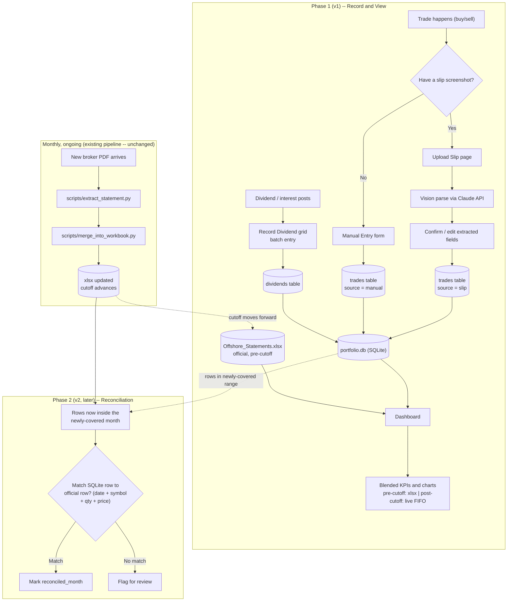
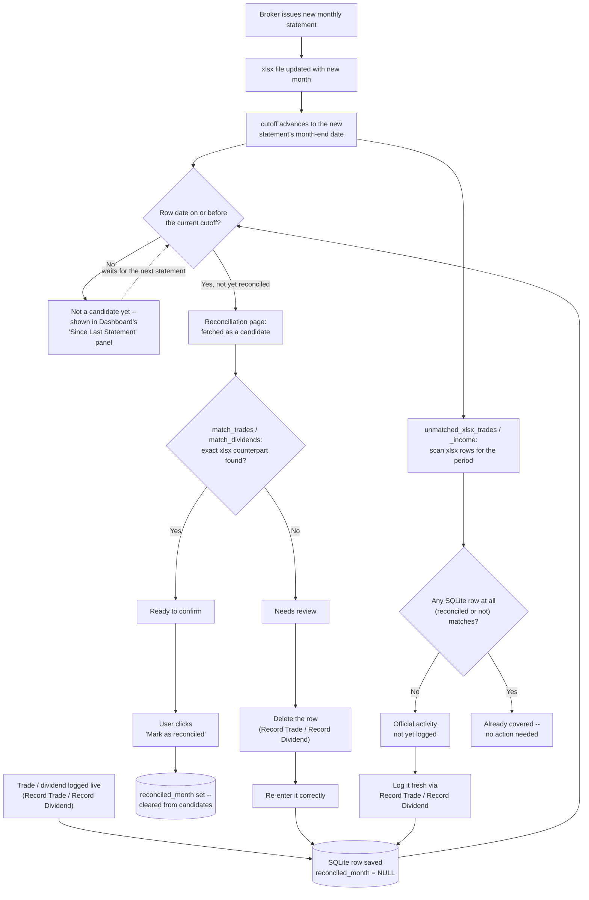

# Roadmap -- build history and design record

The design record for this project's build history: how and why things were
built the way they were, including the real bugs found along the way. See
`CHANGELOG.md` and `docs/METHODOLOGY.md` for the user-facing changelog and
the calculation/methodology detail respectively -- this document is the
process/design side, not the user-facing side.

This file was originally `docs/V1_PLAN.md`, reconstructed as a permanent
record after the live Claude Code plan file (a planning-session artifact
outside this repo, at `~/.claude/plans/`) was overwritten once by a later,
unrelated planning session. **Lesson learned from that incident**: a Claude
Code plan file is not durable -- it gets overwritten the next time Plan Mode
is used for anything else. Every completed build's plan now lives here
instead, permanently. See `CLAUDE.md` for the reminder to keep doing this.

V1, V2, and V2.1 below are **done**. V1 and V2 are merged into `main`;
V2.1 is built and verified on its own branch (`v2.1-allocation-type`, see
`docs/VERSION_CONTROL.md`), pending merge.

## V1: Record Trade and View

### Context

Before this build, portfolio activity was split across three disconnected
surfaces: the Streamlit dashboard (`analyze monthly offshore statement/`,
read-only, refreshed only when a new broker PDF was manually processed), a
hand-maintained Excel workbook where every trade got re-typed across
multiple sheets, and a design prototype (`personal investment portfolio
tool/`) with good trade-entry UX but no data persistence at all. The user
does DCA (recurring small buys) and wanted one web application that both
*shows* portfolio performance and *records* new activity accurately, without
the multi-sheet manual re-entry.

Confirmed through conversation: one unified app, single portfolio (no
multi-user), trade entry supporting **both** slip-image upload (auto-parsed)
and a manual form, dividend entry as a **quick-entry grid** capturing **net
amount only** at the time this was planned (later revised during Step 6 --
see below). Rebalance planning and formal monthly reconciliation against the
official broker PDF were explicitly deferred to a later phase (v2).

### Workflow overview

End-to-end process, phased. Phase 1 (v1) is what got built; Phase 2 (v2) is
a reconciliation loop discussed but deferred, shown here so the full
lifecycle is visible.



### Build steps (all DONE)

```mermaid
flowchart LR
    S1["Step 1<br/>Login gate"] --> S2["Step 2<br/>Storage + seed"]
    S2 --> S3["Step 3<br/>Multi-page shell +<br/>Dashboard blending"]
    S3 --> S4["Step 4<br/>Record Trade:<br/>Manual Entry"]
    S4 --> S45["Step 4.5<br/>Trade traceability +<br/>position visibility"]
    S45 --> S46["Step 4.6<br/>Live sell Realized<br/>P/L preview"]
    S46 --> S5["Step 5<br/>Record Trade:<br/>Upload Slip"]
    S5 --> S55["Step 5.5<br/>Oversell + delete<br/>confirmation"]
    S55 --> S6["Step 6<br/>Record Dividend:<br/>grid + matrix"]
    S6 --> S7["Step 7<br/>Polish +<br/>full regression"]
    S7 --> S8["Bonus<br/>core/ restructure"]
    S8 -.-> V2["v2 (separate round)<br/>Reconciliation, Rebalance"]
```



**Step 1 — Login gate. DONE.** `auth.py` (salted SHA-256, `hmac.compare_digest`)
+ a password gate wrapping `dashboard_app.py` -- nothing renders until it
passes. Validated: wrong password blocks with an error, correct password
reveals the dashboard, a new session requires logging in again. Added a
**Log out** button -- a real gap found during testing.

**Step 2 — Persistent storage + historical seed. DONE.** `db.py` +
`scripts/seed_from_xlsx.py`. Validated against real data: seeded 902 trade
rows and 895 dividend/interest rows, exact match to the xlsx's own counts;
re-running without `--force` correctly no-ops.

**Step 3 — Multi-page shell + Dashboard blending. DONE.** `app_pages/dashboard.py`
(router split out of `dashboard_app.py`), `compute_fifo_realized_pl`/
`blended_realized_pl`/`blended_dividends` added to `calculations.py`.
Validated against real data: with zero live trades logged, blended KPIs
matched the pre-blend values exactly.

**Step 4 — Record Trade: Manual Entry. DONE**, plus two things found
necessary from real testing:
- **Delete** capability for manual/slip-sourced trades, seed rows never
  shown/deletable. Editing a mistake is delete + re-enter, not in-place.
- **Duration-filter bug, found and fixed**: the dashboard's date-range
  filter was capped at the last official statement month, silently
  excluding any live trade/dividend dated after it from KPI calculations.
  Fixed via a `data_end` extended upper bound; Portfolio Value/Unrealized
  P/L/Holdings correctly continue to stay pinned to the last official
  statement regardless.

**Step 4.5 — Trade traceability & position visibility. DONE.** Two gaps
raised from live testing: show *why* a KPI changed (per-trade Realized P/L,
not just an aggregate), and show current holding + average cost for a
symbol while entering a new trade against it. `_run_fifo` factored out as a
shared internal helper so `compute_fifo_realized_pl` and the new
`compute_current_positions` don't duplicate lot-tracking logic. Validated
against real NVDY data: a test sell of 10 shares at $25 (above the $18.54
blended average) correctly showed a **-$6.93** loss, because FIFO drew from
a specific 2024 lot costing $25.69/share.

**Step 4.6 — Live sell Realized P/L preview. DONE.** `estimate_sell_realized_pl()`
simulates a FIFO sell against the current lot book (commission excluded,
not yet known at preview time) and shows it live as Quantity/Price are
typed -- Side/Symbol/Quantity/Price all moved outside `st.form(...)` so
they're reactive. Verified the live preview matches the actual recorded
result exactly (both -$6.93) before commission.

**Step 5 — Record Trade: Upload Slip. DONE.** `slip_parser.py` (Claude
vision, `claude-opus-5`, JSON-schema-constrained structured output) + an
Upload Slip tab in `app_pages/record_trade.py`. Symbol/Side/Quantity/Price
moved to sit above both tabs, shared -- parsing a slip pre-fills them via
`session_state` through an `on_click` callback (writing to a widget's
session_state *after* it's already been instantiated in the same script run
raises `StreamlitAPIException` -- hit and fixed during real testing).
Validated against the real slip images in `labs/`: both parsed exactly
right field-for-field (buy: NVDY, 7.3969607 sh @ $12.14, $0.13 commission,
$0.0092 VAT, Market Order, matching Order ID; sell: PFRL, 14 sh @ $49.28,
$1.04 commission, $0.03 reserved fee, $1.04 rebate -- net commission $0.03
exactly reproducing the slip's own $689.95 Total Credit). Two real bugs
found and fixed: (1) the schema didn't allow `trade_date` to be null, so a
slip with its date section cropped out of frame returned `""` and crashed
`pd.to_datetime()` -- fixed by making it nullable, falling back to today
(editable); (2) numeric prefill fields crashed on `float(None)` for fields a
buy slip genuinely doesn't show -- `prefill.get(key, 0.0)` only substitutes
the default when the key is *missing*, not when it's explicitly `None`, so
switched to `prefill.get(key) or 0.0`.

**Step 5.5 — Oversell confirmation + delete confirmation. DONE.** (1)
Selling more than the current FIFO position holds shows a warning *and*
requires an explicit checkbox (keyed per symbol+quantity, so confirming one
oversell never silently carries over to a different one) before
`render_trade_form` lets the save through -- applies identically to Upload
Slip and Manual Entry, since both call the same function. (2) Deleting a row
in Recent Trades opens a small `st.popover` confirmation ("Delete this
... ?" + a "Yes, delete" button) instead of deleting on the first click.

**Step 6 — Record Dividend: grid + matrix. DONE.** `app_pages/record_dividend.py`
-- entry grid, Recent list (manual-only, matching Record Trade's
convention), Matrix view (full history incl. seed, symbols x months via
`pivot_table` with margins). `db.delete_dividend(id)` added to mirror
`delete_trade`. Changed from the original design based on real usage:
- **Gross Amount + Withholding Tax, not a single Net Amount field.** Dime!'s
  activity feed shows a dividend as two separate line items (e.g. "Dividend
  HDV: 2.45 USD" and "Dividend Withholding Tax HDV: -0.36 USD") which the
  user was previously subtracting by hand in Excel. The grid takes both real
  numbers directly and computes Net = Gross - Withholding silently at save
  time -- deliberately *not* an assumed flat 15%, since Capital Distribution
  rows have no withholding line at all in the real data (confirmed from the
  user's own `labs/dividend receipt.JPEG`). `round(..., 2)` avoids binary
  float noise (2.45-0.36 != 2.09 exactly) leaking into stored data.
- **Symbol is required unless Entry Type is Interest.** A real gap found
  from testing: nothing stopped saving a Dividend row with a blank Symbol.
  Now blocked with a clear per-row error at save time.
- **Symbol autocomplete** via `SelectboxColumn`, sourced from trade history
  (a dividend can't happen before the stock was bought) -- a hard-constrained
  dropdown (no free-text escape hatch in this Streamlit version), unlike
  Record Trade's Symbol field below.
- **Delete-with-confirm**, matching Record Trade's `st.popover` pattern.

Also revisited on **Record Trade** while working through the same request:
- **Symbol** changed from `st.text_input` to `st.selectbox(..., accept_new_options=True)`
  -- sourced from trade history too, but *with* a free-text escape hatch
  (unavailable on the grid's `SelectboxColumn`), so a genuinely new symbol
  can still be typed.
- **Quantity/Executed Price and all four fee fields** default to blank
  (`value=None` + placeholder) instead of a pre-filled "0.0000" -- typing a
  real value no longer requires backspacing the default first. A parsed
  slip's real prefilled values (even a genuine $0.00) still show pre-filled,
  since those are meant to be reviewed, not retyped.

**Step 7 — Polish + full regression. DONE.** `requirements.txt` created
(pins streamlit, pandas, openpyxl, plotly, anthropic, pdfplumber, pytest);
`docs/METHODOLOGY.md` extended with the FIFO/blending and Record
Trade/Record Dividend methodology sections; `CHANGELOG.md` extended; full
`pytest` suite green; manual walkthrough covered piecemeal across the whole
build via live user testing rather than one final cold pass, plus a direct
SQLite persistence check (confirmed real entries survived ~16+ server
restarts across the session).

**Bonus, post-Step-7 — `core/` restructure.** Grouped `auth.py`,
`calculations.py`, `db.py`, `slip_parser.py` into a `core/` package (with
`dashboard_app.py` staying at the root as the Streamlit entry point);
untracked a generated audit-report artifact (`scripts/full_history_check.json`);
removed two stale log files. Surfaced two real, unrelated latent bugs via
post-move testing (not caused by the move's import-line changes themselves):
- `db.py`'s `DB_PATH` was computed relative to its own file location, which
  silently pointed at a *new, empty* database once `db.py` moved a directory
  deeper -- the app was reading/writing `core/data/portfolio.db` for one
  restart cycle before this was caught and fixed. No real data was lost
  (`data/portfolio.db` was never touched). Fixed by resolving from a proper
  `PROJECT_ROOT` two levels up; added a regression test.
- `compute_fifo_realized_pl`'s output columns (all of them, not just `id`)
  come back as `dtype=object` when there are zero realized rows, because
  `pd.DataFrame([], columns=[...])` can't infer types from no data -- this
  is what actually caused both the reported merge error and the `.dt`
  accessor crash (both were downstream symptoms of the empty-decoy-database
  bug above, not independent issues). `id` is now explicitly cast to
  `float64` regardless, since a genuinely empty result (e.g. an account with
  no sells yet) is a real, reachable state worth being robust to.

### Storage schema

SQLite file: `data/portfolio.db` (`core/db.py`, no Streamlit import, every
function accepts an optional injected `conn` for testing).

```sql
CREATE TABLE trades (
    id            INTEGER PRIMARY KEY AUTOINCREMENT,
    trade_date    TEXT NOT NULL,                        -- ISO 'YYYY-MM-DD'
    entry_type    TEXT NOT NULL DEFAULT 'Trade Entry',
    side          TEXT,                                   -- 'buy' | 'sell'
    symbol        TEXT NOT NULL,
    description   TEXT,
    quantity      REAL NOT NULL,                          -- SIGNED: +buy, -sell
    price         REAL,
    amount        REAL,                                   -- SIGNED gross (qty*price)
    commission    REAL,                                   -- NET fee total
    vat           REAL, reserved_fee REAL, fee_rebate REAL,
    order_id      TEXT, order_type TEXT,
    source        TEXT NOT NULL DEFAULT 'manual',          -- 'seed' | 'manual' | 'slip'
    reconciled_month TEXT,                                 -- set by V2 Reconciliation, see below
    notes         TEXT,
    created_at    TEXT NOT NULL DEFAULT (datetime('now'))
);

CREATE TABLE dividends (
    id          INTEGER PRIMARY KEY AUTOINCREMENT,
    trade_date  TEXT NOT NULL,
    symbol      TEXT,                                     -- NULL for Interest rows
    entry_type  TEXT NOT NULL CHECK(entry_type IN ('Dividend','Interest','Capital Distribution')),
    net_amount  REAL NOT NULL,
    source      TEXT NOT NULL DEFAULT 'manual',            -- 'seed' | 'manual'
    reconciled_month TEXT,                                 -- set by V2 Reconciliation, see below
    notes       TEXT,
    created_at  TEXT NOT NULL DEFAULT (datetime('now'))
);
```

### Average-cost vs. FIFO -- decision

`compute_realized_pl` stays **untouched** for the frozen historical xlsx
data (already audited, documented, reconciled -- don't move numbers that
have already been checked). `compute_fifo_realized_pl` is used for
everything flowing through SQLite (seed + live), since per-trade
granularity now exists to track specific lots the way the broker actually
does. See `docs/METHODOLOGY.md` for the full writeup, including why a sell
above average cost can still realize a loss.

### File/module structure (as of end of V1)

```
analyze monthly offshore statement/
├── dashboard_app.py          # thin router (st.navigation) -- entry point, stays at root
├── core/                     # added post-Step-7 (see "Bonus" above)
│   ├── __init__.py
│   ├── auth.py                 # password hash/verify, no streamlit import
│   ├── calculations.py         # FIFO + average-cost realized P/L, blending, ROI
│   ├── db.py                   # SQLite schema, CRUD, no streamlit import
│   └── slip_parser.py          # Claude vision call + field mapping, no streamlit import
├── app_pages/
│   ├── dashboard.py
│   ├── record_trade.py
│   └── record_dividend.py
├── data/
│   ├── Offshore_Statements_2023-01_to_2026-06.xlsx   # unchanged, official source
│   └── portfolio.db
├── scripts/
│   └── seed_from_xlsx.py       # one-time import of xlsx Transactions/Income into SQLite
├── tests/
│   ├── test_calculations.py
│   ├── test_db.py
│   ├── test_slip_parser.py     # never touches the real API -- injected fake client
│   └── test_auth.py
├── requirements.txt
├── .streamlit/secrets.toml     # ANTHROPIC_API_KEY, APP_PASSWORD_SALT, APP_PASSWORD_HASH (gitignored)
└── docs/
    ├── METHODOLOGY.md          # calculation/KPI reasoning
    └── ROADMAP.md               # this file (then named V1_PLAN.md)
```

See "V2: Reconciliation" below for what was added on top of this structure.

## V2: Reconciliation

### Context

V1 (above) blends two sources at a `cutoff` date: the audited xlsx statement
for anything `<= cutoff`, live SQLite FIFO for anything after. Each time the
xlsx gets manually updated with a new month (that update process itself is
unchanged and out of scope here), the cutoff advances, and some SQLite rows
that were previously "live/after cutoff" now fall inside the newly-official
period. This feature verifies each such row actually matches an official
xlsx row -- proving the live entry was accurate -- and marks it via the
`reconciled_month` column (present in both `trades` and `dividends` schemas
since Step 2, but never read or written by any code until now). Rows that
don't match get flagged for manual review instead of silently ignored.

Scope: self-contained to matching SQLite against whatever xlsx is currently
live -- **does not** touch `scripts/reconcile.py` or
`scripts/merge_into_workbook.py` (both confirmed broken/one-off during
research, a separate concern). Shipped as a new **Reconciliation** page
under a new "Tools" nav section, filling the placeholder left in V1's
`dashboard_app.py`.

### Research findings (verified against real data, not assumed)

- **No unique ID exists on the xlsx side for trades.** The only usable key
  is `(Trade Date, Symbol, Quantity, Price)` -- empirically unique across
  all 902 historical rows, but same-day/same-symbol/same-price legs with
  *different* quantities are real (whole-share + fractional-share fills), so
  treat this as best-effort 1:1 pairing per `(date, symbol)` bucket, not a
  guaranteed lookup. **Exact match only, no fuzzy/tolerance matching** --
  except two *bounded* precision alignments that are really "match what the
  UI can produce," not fuzziness: round Quantity to 6dp (Record Trade's
  `number_input` format caps entry there; xlsx carries up to 9dp) and Price
  to 4dp before comparing.
- **Every real xlsx dividend is two Income rows** sharing `(Trade Date,
  Symbol)` -- a `Dividends` row (gross) and a `Div. Adj(NRA Withheld)` row
  (tax, negative). Must match against the **grouped sum**, exactly mirroring
  `scripts/seed_from_xlsx.py::build_dividend_rows()`. Round `Net Amt` to 2dp
  on both sides (unrounded float noise already sits in seeded data).
- **Interest correction**: real xlsx `Credit/Margin Interest` rows *do* have
  a real Symbol (e.g. `SHV`, `SGOV`) -- but `seed_from_xlsx.py` hardcodes
  `symbol=None` on the SQLite side regardless. Interest matching must ignore
  the xlsx Symbol column entirely and key on `(Trade Date, round(Net Amt,2))`
  only, mirroring the seed script's actual behavior, not the literal xlsx
  data. Same-day multi-symbol interest postings are real (e.g. `2024-04-05`:
  SGOV 0.14 + SHV 0.72, two separate un-summed SQLite rows) -- pair
  positionally, don't group/sum.
- **Entry-type vocabulary is never normalized** between xlsx (`Dividends`/
  `Div. Adj(NRA Withheld)`/`Credit/Margin Interest`) and SQLite (`Dividend`/
  `Interest`/`Capital Distribution`, CHECK-constrained) -- match dividends on
  `(date, symbol, amount)` only, never on entry_type, per the same
  "widen filters at the consumption site" convention
  `calculations.py::blended_dividends` already documents.
- **`pd.merge` treats NaN as equal on join keys** -- relevant because one
  real seed trade (a rights distribution) has `Price=NaN` on both sides.
  Verified working correctly with no special-casing.
- **First run surfaces the full history, not a trickle**: `reconciled_month`
  had never been written before this feature, so the first run found all
  902/902 trades and 895/895 dividend+interest rows unreconciled. The UI is
  designed for "confirm ~900 rows grouped by month," not "review a handful."

### Implementation

**`core/reconciliation.py`** -- pure logic, no Streamlit import, no `conn`
param (DataFrame-in/DataFrame-out except the xlsx loader):

- `load_xlsx_for_reconciliation(path)` -- loads Summary/Transactions/Income,
  parses Trade Date, computes `cutoff` the same way `app_pages/dashboard.py`
  does inline (`Summary["Month"].max() + MonthEnd(0)`) -- a second
  independent loader, same precedent as `seed_from_xlsx.py`'s own loader.
- `_pair_1to1(left, right, key_cols)` -- generic duplicate-safe 1:1 pairing
  via a shared `groupby(..., dropna=False).cumcount()` rank folded into the
  join key, used by every matcher below so a duplicate on one side without a
  duplicate counterpart on the other is correctly left unmatched rather than
  fanning out to match twice. `dropna=False` matters: a NaN-valued key
  column (the rights-distribution Price) still needs a real per-row rank,
  not every NaN-key row collapsing into one group.
- `match_trades(sqlite_trades, xlsx_transactions)` -- key: exact
  `(Trade Date, Symbol, round(Quantity,6), round(Price,4))`. xlsx side
  filtered to `Symbol.notna()` first.
- `match_dividend_rows` / `match_interest_rows` / `match_dividends` -- the
  non-Interest and Interest-only matchers described in Research findings
  above, concatenated by `match_dividends` (`entry_type` is a strict
  two-way partition, covers every input row once).
- `unmatched_xlsx_trades` / `unmatched_xlsx_income` -- the reverse
  direction: xlsx rows with no SQLite counterpart at all (official activity
  never logged). Both take the **full** trades/dividends table, not just
  unreconciled candidates -- otherwise a row a prior run already reconciled
  looks like a fresh gap. `since` optionally scopes to `Trade Date >= since`
  for speed.

**`core/db.py`** additions -- `fetch_unreconciled_trades`/`_dividends`
(candidates: `<= cutoff` and `reconciled_month IS NULL`),
`mark_reconciled`/`_bulk` (`table` validated against a fixed allowlist since
table names can't be parameterized via `?`; `month` is the xlsx statement
month the row matched against, not the cutoff date; bulk version is one
transaction, executemany + single commit, rollback on failure).

**`app_pages/reconciliation.py`** -- new page, five things on it:

1. Title + caption stating the cutoff date and what it means.
2. Fetches candidates, runs `match_trades`/`match_dividends` against the
   loaded xlsx.
3. **"Ready to confirm"** (matched rows) -- `st.metric` totals, grouped by
   `xlsx_month` into `st.expander`s (required at ~900-row first-run scale),
   a "Mark all N as reconciled" button behind an `st.popover` confirm, plus
   a smaller per-month "Mark just this month" button for steady-state use.
4. **"Needs review"** (unmatched SQLite rows) -- plain read-only table, no
   action buttons. Fix path is delete-and-re-enter in Record
   Trade/Record Dividend, matching this app's established
   mistake-correction model (see "Deferred / future" below for one gap this
   surfaced).
5. **"Official activity not yet logged"** (unmatched xlsx rows) -- defaults
   to the newest statement month only for speed, checkbox to scan full
   history. Read-only, informational. Arguably the highest-value check in
   the whole feature, since a never-logged entry has no other surface in
   the app that would ever mention it.

Nav wiring in `dashboard_app.py`: the "Tools" section placeholder left in V1
became `"Tools": [st.Page("app_pages/reconciliation.py", title="Reconciliation")]`.

### Edge cases (all explicitly handled)

| Case | Handling |
|---|---|
| Row never matched | Left-joins preserve every input row; unmatched ones surface with a `reason`, never dropped |
| Duplicate entries on either side | `_pair_1to1`'s per-key rank enforces strict 1:1; excess duplicates flagged unmatched |
| Already-reconciled rows reprocessed | Prevented structurally by the `reconciled_month IS NULL` filter in `fetch_unreconciled_*` |
| Capital Distribution (no xlsx vocabulary) | Matched on (date, symbol, amount) only, entry_type never part of the key |
| Interest Symbol mismatch | xlsx Symbol ignored entirely, matches seed script's actual (not literal-data) behavior |
| Same-day multi-symbol interest | Positional pairing, not grouped/summed |
| First-run ~900-row backlog | Grouped-by-month UI + bulk action, designed for from the start |
| Unmatched-xlsx false positives | `unmatched_xlsx_*` require the *full* table, not unreconciled-only candidates |
| Float precision | Quantity 6dp / Price 4dp (matches UI input ceilings) / dividend amounts 2dp |
| NaN price (rights distribution) | Works via `pd.merge`'s NaN-equality |

### Operational notes -- database/Excel effects and the cutoff relationship

**Effect on database vs. Excel**: the only function in this feature that
writes anything is `mark_reconciled_bulk()`, and it only ever sets
`reconciled_month` on existing rows -- never deletes a row or changes any
financial figure. The xlsx is never written to, under any button, ever --
every function only reads it. The write goes straight to the SQLite file on
disk (not session state), so it survives page refresh/`st.rerun()`/server
restart; only an explicit `reconciled_month = NULL` update or a restored
file backup undoes it.

**Relation between `cutoff` and reconciliation**: the Dashboard blends at
`cutoff` (`<= cutoff` = official xlsx figures, `> cutoff` = live SQLite data
in the "Since Last Statement" panel). Reconciliation only ever looks at
`<= cutoff` rows not yet reconciled. Rows in "Since Last Statement" are
**not** reconciliation candidates yet -- they only become candidates once
the xlsx is updated with a new statement and `cutoff` advances past their
date. This is also why the first-ever run has a large backlog:
`reconciled_month` was never written before this feature existed, so all
seeded history through the cutoff counted as "unverified" even though it
was correct. Going forward, each new statement only adds the small batch
logged live since the previous one.

**If a reviewed row turns out to be wrong**: this app has no in-place edit,
by design -- the fix is always delete-then-re-enter on the page that owns
it (Record Trade for trades, Record Dividend for dividends/interest,
"Recent list" view). `reconciled_month` does not lock or protect a row from
that delete button.

### Reconciliation flow diagram



### Testing

`tests/test_reconciliation.py` -- synthetic-DataFrame style matching
`tests/test_calculations.py`: exact-match happy path, no-match, price/
quantity mismatch (no tolerance), same-day different-quantity legs, duplicate
handling, `Symbol.notna()` filtering, 6dp/4dp precision, NaN-price
regression, grouped dividend sum matching, Capital Distribution vocabulary
mismatch, interest ignoring xlsx Symbol, same-day multi-interest positional
pairing, unmatched-xlsx-row detection, already-reconciled rows not
re-flagged, `since` filtering. Plus `tests/test_db.py` additions for
`fetch_unreconciled_*`/`mark_reconciled*`.

### Verification (results from the real first run)

Against the real `data/portfolio.db`/xlsx: **902/902 trades and 895/895
dividend+interest rows matched**, 0 rows needing review, 0 gaps found --
confirming the audited xlsx and the live-logged data had agreed the whole
time. All four app pages (Dashboard, Record Trade, Record Dividend,
Reconciliation) verified via Streamlit's `AppTest` headless harness with no
exceptions. Full test suite: 140/140 passing.

Matching definitions were independently cross-checked against this
account's real Dime! slip/receipt screenshots in `labs/` (a buy
confirmation, a sell confirmation, a dividend activity receipt) --
confirmed the Gross/Withholding split, the fee-netting formula, and the
whole-share/fractional-share leg pattern all match exactly what this
feature expects.

## V2.1: Symbol Allocation Type

### Context

The user manually tracks two parallel portfolios in a personal Excel
workbook (`labs/วางแผนการเงิน_Financial Planning v1.0 (20260706bk).xlsx`): a
`4.2.dividend (chaii)` sheet (income-focused holdings -- bond ETFs,
covered-call ETFs: SHV, SGOV, VRIG, PFRL, ICLO, FLTR, JAAA, GOOY, QYLD,
KLIP, RYLD) and a `4.2.growth (chaii)` sheet (capital-appreciation stocks:
KO, PLTR, TSM, ARM, NDAQ, RKLB, AIQ, and others). A symbol lives in exactly
one sheet -- that sheet membership *is* the allocation type. A third sheet
(`4.4.sum (chaii)`) computes a full target-allocation tracker on top of
this tagging (e.g. Dividend 87.1% actual vs. 80% target) -- that's the
**Rebalance planner** already named-but-deferred below; this version is
just the tagging foundation it will eventually need.

Scoped, through conversation, to exactly three things: **just the tagging**
(no target-%/rebalance math yet), **one tag per symbol** (not per trade --
matches how the Excel sheets themselves work), and **three buckets --
Dividend, Growth, Others** -- where Others is a catch-all default so no
symbol is ever left in a blank/ambiguous state, not a real target-allocation
type itself. Also decided on a **two-track classification** flow: a
one-time bulk catch-up page for symbols that already existed before this
shipped, plus an inline field in Record Trade that only fires on a symbol's
very first-ever trade going forward -- confirmed against real prior art
(`personal investment portfolio tool/NOTES.md`'s "Record box," which has a
Portfolio (Dividend/Growth) field right in trade entry).

### Data model

```sql
CREATE TABLE symbol_types (
    symbol           TEXT PRIMARY KEY,
    allocation_type  TEXT NOT NULL CHECK(allocation_type IN ('Dividend', 'Growth')),
    updated_at       TEXT NOT NULL DEFAULT (datetime('now'))
);
```

No stored "Others" value -- the CHECK constraint only allows the two
*actively chosen* types; absence of a row means "Others," mirroring how
`reconciled_month IS NULL` already means "not yet reconciled" elsewhere in
this schema. Full coverage (every symbol always shows a type, never blank)
is guaranteed at **fetch time** by `db.fetch_symbol_types()`, not by
writing a row for every symbol: it starts from every distinct symbol in
`trades` (not just tagged ones), left-joins `symbol_types`, and fills
missing rows with `"Others"`. This keeps the table small while still
satisfying "every stock always has a visible bucket" -- see
`docs/DATA_MODEL.md` for the full column reference.

### Implementation

**`core/db.py`**: `set_symbol_type`/`clear_symbol_type`/`fetch_symbol_types`
(described above), plus `TestSymbolTypes` in `tests/test_db.py` (9 tests,
including a regression for a fully-sold-out symbol still appearing in the
fetch -- real and common, not hypothetical: 44 of 96 traded symbols today
have net zero position).

**`app_pages/allocation_type.py`** (new page, under Tools nav alongside
Reconciliation): a metric ("N of M symbols still in Others"), a type filter
(`st.radio`: All/Others/Dividend/Growth) with a "Showing N of M" row count,
and a `st.data_editor` grid with two independent input paths -- bulk
checkbox-select + "Set N selected to Dividend/Growth/Others" buttons
(applied immediately), or edit a row's dropdown directly + "Save dropdown
changes" (diffs against prior state, only writes actual changes). The bulk
buttons were added after the first version shipped, in response to real
usage feedback that one-row-at-a-time dropdown editing was too slow for a
~96-symbol backlog.

**`app_pages/record_trade.py`**: `is_new_symbol = bool(symbol) and symbol
not in known_symbols`, computed right after the outer Symbol widget (the
same `known_symbols` list that already drives the Symbol autocomplete --
no new query needed). When true, an `Allocation Type` selectbox appears
(keyed by symbol, so a stale selection can't carry over to a different new
symbol before submitting), defaulting to Others. On save, calls
`db.set_symbol_type(symbol, allocation_type)` only if `is_new_symbol` and a
real choice was made -- leaving it at Others is a no-op, already the
default.

**`app_pages/dashboard.py`**: `symbol_types`/`symbol_type_map` fetched once
near the top (shared per-symbol aggregates section), merged into `by_symbol`
as a new `Allocation Type` display column, plus a Dividend/Growth/Others
`st.metric` row (Market Value + % of holdings) under the existing "Current
Allocation" pie chart -- grouped the same way that chart's data already
supports, just by allocation type instead of by symbol.

### Testing and verification

`tests/test_db.py`'s `TestSymbolTypes`: upsert behavior, the CHECK
constraint rejecting both invalid strings and `"Others"` itself as a stored
value, `clear_symbol_type` removing a row (unknown symbol = no-op), full
coverage including a fully-sold-out symbol, and an empty-database edge case
(caught a real bug -- see below). Full suite: 149/149 passing (9 new).

Verified against real data at every step:
- `fetch_symbol_types()` against the real `data/portfolio.db`: exactly 96
  symbols, all "Others" before any tagging, including sold-out spot-check
  symbols (AEE, BWB, CIBR).
- Allocation Type page: `AppTest` confirms it renders with no exception
  (96 of 96 symbols shown); `AppTest` doesn't support driving `st.data_editor`
  interactively, so the edit-and-save click-through was verified live in the
  browser instead (same pattern as Reconciliation's "Mark all" button).
- Record Trade: `AppTest` confirms the field appears for a genuinely new
  symbol (options `Others`/`Dividend`/`Growth`, default Others) and is
  absent for an existing one -- both directions checked. The full
  save-and-persist round trip hit an `AppTest` limitation (a
  `st.selectbox(accept_new_options=True)` pre-seeded with an out-of-`options`
  value resets to `None` on a second `.run()` call) and was deferred to a
  real-browser check with a throwaway symbol.
- Dashboard: By Symbol table has zero blank/NaN Allocation Type values
  across 95 rows (43 Dividend / 29 Growth / 23 Others after live tagging);
  the value-weighted metric row (88.2% / 11.0% / 0.7%) closely tracks the
  real Excel's own 87.1%/12.9% actual split.
- All 5 pages (Dashboard, Record Trade, Record Dividend, Reconciliation,
  Allocation Type) smoke-tested clean via `AppTest` in one final pass.

**Bug found and fixed**: `pd.DataFrame({"Symbol": []})` built from a plain
empty Python list defaults to `float64` dtype, not `object` -- broke the
merge against `symbol_types`' object-dtype `Symbol` column on an empty
database. Fixed by explicitly constructing `pd.Series(..., dtype="object")`
-- the same empty-collection dtype pitfall already hit twice elsewhere in
this project (see `compute_fifo_realized_pl`'s `id` column, V1's "Bonus"
section above).

## V2.2: Monitor Stocks

### Context

The user wanted one table showing every currently-held symbol, filterable
by Allocation Type (Dividend/Growth/Others, from v2.1), enriched with
**live market data** -- replacing the manual process from their Excel
workbook, where "live" price/change columns were actually frozen
`GOOGLEFINANCE()` values (Excel can't execute Google Sheets functions) plus
HTML-scraping of finviz.com/stockanalysis.com for supplementary fields,
several already broken (`"Loading..."` literal values) in the user's own
source spreadsheet -- the reason a proper free market-data library was used
instead of replicating either approach.

Scoped through conversation: **current holdings only** (not every symbol
ever traded -- a live-price monitor is for what's actually owned today),
and an **incremental column rollout** -- rather than build every column at
once, each addition below was tested with real data and shown in chat
*before* being implemented, then verified against real holdings afterward.
That request-by-request pattern is why this section reads as a sequence of
small, independently-motivated additions rather than one upfront design.

### Data source decision: `yfinance`

Google Finance has no server-usable API outside the Sheets-only
`GOOGLEFINANCE()` formula. Scraping is proven fragile (already broken in
the user's own data). `yfinance` (unofficial Yahoo Finance wrapper, free,
no API key) is the standard Python choice for this. First non-Claude
external network call in this project -- `yfinance==1.5.2` pinned in
`requirements.txt`.

**Market price is kept in-memory only** (`@st.cache_data(ttl=300)`), never
persisted to `data/portfolio.db` -- every other table in that database
holds data the user actually owns/entered; a `market_data` table would be
the first one holding a third party's cached data, and a "monitor" should
show what's fresh (within the TTL) or visibly being refetched, not a
number that's silently stale after a restart.

### Implementation

**`core/market_data.py`** (new module, no Streamlit import, mirrors
`slip_parser.py`'s dependency-injection test pattern -- `yf_module` can be
swapped for a fake in tests). `fetch_stock_profile(symbols)` batches, per
symbol, inside one `try`/`except` so a bad symbol never aborts the batch:

- **Description, Sector/Industry, Beta, Quote Type** from yfinance's
  `info` dict, plus **daily closes over the trailing 90 calendar days**
  (`History90D`) for the sparkline and as the latest-close price source
  (yfinance's `currentPrice`/`regularMarketPrice` fields were found
  inconsistent across symbol types during feasibility testing -- present
  for an equity, `None` for a short-duration bond ETF).
- **Explicit `start`/`end` dates, not `period="90d"`** -- confirmed by
  direct comparison that the shorthand returns 90 *trading* days (~131
  calendar days), silently diverging from the user's own reference formula
  (`GOOGLEFINANCE(symbol,"Price",TODAY()-90,TODAY())`, calendar-day
  arithmetic). A regression test asserts the requested span is exactly 91
  days (90 back + 1, since `end` is exclusive).
- **ETF fallbacks for two equity-only concepts**, same shape both times --
  yfinance leaves a field blank for funds, but a fund-appropriate field
  exists in the same `info` dict:
  - Sector/Industry blank for 28 of 52 real holdings (almost all ETFs) ->
    fall back to `fundFamily`/`category` (issuer / Morningstar-style fund
    classification) when the equity field is blank.
  - Beta (`beta`, Yahoo's 5-year-monthly figure) blank for 29 of 52 ->
    fall back to `beta3Year` (the 3-year-monthly figure funds are
    conventionally reported under) -- confirmed to exactly match
    finviz.com's own displayed ETF Beta for a real holding (SHV: 0.01 both
    ways). Confirmed no equity ever has `beta3Year` populated, so the
    fallback can't override a real equity beta.
- **Dividends**: yfinance's `dividendRate`/`trailingAnnualDividendRate`
  fields are blank/`$0.00` for ETFs despite real payouts (confirmed: SHV,
  SCHD). Fixed differently from the fallbacks above -- computed directly
  from `Ticker.dividends` (the actual per-share payout history with real
  dates), summed over the trailing 365 calendar days, which works for both
  equities and ETFs. Returns `Dividend Per Year` ($/share), `Dividend
  Yield %` (`= Dividend Per Year / Latest Price * 100`, computed here
  rather than using yfinance's own `dividendYield` field since that one
  doesn't always reconcile exactly to price/share), and `Dividend
  Frequency` (a label from the trailing payout count: 0->None,
  1->Annual, 2->Semi-Annual, 4->Quarterly, 12->Monthly, else->"Irregular
  (N/yr)"). A non-payer (confirmed real: ARM) gets `0.0`/`0.0`/"None" --
  valid data, distinct from an unresolvable symbol's NaN/NaN/None.

**`app_pages/monitor_stocks.py`** (new page, under **Overview** nav
alongside Dashboard -- it's a read-only view, not data entry or a
maintenance tool). Merges `calculations.compute_current_positions()`
(already excludes sold-out symbols) + `db.fetch_symbol_types()` (renamed
`Category` on this page) + a `@st.cache_data(ttl=300)`-wrapped
`fetch_stock_profile()`, with a **Refresh now** button that clears the
cache on demand and a **Last refreshed** timestamp (`dd/mm/yyyy HH:MM`,
captured inside the cached function at cache-miss time, not recomputed
every rerun).

Page-level computed columns (all derived, not fetched -- built from the
merged frame since they need `Quantity` from `compute_current_positions()`
alongside `Latest Price` from the profile fetch):
- **Total Market Value / Unrealized / Unrealized %** -- `Quantity x Latest
  Price`; `Position Value - Cost Basis`; the % version guarded against
  `Cost Basis > 0` (NaN otherwise, not a divide-by-zero crash).
- **Weight % / Category Weight %** -- share of the whole portfolio vs.
  share of just the symbol's own Dividend/Growth/Others group.
- **Expected Div per Year/Month** -- `Total Market Value x (Dividend
  Yield % / 100) x 0.85`, net of the 15% Thai (NRA) withholding tax
  (`WITHHOLDING_TAX_RATE`), matching how Dashboard's own Dividends KPI is
  already net (there because the broker's recorded amount already is;
  here applied explicitly since yfinance's yield is gross). `% Div per
  Year` itself stays gross -- a fund's advertised yield is conventionally
  quoted pre-tax. A permanent `help=` tooltip on every tax-adjusted figure
  states the deduction, not just a mention in the page caption.
- **Div Return Contribution %** -- applies the user-supplied Portfolio
  Return formula (`Sigma(wi x ri)`) to dividends: `wi` = `Category Weight
  %`, `ri` = `Dividend Yield %`, net of tax. Summing this column within
  one category reproduces that category's blended yield exactly (proven
  algebraically and confirmed real: 8.3564% both ways for the Dividend
  category).
- **Category Summary** -- a KPI-card row (`st.metric`, matching
  Dashboard's own visual style) per category (All/Others/Dividend/Growth):
  Holdings (count), Total Cost, Total Market Value (delta: % of
  portfolio), Unrealized % (delta: $ amount), Total Div/Yr, Total Div/Mth,
  Expected Div Return %. A real correctness bug was found and fixed here:
  Total Cost sums *every* symbol (Cost Basis is always known, sourced
  from live trade history, never from yfinance), but Total Market
  Value/Unrealized/Total Div/Yr sum **resolved symbols only** -- pairing
  Unrealized %'s numerator and denominator from that same resolved-only
  subset is what avoids a nonsensical **-100%** for a category holding
  only one unresolvable symbol (naively dividing $0 resolved value by the
  all-symbol cost). A caption lists any excluded symbols by name when
  nonzero.
- Two **pie charts** (top-10-plus-"Other" grouping, shared
  `_grouped_pie()` helper): by Symbol, and by a blended Classification
  (Sector for equities, Asset Class for ETFs/unresolved symbols).

**Column labels/order** were abbreviated and reordered per the user's own
annotated proposal once the table reached 21 columns (Symbol, Desc., Cat.,
90D Trend, Asset Class, Port. Group, Weight %, Cat. Weight %, Shares,
Cost/Sh, Mkt. Price, Tot. Cost, Tot. Mkt., Unreal., Unreal. %, Div Yield
%, Freq., Expt. Div/Yr, Expt. Div/Mth, Beta, Div Contrib %) -- full names
kept as hover tooltips on every column so nothing is lost.

### Testing and verification

`tests/test_market_data.py`: 16 tests, injected `FakeYfModule`/`FakeTicker`
doubles (happy path, ETF Sector/Beta fallback + equity-not-overridden
pairs, dividend happy path + 365-day-window exclusion + non-payer,
90-calendar-day regression, unresolvable symbol, exception mid-fetch,
empty history, empty symbol list). Full suite: **164/164 passing**.

Verified against all 52 real current holdings at every step (not just the
first pass) -- ETF fallback coverage (Sector/Industry blank dropped from
28 to 1 of 52; Beta blank dropped from 29 to 2 of 52, the remainder
genuinely missing in both fields), the 90-day window fix (61 rows per
symbol instead of the previous ~90), and every derived column
cross-checked by reconstructing it independently (e.g. `Quantity x Avg
Cost == Cost Basis` for all 52 rows; `Expected Div per Year` for two real
holdings, CLOZ and SHV, reproduced by hand in chat before implementing and
matched exactly afterward: $64.26 and $216.13 net of tax). One live check
caught a real, naturally-occurring second failure mode: a transient Yahoo
timeseries error for a *different* symbol (HDV) than the already-known
unresolvable one, confirming the resolved/unresolved split handles an
arbitrary, changing set of failures, not just the one case already known
about. `AppTest` smoke-tested clean throughout; all 6 pages (Dashboard,
Monitor Stocks, Record Trade, Record Dividend, Reconciliation, Allocation
Type) verified together in a final pass.

**Considered and explicitly deferred**: an externally-sourced "Unified
Portfolio Category" proposal (5-6 functional buckets like Growth Equity/
Fixed Income/Cash Equivalents) -- flagged two concerns before declining to
bundle it in: its own example table referenced a symbol that doesn't match
any real holding (suggesting it wasn't checked against real portfolio
data, unlike everything else in this section), and it would be a *third*
classification axis requiring the same scale of build as v2.1's Allocation
Type (new table, new tagging page). Not rejected -- deferred to its own
properly-scoped pass later if wanted.

## Deferred / future

- **Rebalance planner** -- the dividend-reinvestment/rebalance screen from
  `personal investment portfolio tool/NOTES.md` is good prior art. V2.1
  above builds the tagging foundation (Dividend/Growth per symbol) it
  needs; the target-%/actual-% math and delta indicator itself (like the
  Excel workbook's `4.4.sum` sheet) is still not designed.
- Specific-lot *selection* on sell (FIFO-only today). (Live market-price
  feed for mark-to-market -- the other half of this deferred item -- is
  now done, see V2.2 above; it's scoped to Monitor Stocks only, not yet
  wired into Dashboard's own Portfolio Value/Unrealized P/L KPIs, which
  still stay pinned to the last official statement by design.)
- **Unified Portfolio Category** -- see V2.2's "Considered and explicitly
  deferred" note above.
- **Record Dividend's Recent list is capped at `.head(20)`** -- an old
  flagged row from Reconciliation's "Needs review" section might not be
  reachable to delete there. Noted during V2 Step 6 testing, not fixed.
- **Seed rows (`source='seed'`) have no delete path** -- both Record
  Trade's and Record Dividend's Recent lists only show `source='manual'`
  rows, by design (protects seeded historical data from accidental
  deletion) -- but this means a wrong seed row can't currently be corrected
  through either page's UI. Noted during V2 testing, not fixed.
