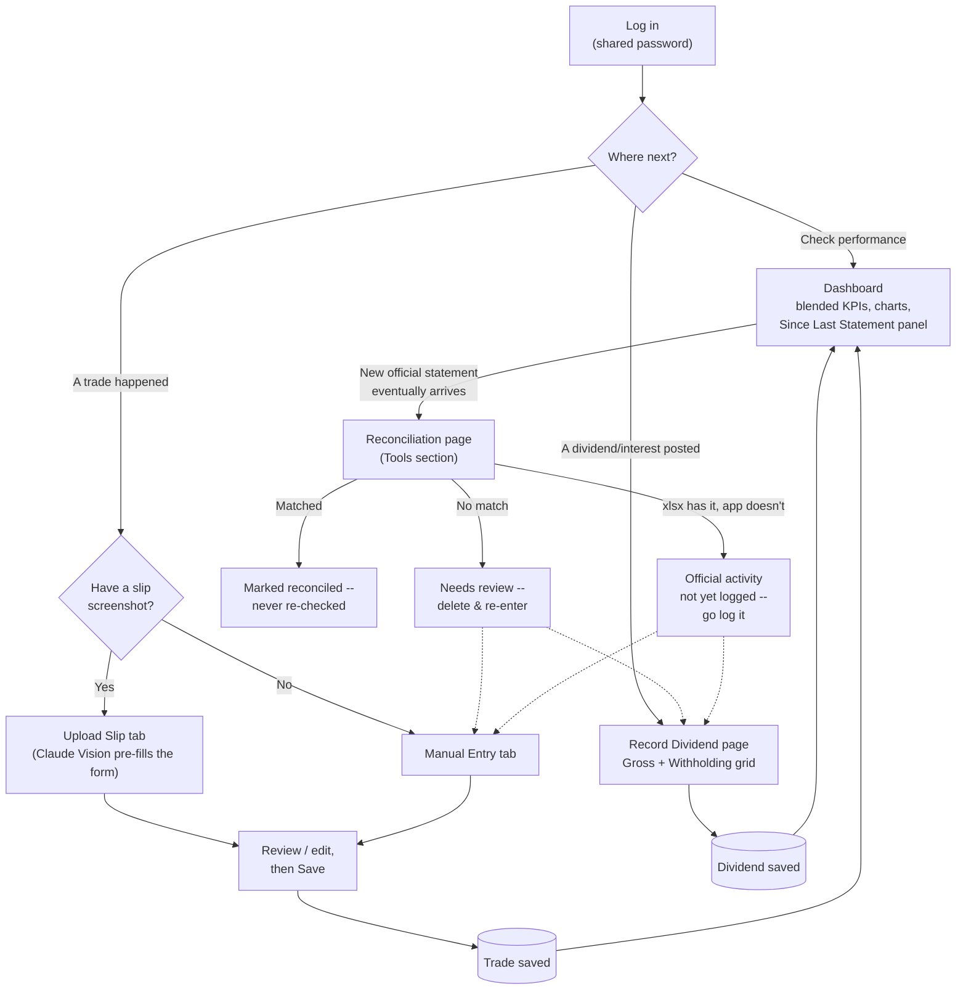

# User / business flow

The whole app's user journey, from the login gate through to the
reconciliation loop it eventually feeds into. This is the outer loop;
`docs/ROADMAP.md`'s V2 section has a narrower diagram focused just on the
Reconciliation page's own internal logic.

## Notes

- **Login** is a single shared password, not per-user accounts -- this is a
  single-portfolio, single-user app by design (see `docs/ROADMAP.md`'s V1
  context).
- **Dashboard** is the default landing page and the only one most sessions
  actually need -- Record Trade/Record Dividend are only visited when new
  activity happens, and Reconciliation only after a new official statement
  is processed (infrequent, monthly at most).
- **The two loop-backs out of Reconciliation** (Needs review / Gap ->
  Record Trade / Record Dividend) are the same correction path either way:
  this app has no in-place edit anywhere, so both "wrong data" and "missing
  data" resolve through the same two entry pages.
