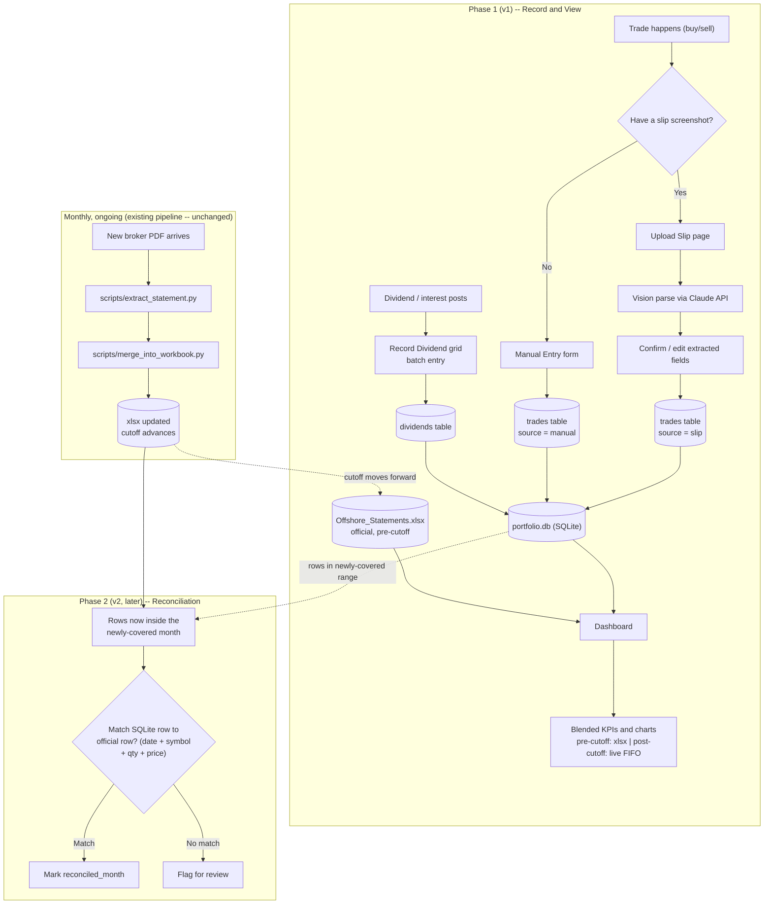

# Unified Portfolio Web App — V1 build plan (completed)

This is the original planning document for the V1 build (`V1-record-trade-and-view`
branch), reconstructed here as a permanent record after the live plan file
(a Claude Code planning-session artifact outside this repo) was overwritten
by a later, unrelated planning session. All of Steps 1-7 below are done and
merged into this branch; see `CHANGELOG.md` and `docs/METHODOLOGY.md` for the
user-facing changelog and the calculation/methodology detail respectively --
this document is the *design record*, kept for how and why things were built
the way they were, including the real bugs found along the way.

## Context

Before this build, portfolio activity was split across three disconnected
surfaces: the Streamlit dashboard (`analyze monthly offshore statement/`,
read-only, refreshed only when a new broker PDF was manually processed), a
hand-maintained Excel workbook where every trade got re-typed across
multiple sheets, and a design prototype (`personal investment portfolio
tool/`) with good trade-entry UX but no data persistence at all. The user
does DCA (recurring small buys) and wanted one web application that both
*shows* portfolio performance and *records* new activity accurately, without
the multi-sheet manual re-entry.

Confirmed through conversation: one unified app, single portfolio (no
multi-user), trade entry supporting **both** slip-image upload (auto-parsed)
and a manual form, dividend entry as a **quick-entry grid** capturing **net
amount only** at the time this was planned (later revised during Step 6 --
see below). Rebalance planning and formal monthly reconciliation against the
official broker PDF were explicitly deferred to a later phase (v2).

## Workflow overview

End-to-end process, phased. Phase 1 (v1) is what got built; Phase 2 (v2) is
a reconciliation loop discussed but deferred, shown here so the full
lifecycle is visible.



## Build steps (all DONE)

```mermaid
flowchart LR
    S1["Step 1<br/>Login gate"] --> S2["Step 2<br/>Storage + seed"]
    S2 --> S3["Step 3<br/>Multi-page shell +<br/>Dashboard blending"]
    S3 --> S4["Step 4<br/>Record Trade:<br/>Manual Entry"]
    S4 --> S45["Step 4.5<br/>Trade traceability +<br/>position visibility"]
    S45 --> S46["Step 4.6<br/>Live sell Realized<br/>P/L preview"]
    S46 --> S5["Step 5<br/>Record Trade:<br/>Upload Slip"]
    S5 --> S55["Step 5.5<br/>Oversell + delete<br/>confirmation"]
    S55 --> S6["Step 6<br/>Record Dividend:<br/>grid + matrix"]
    S6 --> S7["Step 7<br/>Polish +<br/>full regression"]
    S7 --> S8["Bonus<br/>core/ restructure"]
    S8 -.-> V2["v2 (separate round)<br/>Reconciliation, Rebalance"]
```



**Step 1 — Login gate. DONE.** `auth.py` (salted SHA-256, `hmac.compare_digest`)
+ a password gate wrapping `dashboard_app.py` -- nothing renders until it
passes. Validated: wrong password blocks with an error, correct password
reveals the dashboard, a new session requires logging in again. Added a
**Log out** button -- a real gap found during testing.

**Step 2 — Persistent storage + historical seed. DONE.** `db.py` +
`scripts/seed_from_xlsx.py`. Validated against real data: seeded 902 trade
rows and 895 dividend/interest rows, exact match to the xlsx's own counts;
re-running without `--force` correctly no-ops.

**Step 3 — Multi-page shell + Dashboard blending. DONE.** `app_pages/dashboard.py`
(router split out of `dashboard_app.py`), `compute_fifo_realized_pl`/
`blended_realized_pl`/`blended_dividends` added to `calculations.py`.
Validated against real data: with zero live trades logged, blended KPIs
matched the pre-blend values exactly.

**Step 4 — Record Trade: Manual Entry. DONE**, plus two things found
necessary from real testing:
- **Delete** capability for manual/slip-sourced trades, seed rows never
  shown/deletable. Editing a mistake is delete + re-enter, not in-place.
- **Duration-filter bug, found and fixed**: the dashboard's date-range
  filter was capped at the last official statement month, silently
  excluding any live trade/dividend dated after it from KPI calculations.
  Fixed via a `data_end` extended upper bound; Portfolio Value/Unrealized
  P/L/Holdings correctly continue to stay pinned to the last official
  statement regardless.

**Step 4.5 — Trade traceability & position visibility. DONE.** Two gaps
raised from live testing: show *why* a KPI changed (per-trade Realized P/L,
not just an aggregate), and show current holding + average cost for a
symbol while entering a new trade against it. `_run_fifo` factored out as a
shared internal helper so `compute_fifo_realized_pl` and the new
`compute_current_positions` don't duplicate lot-tracking logic. Validated
against real NVDY data: a test sell of 10 shares at $25 (above the $18.54
blended average) correctly showed a **-$6.93** loss, because FIFO drew from
a specific 2024 lot costing $25.69/share.

**Step 4.6 — Live sell Realized P/L preview. DONE.** `estimate_sell_realized_pl()`
simulates a FIFO sell against the current lot book (commission excluded,
not yet known at preview time) and shows it live as Quantity/Price are
typed -- Side/Symbol/Quantity/Price all moved outside `st.form(...)` so
they're reactive. Verified the live preview matches the actual recorded
result exactly (both -$6.93) before commission.

**Step 5 — Record Trade: Upload Slip. DONE.** `slip_parser.py` (Claude
vision, `claude-opus-5`, JSON-schema-constrained structured output) + an
Upload Slip tab in `app_pages/record_trade.py`. Symbol/Side/Quantity/Price
moved to sit above both tabs, shared -- parsing a slip pre-fills them via
`session_state` through an `on_click` callback (writing to a widget's
session_state *after* it's already been instantiated in the same script run
raises `StreamlitAPIException` -- hit and fixed during real testing).
Validated against the real slip images in `labs/`: both parsed exactly
right field-for-field (buy: NVDY, 7.3969607 sh @ $12.14, $0.13 commission,
$0.0092 VAT, Market Order, matching Order ID; sell: PFRL, 14 sh @ $49.28,
$1.04 commission, $0.03 reserved fee, $1.04 rebate -- net commission $0.03
exactly reproducing the slip's own $689.95 Total Credit). Two real bugs
found and fixed: (1) the schema didn't allow `trade_date` to be null, so a
slip with its date section cropped out of frame returned `""` and crashed
`pd.to_datetime()` -- fixed by making it nullable, falling back to today
(editable); (2) numeric prefill fields crashed on `float(None)` for fields a
buy slip genuinely doesn't show -- `prefill.get(key, 0.0)` only substitutes
the default when the key is *missing*, not when it's explicitly `None`, so
switched to `prefill.get(key) or 0.0`.

**Step 5.5 — Oversell confirmation + delete confirmation. DONE.** (1)
Selling more than the current FIFO position holds shows a warning *and*
requires an explicit checkbox (keyed per symbol+quantity, so confirming one
oversell never silently carries over to a different one) before
`render_trade_form` lets the save through -- applies identically to Upload
Slip and Manual Entry, since both call the same function. (2) Deleting a row
in Recent Trades opens a small `st.popover` confirmation ("Delete this
... ?" + a "Yes, delete" button) instead of deleting on the first click.

**Step 6 — Record Dividend: grid + matrix. DONE.** `app_pages/record_dividend.py`
-- entry grid, Recent list (manual-only, matching Record Trade's
convention), Matrix view (full history incl. seed, symbols x months via
`pivot_table` with margins). `db.delete_dividend(id)` added to mirror
`delete_trade`. Changed from the original design based on real usage:
- **Gross Amount + Withholding Tax, not a single Net Amount field.** Dime!'s
  activity feed shows a dividend as two separate line items (e.g. "Dividend
  HDV: 2.45 USD" and "Dividend Withholding Tax HDV: -0.36 USD") which the
  user was previously subtracting by hand in Excel. The grid takes both real
  numbers directly and computes Net = Gross - Withholding silently at save
  time -- deliberately *not* an assumed flat 15%, since Capital Distribution
  rows have no withholding line at all in the real data (confirmed from the
  user's own `labs/dividend receipt.JPEG`). `round(..., 2)` avoids binary
  float noise (2.45-0.36 != 2.09 exactly) leaking into stored data.
- **Symbol is required unless Entry Type is Interest.** A real gap found
  from testing: nothing stopped saving a Dividend row with a blank Symbol.
  Now blocked with a clear per-row error at save time.
- **Symbol autocomplete** via `SelectboxColumn`, sourced from trade history
  (a dividend can't happen before the stock was bought) -- a hard-constrained
  dropdown (no free-text escape hatch in this Streamlit version), unlike
  Record Trade's Symbol field below.
- **Delete-with-confirm**, matching Record Trade's `st.popover` pattern.

Also revisited on **Record Trade** while working through the same request:
- **Symbol** changed from `st.text_input` to `st.selectbox(..., accept_new_options=True)`
  -- sourced from trade history too, but *with* a free-text escape hatch
  (unavailable on the grid's `SelectboxColumn`), so a genuinely new symbol
  can still be typed.
- **Quantity/Executed Price and all four fee fields** default to blank
  (`value=None` + placeholder) instead of a pre-filled "0.0000" -- typing a
  real value no longer requires backspacing the default first. A parsed
  slip's real prefilled values (even a genuine $0.00) still show pre-filled,
  since those are meant to be reviewed, not retyped.

**Step 7 — Polish + full regression. DONE.** `requirements.txt` created
(pins streamlit, pandas, openpyxl, plotly, anthropic, pdfplumber, pytest);
`docs/METHODOLOGY.md` extended with the FIFO/blending and Record
Trade/Record Dividend methodology sections; `CHANGELOG.md` extended; full
`pytest` suite green; manual walkthrough covered piecemeal across the whole
build via live user testing rather than one final cold pass, plus a direct
SQLite persistence check (confirmed real entries survived ~16+ server
restarts across the session).

**Bonus, post-Step-7 — `core/` restructure.** Grouped `auth.py`,
`calculations.py`, `db.py`, `slip_parser.py` into a `core/` package (with
`dashboard_app.py` staying at the root as the Streamlit entry point);
untracked a generated audit-report artifact (`scripts/full_history_check.json`);
removed two stale log files. Surfaced two real, unrelated latent bugs via
post-move testing (not caused by the move's import-line changes themselves):
- `db.py`'s `DB_PATH` was computed relative to its own file location, which
  silently pointed at a *new, empty* database once `db.py` moved a directory
  deeper -- the app was reading/writing `core/data/portfolio.db` for one
  restart cycle before this was caught and fixed. No real data was lost
  (`data/portfolio.db` was never touched). Fixed by resolving from a proper
  `PROJECT_ROOT` two levels up; added a regression test.
- `compute_fifo_realized_pl`'s output columns (all of them, not just `id`)
  come back as `dtype=object` when there are zero realized rows, because
  `pd.DataFrame([], columns=[...])` can't infer types from no data -- this
  is what actually caused both the reported merge error and the `.dt`
  accessor crash (both were downstream symptoms of the empty-decoy-database
  bug above, not independent issues). `id` is now explicitly cast to
  `float64` regardless, since a genuinely empty result (e.g. an account with
  no sells yet) is a real, reachable state worth being robust to.

## Storage schema

SQLite file: `data/portfolio.db` (`core/db.py`, no Streamlit import, every
function accepts an optional injected `conn` for testing).

```sql
CREATE TABLE trades (
    id            INTEGER PRIMARY KEY AUTOINCREMENT,
    trade_date    TEXT NOT NULL,                        -- ISO 'YYYY-MM-DD'
    entry_type    TEXT NOT NULL DEFAULT 'Trade Entry',
    side          TEXT,                                   -- 'buy' | 'sell'
    symbol        TEXT NOT NULL,
    description   TEXT,
    quantity      REAL NOT NULL,                          -- SIGNED: +buy, -sell
    price         REAL,
    amount        REAL,                                   -- SIGNED gross (qty*price)
    commission    REAL,                                   -- NET fee total
    vat           REAL, reserved_fee REAL, fee_rebate REAL,
    order_id      TEXT, order_type TEXT,
    source        TEXT NOT NULL DEFAULT 'manual',          -- 'seed' | 'manual' | 'slip'
    reconciled_month TEXT,                                 -- v2 hook, unused for now
    notes         TEXT,
    created_at    TEXT NOT NULL DEFAULT (datetime('now'))
);

CREATE TABLE dividends (
    id          INTEGER PRIMARY KEY AUTOINCREMENT,
    trade_date  TEXT NOT NULL,
    symbol      TEXT,                                     -- NULL for Interest rows
    entry_type  TEXT NOT NULL CHECK(entry_type IN ('Dividend','Interest','Capital Distribution')),
    net_amount  REAL NOT NULL,
    source      TEXT NOT NULL DEFAULT 'manual',            -- 'seed' | 'manual'
    reconciled_month TEXT,
    notes       TEXT,
    created_at  TEXT NOT NULL DEFAULT (datetime('now'))
);
```

## Average-cost vs. FIFO -- decision

`compute_realized_pl` stays **untouched** for the frozen historical xlsx
data (already audited, documented, reconciled -- don't move numbers that
have already been checked). `compute_fifo_realized_pl` is used for
everything flowing through SQLite (seed + live), since per-trade
granularity now exists to track specific lots the way the broker actually
does. See `docs/METHODOLOGY.md` for the full writeup, including why a sell
above average cost can still realize a loss.

## Final file/module structure

```
analyze monthly offshore statement/
├── dashboard_app.py          # thin router (st.navigation) -- entry point, stays at root
├── core/                     # added post-Step-7 (see "Bonus" above)
│   ├── __init__.py
│   ├── auth.py                 # password hash/verify, no streamlit import
│   ├── calculations.py         # FIFO + average-cost realized P/L, blending, ROI
│   ├── db.py                   # SQLite schema, CRUD, no streamlit import
│   └── slip_parser.py          # Claude vision call + field mapping, no streamlit import
├── app_pages/
│   ├── dashboard.py
│   ├── record_trade.py
│   └── record_dividend.py
├── data/
│   ├── Offshore_Statements_2023-01_to_2026-06.xlsx   # unchanged, official source
│   └── portfolio.db
├── scripts/
│   └── seed_from_xlsx.py       # one-time import of xlsx Transactions/Income into SQLite
├── tests/
│   ├── test_calculations.py
│   ├── test_db.py
│   ├── test_slip_parser.py     # never touches the real API -- injected fake client
│   └── test_auth.py
├── requirements.txt
├── .streamlit/secrets.toml     # ANTHROPIC_API_KEY, APP_PASSWORD_SALT, APP_PASSWORD_HASH (gitignored)
└── docs/
    ├── METHODOLOGY.md          # calculation/KPI reasoning
    └── V1_PLAN.md               # this file
```

## Explicitly deferred (v2, not designed here)

- **Monthly reconciliation** against the next official PDF -- match
  `trades`/`dividends` rows falling inside a newly-covered month against the
  official `Transactions`/`Income` rows and mark them via the
  `reconciled_month` column already present in the schema (added specifically
  so this doesn't need a future migration).
- **Rebalance planner** -- the dividend-reinvestment/rebalance screen from
  `personal investment portfolio tool/NOTES.md` is good prior art, not
  designed here.
- Specific-lot *selection* on sell (FIFO-only for v1) and any live
  market-price feed for true mark-to-market of post-cutoff positions.
